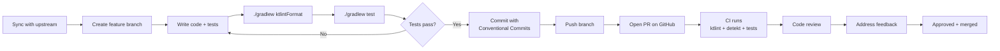

# AutoTrans Android — Contributor Guide

> **Version**: 1.0 | **Last updated**: 2026-06-29
> Welcome! This guide helps you go from zero to your first merged PR.
> All code style rules are in [CODING_GUIDELINES.md](CODING_GUIDELINES.md).
> Architecture overview is in [ARCHITECTURE.md](architecture/ARCHITECTURE.md).

---

## Table of Contents

1. [Before You Start](#1-before-you-start)
2. [Environment Setup](#2-environment-setup)
3. [Project Structure Quick Map](#3-project-structure-quick-map)
4. [Running the Project](#4-running-the-project)
5. [Development Workflow](#5-development-workflow)
6. [How to Create a New Feature](#6-how-to-create-a-new-feature)
7. [How to Add a New OCR Engine](#7-how-to-add-a-new-ocr-engine)
8. [How to Add a New Translation Engine](#8-how-to-add-a-new-translation-engine)
9. [How to Add a New Use Case](#9-how-to-add-a-new-use-case)
10. [Submitting a Pull Request](#10-submitting-a-pull-request)
11. [Issue Guidelines](#11-issue-guidelines)
12. [Getting Help](#12-getting-help)

---

## 1. Before You Start

### Read first

Before writing any code, read these documents in order:

| Order | Document | Time |
|-------|---------|------|
| 1 | [ARCHITECTURE.md](architecture/ARCHITECTURE.md) | 15 min |
| 2 | [CODING_GUIDELINES.md](CODING_GUIDELINES.md) | 10 min |
| 3 | [PIPELINE.md](architecture/PIPELINE.md) | 10 min |
| 4 | This guide | 10 min |

### Code of Conduct

All contributors are expected to follow the [CODE_OF_CONDUCT.md](CODE_OF_CONDUCT.md).
In short: be respectful, be constructive, assume good intent.

### Types of contributions welcome

| Type | Where to start |
|------|---------------|
| 🐛 Bug fix | Find an issue labeled `bug`, comment you're working on it |
| ✨ New feature | Open a feature request issue first — discuss before coding |
| 🔌 New OCR engine | See [§7 below](#7-how-to-add-a-new-ocr-engine) |
| 🌐 New translation engine | See [§8 below](#8-how-to-add-a-new-translation-engine) |
| 📖 Documentation | PRs welcome without prior issue |
| 🧪 Tests | Always welcome — check coverage gaps first |
| 🌍 Translation (strings) | See `app/src/main/res/values-*/strings.xml` |

---

## 2. Environment Setup

### Prerequisites

| Tool | Minimum version | Notes |
|------|----------------|-------|
| Android Studio | Ladybug (2024.2.1) or later | Required |
| JDK | 17 | Use Temurin distribution |
| Android SDK | API 35 (Target), API 26 (Min) | Install via SDK Manager |
| Git | 2.40+ | — |
| Kotlin | 2.0.x | Managed by Gradle |

### Step-by-step setup

**1. Fork and clone**

```bash
# Fork the repo on GitHub first, then:
git clone https://github.com/<your-username>/autotrans-android.git
cd autotrans-android

# Add upstream remote
git remote add upstream https://github.com/autotrans/autotrans-android.git
```

**2. Open in Android Studio**

- Open Android Studio → `File → Open` → select the cloned directory
- Wait for Gradle sync to complete (first sync downloads ~500 MB)
- If sync fails: `File → Invalidate Caches → Restart`

**3. Install ktlint and detekt**

Both run via Gradle — no separate installation needed:

```bash
./gradlew ktlintCheck   # check formatting
./gradlew ktlintFormat  # auto-fix formatting
./gradlew detekt        # static analysis
```

**4. Set up Git hooks (recommended)**

```bash
# Auto-run ktlint before every commit
cp scripts/pre-commit .git/hooks/pre-commit
chmod +x .git/hooks/pre-commit
```

Content of `scripts/pre-commit`:
```bash
#!/bin/sh
./gradlew ktlintCheck --daemon
if [ $? -ne 0 ]; then
  echo "ktlint failed. Run './gradlew ktlintFormat' to fix."
  exit 1
fi
```

**5. Verify setup**

```bash
./gradlew test          # all unit tests should pass
./gradlew assembleDebug # debug APK should build successfully
```

If both pass, your environment is ready. ✅

---

## 3. Project Structure Quick Map

```
autotrans-android/
│
├── app/                    ← Entry point, navigation, DI bootstrap
├── domain/                 ← Pure Kotlin: use cases, interfaces, models
│   └── src/main/kotlin/com/autotrans/android/domain/
│       ├── model/          ← OcrResult, TranslationResult, Language, …
│       ├── repository/     ← CaptureRepository, OcrRepository, …
│       ├── usecase/        ← TranslateScreenUseCase, GetSettingsUseCase, …
│       └── engine/         ← OcrEngine, TranslationEngine (plugin interfaces)
│
├── data/                   ← Room, DataStore, repository implementations
├── feature/
│   ├── capture/            ← MediaProjection, CaptureRepositoryImpl
│   ├── ocr/                ← ML Kit OCR engine + provider + repo impl
│   ├── translator/         ← ML Kit / Cloud translation engines
│   ├── overlay/            ← ForegroundService, WindowManager, pipeline
│   └── settings/           ← Settings UI + ViewModel
│
├── core/
│   ├── common/             ← Extensions, RetryPolicy, AppDispatchers
│   ├── ui/                 ← Theme, shared Compose components
│   └── testing/            ← Fakes, builders, test rules
│
├── docs/                   ← All documentation
├── .github/
│   ├── workflows/          ← CI/CD
│   └── ISSUE_TEMPLATE/     ← Bug / feature templates
└── gradle/
    └── libs.versions.toml  ← All dependency versions here
```

**Golden rule for navigation**: When you want to understand a feature, start in `:domain` to see the interfaces and models, then look at `:feature:[name]` for the implementation.

---

## 4. Running the Project

### Debug build

```bash
./gradlew assembleDebug
# Install on connected device:
./gradlew installDebug
```

### Run unit tests

```bash
# All tests
./gradlew test

# Single module
./gradlew :domain:test
./gradlew :feature:overlay:test

# With coverage report
./gradlew koverHtmlReport
# Open: build/reports/kover/html/index.html
```

### Run with Android Studio

- Select the `app` run configuration
- Choose your device in the device selector
- Press ▶ Run

### Required device permissions for manual testing

When the app launches for the first time:
1. Grant **"Display over other apps"** → System Settings will open automatically
2. Grant **"Screen capture"** → System dialog will appear when starting overlay

---

## 5. Development Workflow



### Daily workflow commands

```bash
# 1. Sync with upstream before starting work
git fetch upstream
git rebase upstream/develop

# 2. Create branch
git checkout -b feat/my-feature

# 3. Work...
# 4. Auto-fix formatting before committing
./gradlew ktlintFormat

# 5. Run tests
./gradlew test

# 6. Commit
git add .
git commit -m "feat(ocr): add Tesseract OCR engine implementation"

# 7. Push
git push origin feat/my-feature

# 8. Open PR on GitHub targeting 'develop' branch
```

---

## 6. How to Create a New Feature

This section walks through the full process of adding a new feature from scratch.
**Example**: Adding a "Translation History" feature.

### Step 1 — Define domain models (`:domain`)

Start in the innermost layer. If your feature needs new data types, add them to `:domain/model/`:

```kotlin
// domain/src/main/kotlin/model/TranslationHistoryItem.kt
data class TranslationHistoryItem(
    val id: Long = 0,
    val originalText: String,
    val translatedText: String,
    val sourceLang: String,
    val targetLang: String,
    val timestamp: Long,
    val isFavorite: Boolean = false
)
```

### Step 2 — Define repository interface (`:domain`)

```kotlin
// domain/src/main/kotlin/repository/TranslationHistoryRepository.kt
interface TranslationHistoryRepository {
    fun getHistory(limit: Int = 50): Flow<List<TranslationHistoryItem>>
    suspend fun save(item: TranslationHistoryItem): Result<Unit>
    suspend fun delete(id: Long): Result<Unit>
    suspend fun clearAll(): Result<Unit>
    suspend fun toggleFavorite(id: Long): Result<Unit>
}
```

### Step 3 — Write use cases (`:domain`)

One class per action:

```kotlin
// domain/src/main/kotlin/usecase/GetTranslationHistoryUseCase.kt
class GetTranslationHistoryUseCase(
    private val repository: TranslationHistoryRepository
) {
    operator fun invoke(limit: Int = 50): Flow<List<TranslationHistoryItem>> =
        repository.getHistory(limit)
}
```

### Step 4 — Write unit tests for use cases (`:domain`)

```kotlin
// domain/src/test/kotlin/usecase/GetTranslationHistoryUseCaseTest.kt
class GetTranslationHistoryUseCaseTest {
    private val repo = FakeTranslationHistoryRepository()
    private val useCase = GetTranslationHistoryUseCase(repo)

    @Test
    fun `returns history items from repository`() = runTest {
        repo.items = listOf(TranslationHistoryItemBuilder.default())
        useCase(limit = 10).test {
            assertThat(awaitItem()).hasSize(1)
            cancelAndIgnoreRemainingEvents()
        }
    }
}
```

### Step 5 — Implement repository (`:data`)

```kotlin
// data/src/main/kotlin/repository/TranslationHistoryRepositoryImpl.kt
class TranslationHistoryRepositoryImpl @Inject constructor(
    private val dao: TranslationHistoryDao
) : TranslationHistoryRepository {

    override fun getHistory(limit: Int): Flow<List<TranslationHistoryItem>> =
        dao.getHistory(limit).map { entities -> entities.map { it.toDomain() } }

    override suspend fun save(item: TranslationHistoryItem): Result<Unit> =
        runCatching { dao.insert(item.toEntity()) }

    // ...
}
```

### Step 6 — Add Room entity and DAO (`:data`)

```kotlin
// data/src/main/kotlin/local/room/entity/TranslationHistoryEntity.kt
@Entity(tableName = "translation_history")
data class TranslationHistoryEntity(
    @PrimaryKey(autoGenerate = true) val id: Long = 0,
    val originalText: String,
    val translatedText: String,
    val sourceLang: String,
    val targetLang: String,
    val timestamp: Long,
    val isFavorite: Boolean
)
```

### Step 7 — Add mapper (`:data`)

```kotlin
// data/src/main/kotlin/mapper/TranslationHistoryMapper.kt
fun TranslationHistoryEntity.toDomain() = TranslationHistoryItem(
    id = id, originalText = originalText, translatedText = translatedText,
    sourceLang = sourceLang, targetLang = targetLang,
    timestamp = timestamp, isFavorite = isFavorite
)

fun TranslationHistoryItem.toEntity() = TranslationHistoryEntity(
    id = id, originalText = originalText, translatedText = translatedText,
    sourceLang = sourceLang, targetLang = targetLang,
    timestamp = timestamp, isFavorite = isFavorite
)
```

### Step 8 — Wire Hilt bindings (`:data/di/`)

```kotlin
// data/src/main/kotlin/di/DataModule.kt
@Binds @Singleton
abstract fun bindHistoryRepository(
    impl: TranslationHistoryRepositoryImpl
): TranslationHistoryRepository
```

### Step 9 — Build ViewModel and UI (`:feature:settings` or new feature module)

```kotlin
// feature/settings/ui/viewmodel/HistoryViewModel.kt
@HiltViewModel
class HistoryViewModel @Inject constructor(
    getHistory: GetTranslationHistoryUseCase,
    private val clearHistory: ClearTranslationHistoryUseCase
) : ViewModel() {
    val history = getHistory(limit = 50)
        .stateIn(viewModelScope, SharingStarted.WhileSubscribed(5_000), emptyList())

    fun clearAll() = viewModelScope.launch { clearHistory() }
}
```

### Step 10 — Add fake to `:core:testing`

```kotlin
// core/testing/src/main/kotlin/fake/FakeTranslationHistoryRepository.kt
class FakeTranslationHistoryRepository : TranslationHistoryRepository {
    var items: List<TranslationHistoryItem> = emptyList()
    private val _flow = MutableStateFlow(items)

    override fun getHistory(limit: Int): Flow<List<TranslationHistoryItem>> =
        _flow.map { it.take(limit) }

    override suspend fun save(item: TranslationHistoryItem): Result<Unit> {
        items = items + item
        _flow.value = items
        return Result.success(Unit)
    }
    // ...
}
```

### Commit sequence for this feature (example)

```
feat(domain): add TranslationHistoryItem model and repository interface
test(domain): add unit tests for GetTranslationHistoryUseCase
feat(data): add Room entity, DAO, and TranslationHistoryRepositoryImpl
feat(data): add TranslationHistoryMapper between entity and domain
feat(settings): add HistoryViewModel and history screen UI
test(settings): add HistoryViewModel tests with fake repository
chore(di): wire TranslationHistoryRepository Hilt binding
```

---

## 7. How to Add a New OCR Engine

The plugin pattern means adding an engine requires **zero changes** to `:domain` or the pipeline.

**Example**: Adding `TesseractOcrEngine`.

### Step 1 — Create the engine class (`:feature:ocr`)

```kotlin
// feature/ocr/src/main/kotlin/engine/TesseractOcrEngine.kt
class TesseractOcrEngine @Inject constructor(
    private val imageStore: ImageStore,
    private val dispatchers: AppDispatchers
) : OcrEngine {

    override val engineType: OcrEngineType = OcrEngineType.TESSERACT
    override val supportedLanguages: List<String> = listOf("eng", "vie", "jpn")

    private var tessBaseAPI: TessBaseAPI? = null

    override suspend fun initialize(): Result<Unit> = runCatching {
        withContext(dispatchers.io) {
            tessBaseAPI = TessBaseAPI().apply {
                init(/* tessdata path */, "eng")
            }
        }
    }

    override suspend fun recognize(imageData: ImageData): Result<OcrResult> =
        withContext(dispatchers.default) {
            runCatching {
                val bitmap = imageStore.resolve(imageData.id)
                    ?: return@runCatching Result.failure<OcrResult>(
                        IllegalStateException("Bitmap not found for ${imageData.id}")
                    )

                tessBaseAPI!!.setImage(bitmap)
                val text = tessBaseAPI!!.utF8Text ?: ""

                OcrResult(
                    blocks    = listOf(OcrBlock(text, BoundingBox(0f, 0f, 1f, 1f), 1.0f)),
                    fullText  = text,
                    timestamp = System.currentTimeMillis()
                )
            }
        }

    override suspend fun recognizeInRegion(
        imageData: ImageData,
        region: BoundingBox
    ): Result<OcrResult> = recognize(imageData)  // simplify for now

    override fun release() {
        tessBaseAPI?.recycle()
        tessBaseAPI = null
    }
}
```

### Step 2 — Add enum value to `OcrEngineType` (`:domain`)

```kotlin
// domain/src/main/kotlin/engine/OcrEngineType.kt
enum class OcrEngineType {
    ML_KIT,
    PADDLE_OCR,
    TESSERACT   // ← add this
}
```

### Step 3 — Register in Hilt module (`:feature:ocr/di/`)

```kotlin
// feature/ocr/src/main/kotlin/di/OcrModule.kt
@Binds @IntoMap
@OcrEngineKey(OcrEngineType.TESSERACT)   // ← add this binding
abstract fun bindTesseractEngine(impl: TesseractOcrEngine): OcrEngine
```

### Step 4 — Add dependency to `libs.versions.toml`

```toml
# gradle/libs.versions.toml
[versions]
tesseract = "4.7.0"

[libraries]
tesseract-android = { group = "cz.adaptech.tesseract4android", name = "tesseract4android", version.ref = "tesseract" }
```

```kotlin
// feature/ocr/build.gradle.kts
dependencies {
    implementation(libs.tesseract.android)
}
```

### Step 5 — Add to Settings UI engine selector

```kotlin
// Update the engine options list in SettingsScreen composable
val ocrEngineOptions = listOf(
    OcrEngineType.ML_KIT    to "ML Kit (Recommended)",
    OcrEngineType.TESSERACT to "Tesseract (Offline)"  // ← add
)
```

### Step 6 — Write tests

```kotlin
// feature/ocr/src/test/kotlin/TesseractOcrEngineTest.kt
class TesseractOcrEngineTest {
    // Test initialization, recognize(), and release()
    // Use FakeImageStore for bitmap resolution
}
```

### Step 7 — Update `AppSettings` default strings in `strings.xml`

```xml
<!-- app/src/main/res/values/strings.xml -->
<string name="ocr_engine_tesseract">Tesseract</string>
```

### Checklist for new OCR engine

```
[ ] Class implements OcrEngine interface fully
[ ] Enum value added to OcrEngineType
[ ] @Binds @IntoMap added to OcrModule
[ ] Dependency added to libs.versions.toml
[ ] Settings UI option added
[ ] Unit tests written (initialize, recognize, release, error cases)
[ ] Fake engine added to core:testing if needed by other tests
[ ] CHANGELOG.md updated
```

---

## 8. How to Add a New Translation Engine

Mirrors the OCR engine pattern exactly.

**Example**: Adding `DeepLTranslationEngine`.

### Step 1 — Create engine class (`:feature:translator`)

```kotlin
// feature/translator/src/main/kotlin/engine/deepl/DeepLTranslationEngine.kt
class DeepLTranslationEngine @Inject constructor(
    private val okHttpClient: OkHttpClient,
    private val dispatchers: AppDispatchers
) : TranslationEngine {

    override val engineType       = TranslationEngineType.DEEPL
    override val requiresApiKey   = true
    override val supportsOffline  = false

    private var apiKey: String? = null
    private val baseUrl = "https://api-free.deepl.com/v2"

    override suspend fun initialize(config: EngineConfig): Result<Unit> = runCatching {
        requireNotNull(config.apiKey) { "DeepL requires an API key" }
        apiKey = config.apiKey
        // Optional: validate key with a test request
    }

    override suspend fun translate(request: TranslationRequest): Result<TranslationResult> =
        withContext(dispatchers.io) {
            runCatching {
                val response = okHttpClient.newCall(
                    buildTranslateRequest(request, requireNotNull(apiKey))
                ).await()   // OkHttp coroutine extension

                val body = response.body?.string() ?: throw IOException("Empty response")
                parseTranslationResponse(body, request)
            }
        }

    override suspend fun detectLanguage(text: String): Result<Language> =
        // DeepL can detect language automatically — implement here
        Result.success(Language.Auto)

    override suspend fun getSupportedLanguages(): Result<List<Language>> =
        withContext(dispatchers.io) {
            runCatching { fetchSupportedLanguages() }
        }

    override fun release() { apiKey = null }

    private fun buildTranslateRequest(request: TranslationRequest, key: String): Request {
        val body = FormBody.Builder()
            .add("text", request.text)
            .add("target_lang", request.to.code.uppercase())
            .apply {
                if (request.from !is Language.Auto) add("source_lang", request.from.code.uppercase())
            }
            .build()
        return Request.Builder()
            .url("$baseUrl/translate")
            .header("Authorization", "DeepL-Auth-Key $key")
            .post(body)
            .build()
    }
}
```

### Step 2 — Add to `TranslationEngineType` enum (`:domain`)

```kotlin
enum class TranslationEngineType {
    ML_KIT,
    GOOGLE_CLOUD,
    LIBRE_TRANSLATE,
    DEEPL   // ← add
}
```

### Step 3 — Register in Hilt module

```kotlin
// feature/translator/src/main/kotlin/di/TranslatorModule.kt
@Binds @IntoMap
@TranslationEngineKey(TranslationEngineType.DEEPL)
abstract fun bindDeepLEngine(impl: DeepLTranslationEngine): TranslationEngine
```

### Step 4 — Handle API key in Settings

```kotlin
// Settings screen — show API key input field when DeepL is selected
if (selectedEngine == TranslationEngineType.DEEPL) {
    ApiKeyInputField(
        value = uiState.deeplApiKey,
        onValueChange = { viewModel.onDeeplApiKeyChanged(it) },
        modifier = Modifier.testTag("deepl_api_key_input")
    )
}
```

### Step 5 — Store API key securely

```kotlin
// Use EncryptedSharedPreferences or Android Keystore — NOT DataStore plain text
// data/src/main/kotlin/local/ApiKeyStorage.kt
class ApiKeyStorage @Inject constructor(@ApplicationContext context: Context) {
    private val prefs = EncryptedSharedPreferences.create(
        "api_keys", MasterKey.Builder(context).setKeyScheme(AES256_GCM).build(),
        context, AES256_SIV, AES256_GCM
    )
    fun getDeepLKey(): String? = prefs.getString("deepl_key", null)
    fun setDeepLKey(key: String) = prefs.edit().putString("deepl_key", key).apply()
}
```

### Checklist for new Translation engine

```
[ ] Class implements TranslationEngine interface fully
[ ] Enum value added to TranslationEngineType
[ ] @Binds @IntoMap added to TranslatorModule
[ ] API key stored securely (EncryptedSharedPreferences) if requiresApiKey = true
[ ] Settings UI shows API key input when engine is selected
[ ] Settings UI shows engine capabilities (offline? requires key?)
[ ] Unit tests: initialize(), translate() success, translate() failure, key validation
[ ] CHANGELOG.md updated
[ ] README "Supported Engines" table updated
```

---

## 9. How to Add a New Use Case

Use cases live in `:domain` and have no Android dependencies.

**Example**: Adding `ExportTranslationHistoryUseCase` to export history as a text file.

```kotlin
// domain/src/main/kotlin/usecase/ExportTranslationHistoryUseCase.kt
class ExportTranslationHistoryUseCase(
    private val historyRepo: TranslationHistoryRepository
) {
    suspend operator fun invoke(): Result<String> = runCatching {
        val items = historyRepo.getHistory(limit = Int.MAX_VALUE).first()
        items.joinToString(separator = "\n\n") { item ->
            "[${item.sourceLang} → ${item.targetLang}]\n" +
            "Original: ${item.originalText}\n" +
            "Translation: ${item.translatedText}"
        }
    }
}
```

### Rules for writing use cases

1. **One class = one responsibility** — single `invoke()` function
2. **No Android types** — pure Kotlin input/output
3. **Return `Result<T>` or `Flow<T>`** — never throw
4. **Inject via constructor** — Hilt wires it in `:app/di/UseCaseModule.kt`
5. **Test first** — write use case test before implementation
6. **No `@Inject` annotation** — see [CODING_GUIDELINES.md §5](CODING_GUIDELINES.md#5-dependency-injection-rules)

---

## 10. Submitting a Pull Request

### PR title format

Same as commit format:
```
feat(translator): add DeepL translation engine
fix(overlay): prevent WindowManager leak on service restart
docs: add contributor guide
```

### PR description template

```markdown
## Summary
<!-- What does this PR do? Why? -->

## Changes
- [ ] New `OcrEngine` implementation: `TesseractOcrEngine`
- [ ] Hilt binding registered in `OcrModule`
- [ ] Settings UI option added
- [ ] Unit tests covering happy path and error path

## Testing
<!-- How was this tested? -->
- [ ] Unit tests pass (`./gradlew test`)
- [ ] Manually tested on [device model, Android version]

## Screenshots / Demo
<!-- Required for UI changes -->

## Related issues
Closes #123
```

### PR rules

| Rule | Detail |
|------|--------|
| **Base branch** | Always target `develop`, never `main` |
| **Draft PRs** | Use for early feedback — prefix title with `[WIP]` |
| **PR size** | Aim for < 400 lines changed. Large PRs take longer to review. |
| **Force push** | Allowed on your own branch before review starts. Avoid after review begins. |
| **Rebase vs merge** | Rebase onto `develop` before marking PR ready |
| **Breaking changes** | Must add `BREAKING CHANGE:` footer in commit message and update CHANGELOG |

### What happens after you open a PR

```
1. CI runs automatically (ktlint → detekt → tests → build)
2. Maintainer reviews within 24–48 hours
3. Address review comments with new commits (don't force-push after review)
4. Once approved + CI green → maintainer merges (squash or rebase)
```

---

## 11. Issue Guidelines

### Bug report

Use the `.github/ISSUE_TEMPLATE/bug_report.yml` template. Include:
- Android version and device model
- AutoTrans version (or commit hash)
- Steps to reproduce
- Expected vs actual behavior
- Logcat output (filter by `AutoTrans`)

### Feature request

Use the `.github/ISSUE_TEMPLATE/feature_request.yml` template. Include:
- Problem you're trying to solve
- Proposed solution
- Alternatives considered
- Willingness to implement it yourself

### Before opening an issue

- Search existing issues (open and closed)
- Check if it's already in the [ROADMAP.md](ROADMAP.md)
- For security vulnerabilities: **do not open a public issue** — email maintainers directly

### Issue labels

| Label | Meaning |
|-------|---------|
| `bug` | Confirmed bug |
| `enhancement` | New feature or improvement |
| `good first issue` | Suitable for first-time contributors |
| `help wanted` | Maintainer wants community help |
| `wontfix` | Out of scope or intentional behavior |
| `blocked` | Waiting on external dependency |
| `plugin:ocr` | Related to OCR engine |
| `plugin:translator` | Related to translation engine |

---

## 12. Getting Help

| Channel | For |
|---------|-----|
| GitHub Discussions | Architecture questions, design discussion |
| GitHub Issues | Bug reports, feature requests |
| PR comments | Code-specific questions during review |
| Code comments / KDoc | Understanding individual classes |

### Self-help checklist before asking

```
[ ] Read the relevant doc (ARCHITECTURE.md, PIPELINE.md, etc.)
[ ] Search GitHub Issues for similar question
[ ] Check CODING_GUIDELINES.md for the relevant rule
[ ] Run ./gradlew test to confirm the issue is reproducible
[ ] Isolate the problem to the smallest possible example
```

---

*For all code style rules, see [CODING_GUIDELINES.md](CODING_GUIDELINES.md).*
*For error handling requirements, see [ERROR_HANDLING.md](ERROR_HANDLING.md).*
*For test requirements, see [TESTING_STRATEGY.md](TESTING_STRATEGY.md).*
*For project roadmap and version targets, see [ROADMAP.md](ROADMAP.md).*
