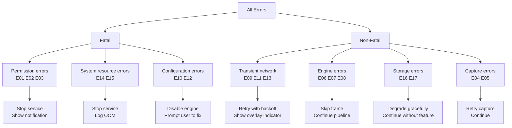
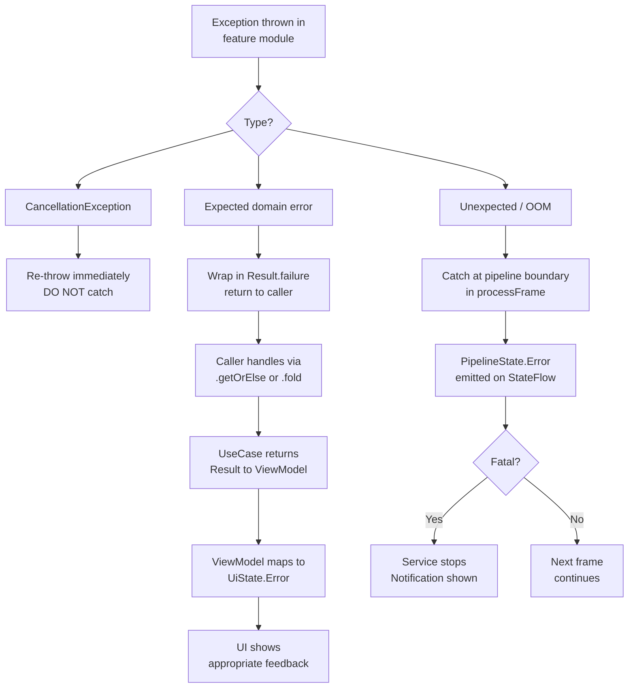

# AutoTrans Android — Error Handling

> **Version**: 1.0 | **Last updated**: 2026-06-29
> **Prerequisite**: Read [PIPELINE.md](architecture/PIPELINE.md) and [STATE_MACHINE.md](architecture/STATE_MACHINE.md) first.
> State transitions triggered by errors are defined in STATE_MACHINE.md §4 (Fatal vs Non-fatal).

---

## Table of Contents

1. [Error Handling Philosophy](#1-error-handling-philosophy)
2. [Error Taxonomy](#2-error-taxonomy)
3. [Error Catalogue](#3-error-catalogue)
   - [E01 — Overlay Permission Denied](#e01--overlay-permission-denied)
   - [E02 — MediaProjection Permission Denied](#e02--mediaprojection-permission-denied)
   - [E03 — Overlay Permission Revoked at Runtime](#e03--overlay-permission-revoked-at-runtime)
   - [E04 — Screen Capture Failure](#e04--screen-capture-failure)
   - [E05 — VirtualDisplay Dead](#e05--virtualdisplay-dead)
   - [E06 — OCR Engine Not Initialized](#e06--ocr-engine-not-initialized)
   - [E07 — OCR Recognition Failure](#e07--ocr-recognition-failure)
   - [E08 — Translation Model Not Downloaded](#e08--translation-model-not-downloaded)
   - [E09 — Translation Network Timeout](#e09--translation-network-timeout)
   - [E10 — Translation API Key Invalid](#e10--translation-api-key-invalid)
   - [E11 — No Network Connection](#e11--no-network-connection)
   - [E12 — Translation Engine Initialization Failure](#e12--translation-engine-initialization-failure)
   - [E13 — Language Model Download Failure](#e13--language-model-download-failure)
   - [E14 — Overlay Window Add Failure](#e14--overlay-window-add-failure)
   - [E15 — Out of Memory](#e15--out-of-memory)
   - [E16 — Settings Read/Write Failure](#e16--settingsreadwrite-failure)
   - [E17 — Translation History DB Failure](#e17--translation-history-db-failure)
4. [Retry Policy Reference](#4-retry-policy-reference)
5. [User Feedback Patterns](#5-user-feedback-patterns)
6. [Logging Strategy](#6-logging-strategy)
7. [Error Propagation Rules](#7-error-propagation-rules)
8. [Global Error Handler](#8-global-error-handler)

---

## 1. Error Handling Philosophy

**Four principles** govern all error handling in AutoTrans:

1. **Fail loudly in debug, fail gracefully in release** — `check()` / `error()` in debug; `Result.failure()` in production paths
2. **Never swallow exceptions silently** — every caught exception must be either returned as `Result.failure`, re-thrown, or logged with sufficient context
3. **Non-fatal errors must not stop the pipeline** — a single bad frame or failed translation should not kill the overlay session
4. **User feedback must be actionable** — every error message shown to the user must include a clear next step

### The `Result<T>` contract

All domain and repository functions return `kotlin.Result<T>`, never throw (except `CancellationException` which must always propagate):

```kotlin
// ✅ Correct
override suspend fun translate(request: TranslationRequest): Result<TranslationResult> =
    runCatching { engine.translate(request) }

// ❌ Wrong — throws instead of returning Result
override suspend fun translate(request: TranslationRequest): TranslationResult =
    engine.translate(request)  // can throw

// ✅ CancellationException must propagate — never catch it
try {
    engine.translate(request)
} catch (e: CancellationException) {
    throw e          // re-throw always
} catch (e: Exception) {
    Result.failure(e)
}
```

---

## 2. Error Taxonomy



---

## 3. Error Catalogue

---

### E01 — Overlay Permission Denied

| Field | Value |
|-------|-------|
| **Type** | Fatal |
| **Where** | `PermissionManager.checkOverlayPermission()` |
| **Exception** | None — detected via `Settings.canDrawOverlays()` |
| **Trigger** | User denies or back-presses the Settings page |

**Cause**: Android requires `SYSTEM_ALERT_WINDOW` (overlay) permission to be granted via a separate Settings page. The user can choose not to grant it.

**Retry strategy**: No automatic retry. User must manually tap "Grant Permission" again.

**User feedback**:
```
Snackbar: "Overlay permission is required to display translations.
           [Grant]"
```

**Logging**:
```kotlin
Timber.w("E01: Overlay permission denied by user")
```

**Recovery**: `AppUiState` returns to `PermissionsRequired`. Service cannot start.

---

### E02 — MediaProjection Permission Denied

| Field | Value |
|-------|-------|
| **Type** | Fatal |
| **Where** | `MainActivity.onActivityResult()` |
| **Exception** | `resultCode != RESULT_OK` from system dialog |
| **Trigger** | User taps "Cancel" in the system screen capture dialog |

**Cause**: Android requires explicit user consent for screen capture each time the app requests it (token is not persisted across reboots).

**Retry strategy**: No automatic retry. User must tap "Start Overlay" again.

**User feedback**:
```
Snackbar: "Screen capture permission is required to capture screen content.
           [Try Again]"
```

**Logging**:
```kotlin
Timber.w("E02: MediaProjection consent denied (resultCode=$resultCode)")
```

**Recovery**: `AppUiState` returns to `PermissionsRequired`.

---

### E03 — Overlay Permission Revoked at Runtime

| Field | Value |
|-------|-------|
| **Type** | Fatal |
| **Where** | `MainActivity.onResume()` → `PermissionManager.recheckPermissions()` |
| **Exception** | None — detected via `Settings.canDrawOverlays()` returning `false` |
| **Trigger** | User revokes overlay permission from Android Settings while service is running |

**Cause**: User navigates to Settings → Apps → AutoTrans → Permissions → revokes "Display over other apps".

**Retry strategy**: None. Service must stop immediately.

**User feedback**:
```
Notification update: "AutoTrans stopped — overlay permission was revoked.
                      Tap to re-enable."
```

**Logging**:
```kotlin
Timber.w("E03: Overlay permission revoked at runtime — stopping service")
```

**Recovery**:
1. `PermissionManager` emits `PermissionState.Overlay.Denied`
2. `MainViewModel` observes → `stopService()`
3. `OverlayForegroundService.onDestroy()` runs full cleanup
4. `AppUiState` → `PermissionsRequired`

---

### E04 — Screen Capture Failure

| Field | Value |
|-------|-------|
| **Type** | Non-fatal |
| **Where** | `CaptureRepositoryImpl.captureFrame()` |
| **Exception** | `IllegalStateException`, `NullPointerException` from `ImageReader` |
| **Trigger** | `ImageReader.acquireLatestImage()` returns `null` or throws |

**Cause**: No image available at the moment of acquisition (timing issue), or `ImageReader` buffer is full.

**Retry strategy**: Skip frame, wait for next `captureIntervalMs` tick. No explicit retry — the capture flow continues automatically.

**User feedback**: None — transparent to user.

**Logging**:
```kotlin
Timber.d("E04: captureFrame returned null — skipping frame")
```

**Recovery**: `PipelineState` remains `Capturing`, next tick produces a new frame.

---

### E05 — VirtualDisplay Dead

| Field | Value |
|-------|-------|
| **Type** | Non-fatal (up to 3 retries), then Fatal |
| **Where** | `CaptureRepositoryImpl.startContinuousCapture()` |
| **Exception** | `IllegalStateException: VirtualDisplay has been released` |
| **Trigger** | Screen off, display change, or system forcibly released the `VirtualDisplay` |

**Retry strategy**:
```kotlin
withRetry(times = 3, initialDelay = 500L) {
    recreateVirtualDisplay()
}
// After 3 failures → Result.failure() → pipeline stops
```

**User feedback** (after retries exhausted):
```
Notification: "AutoTrans stopped — screen capture connection lost.
               Tap to restart."
```

**Logging**:
```kotlin
Timber.e(e, "E05: VirtualDisplay released unexpectedly (attempt $attempt)")
```

**Recovery**: After 3 failures → `PipelineState.Error(fatal=true)` → service stops.

---

### E06 — OCR Engine Not Initialized

| Field | Value |
|-------|-------|
| **Type** | Non-fatal (auto-recovers) |
| **Where** | `OcrEngineProvider.getActiveEngine()` |
| **Exception** | `check()` failure inside engine's `recognize()` |
| **Trigger** | `recognize()` called before `initialize()` completes |

**Cause**: Race condition between engine initialization and first pipeline frame.

**Retry strategy**: `OcrEngineProvider` calls `initialize()` and awaits `Ready` state before returning the engine. If init fails, falls back to the next available engine.

**User feedback**: None — resolved before user notices.

**Logging**:
```kotlin
Timber.w("E06: OCR engine not ready — awaiting initialization")
```

**Recovery**: Engine initializes, next frame processed normally.

---

### E07 — OCR Recognition Failure

| Field | Value |
|-------|-------|
| **Type** | Non-fatal |
| **Where** | `MlKitOcrEngine.recognize()` |
| **Exception** | `Exception` from ML Kit `Tasks.await()` |
| **Trigger** | ML Kit internal error, invalid image format, corrupted bitmap |

**Retry strategy**: No retry — skip frame, continue to next.

**User feedback**: None — a failed OCR frame is invisible to the user.

**Logging**:
```kotlin
Timber.w(e, "E07: OCR recognition failed for imageData=${imageData.id}")
```

**Recovery**: `PipelineState.Error` (non-fatal) → next frame from `Capturing`.

---

### E08 — Translation Model Not Downloaded

| Field | Value |
|-------|-------|
| **Type** | Non-fatal (user action required) |
| **Where** | `MlKitTranslationEngine.translate()` |
| **Exception** | `MlKitException` with `MODEL_NOT_AVAILABLE` code |
| **Trigger** | User selected a language pair whose ML Kit model is not yet downloaded |

**Retry strategy**: No automatic retry. Prompt user to download.

**User feedback**:
```
Overlay banner: "Model for [Language] is not downloaded.
                 [Download Now]"
```

**Logging**:
```kotlin
Timber.w("E08: ML Kit model not available for language=${request.to.code}")
```

**Recovery**:
1. `PipelineState.Error` with `ModelNotAvailableException`
2. Overlay shows download prompt
3. User taps → `DownloadLanguageModelUseCase` invoked
4. After download → pipeline resumes automatically on next frame

---

### E09 — Translation Network Timeout

| Field | Value |
|-------|-------|
| **Type** | Non-fatal |
| **Where** | `GoogleCloudTranslationEngine.translate()` or `LibreTranslateEngine.translate()` |
| **Exception** | `SocketTimeoutException`, `TimeoutCancellationException` |
| **Trigger** | Network slow or server unresponsive within `EngineConfig.timeout` (default 10s) |

**Retry strategy**:
```kotlin
withRetry(times = 3, initialDelay = 1_000L, factor = 2.0) {
    engine.translate(request)
}
// Delays: 1s → 2s → 4s
// Total max wait: ~17s before failure
```

**User feedback**:
```
Overlay indicator: "⚠ Translation failed — retrying…"
// After all retries exhausted:
Overlay indicator: "⚠ Translation unavailable — check connection"
```

**Logging**:
```kotlin
Timber.w(e, "E09: Translation timeout (attempt=$attempt, engine=${engine.engineType})")
```

**Recovery**: Non-fatal — overlay shows error indicator, pipeline continues on next frame.

---

### E10 — Translation API Key Invalid

| Field | Value |
|-------|-------|
| **Type** | Fatal (for that engine) |
| **Where** | `GoogleCloudTranslationEngine.initialize()` or first `translate()` call |
| **Exception** | HTTP 403 / `ApiKeyInvalidException` |
| **Trigger** | User entered wrong API key, or key was revoked |

**Retry strategy**: No retry. Disable engine, fall back to ML Kit.

**User feedback**:
```
Settings screen banner: "Google Cloud API key is invalid.
                          [Update Key] or [Switch to ML Kit]"
```

**Logging**:
```kotlin
Timber.e("E10: API key invalid for engine=GOOGLE_CLOUD — disabling engine")
```

**Recovery**:
1. `TranslationEngineState` → `Failed`
2. `TranslationEngineProvider` falls back to `MlKitTranslationEngine`
3. `SettingsViewModel` shows banner in Settings screen

---

### E11 — No Network Connection

| Field | Value |
|-------|-------|
| **Type** | Non-fatal |
| **Where** | `GoogleCloudTranslationEngine.translate()` or `LibreTranslateEngine.translate()` |
| **Exception** | `UnknownHostException`, `ConnectException` |
| **Trigger** | Device is offline (airplane mode, no Wi-Fi/cellular) |

**Retry strategy**: No immediate retry. Wait for connectivity, then resume. Monitor with `ConnectivityManager.registerNetworkCallback()`.

**User feedback**:
```
Overlay indicator: "⚡ Offline — translation paused"
// When network returns: indicator disappears, pipeline resumes
```

**Logging**:
```kotlin
Timber.w("E11: No network connection — translation paused")
```

**Recovery**: `ConnectivityManager` callback triggers resume on reconnect. If using ML Kit → not affected.

---

### E12 — Translation Engine Initialization Failure

| Field | Value |
|-------|-------|
| **Type** | Fatal (for that engine) |
| **Where** | `TranslationEngineProvider.initialize()` |
| **Exception** | Any exception from `TranslationEngine.initialize()` |
| **Trigger** | ML Kit runtime not available, invalid config, device incompatibility |

**Retry strategy**: 1 retry on next app launch. If failed twice → permanently disable engine for this session.

**User feedback**:
```
Snackbar: "Failed to initialize [Engine Name]. Switched to ML Kit."
```

**Logging**:
```kotlin
Timber.e(e, "E12: Engine initialization failed for engine=${engine.engineType}")
```

**Recovery**: Provider falls back to `MlKitTranslationEngine`. User can switch engine in Settings.

---

### E13 — Language Model Download Failure

| Field | Value |
|-------|-------|
| **Type** | Non-fatal |
| **Where** | `LanguageRepositoryImpl.downloadModel()` |
| **Exception** | `MlKitException`, `IOException` |
| **Trigger** | Network interrupted during model download, storage full |

**Retry strategy**: User-initiated retry only (tap "Retry" in settings).

**User feedback**:
```
Settings screen: "⚠ Download failed for [Language].
                   [Retry]  [Cancel]"
```

**Logging**:
```kotlin
Timber.e(e, "E13: Model download failed for language=${language.code}")
```

**Recovery**: `LanguageModelState` → `Failed`. User taps Retry → `LanguageModelState` → `Downloading`.

---

### E14 — Overlay Window Add Failure

| Field | Value |
|-------|-------|
| **Type** | Fatal |
| **Where** | `OverlayWindowManager.show()` |
| **Exception** | `WindowManager.BadTokenException`, `SecurityException` |
| **Trigger** | `SYSTEM_ALERT_WINDOW` was revoked between permission check and `addView()` call (race condition) |

**Retry strategy**: No retry. Stop service.

**User feedback**:
```
Notification: "AutoTrans could not create overlay window.
               Please re-grant overlay permission."
```

**Logging**:
```kotlin
Timber.e(e, "E14: WindowManager.addView() failed — overlay permission may be revoked")
```

**Recovery**: `OverlayServiceState` → `Stopping` → `Destroyed`. App re-checks permission on next `onResume()`.

---

### E15 — Out of Memory

| Field | Value |
|-------|-------|
| **Type** | Fatal |
| **Where** | `ImageStore` (bitmap registration) or `ComposeView` rendering |
| **Exception** | `OutOfMemoryError` |
| **Trigger** | Accumulated bitmaps not released, device under memory pressure |

**Retry strategy**: None. Stop service and release all resources.

**User feedback**:
```
Notification: "AutoTrans stopped — device ran out of memory.
               Try closing other apps."
```

**Logging**:
```kotlin
Timber.e("E15: OutOfMemoryError — releasing all resources and stopping service")
// Log heap stats: Runtime.getRuntime().totalMemory()
```

**Recovery**:
1. `ImageStore.clear()` — release all bitmaps
2. `ComposeView.disposeComposition()`
3. `serviceScope.cancel()`
4. Service stops

**Prevention** (proactive):
- Bitmap downsampling before storage (Milestone 2)
- `ImageStore` max size: evict oldest if > 3 frames in memory
- LeakCanary in debug builds

---

### E16 — Settings Read/Write Failure

| Field | Value |
|-------|-------|
| **Type** | Non-fatal |
| **Where** | `AppSettingsDataStore.updateSettings()` or `settings` Flow |
| **Exception** | `IOException` from DataStore |
| **Trigger** | Storage I/O error, corrupted DataStore file |

**Retry strategy**: 1 automatic retry for writes. For reads: emit default `AppSettings`.

**User feedback**: None for reads (default settings applied transparently). For writes:
```
Snackbar: "Settings could not be saved. Please try again."
```

**Logging**:
```kotlin
Timber.e(e, "E16: DataStore write failed for key=${settingKey}")
```

**Recovery**: Default `AppSettings` used if DataStore read fails. Write failures are surfaced in UI.

---

### E17 — Translation History DB Failure

| Field | Value |
|-------|-------|
| **Type** | Non-fatal |
| **Where** | `TranslationHistoryRepositoryImpl` (Room operations) |
| **Exception** | `SQLiteException`, `RoomException` |
| **Trigger** | DB corruption, storage full, schema migration failure |

**Retry strategy**: No retry for reads (return empty list). 1 retry for writes.

**User feedback**: None — history is a secondary feature, not critical to translation.

**Logging**:
```kotlin
Timber.e(e, "E17: Room operation failed — table=translation_history, op=${operation}")
```

**Recovery**: Core translation pipeline is unaffected. History screen shows empty state.

---

## 4. Retry Policy Reference

All retries use the shared `withRetry` helper from `:core:common`:

```kotlin
// core/common/src/main/kotlin/.../RetryPolicy.kt
suspend fun <T> withRetry(
    times: Int,
    initialDelay: Long = 200L,
    factor: Double = 2.0,
    isRetryable: (Throwable) -> Boolean = { it !is CancellationException },
    block: suspend () -> Result<T>
): Result<T> {
    var delay = initialDelay
    repeat(times - 1) {
        val result = block()
        if (result.isSuccess) return result
        val error = result.exceptionOrNull()!!
        if (!isRetryable(error)) return result  // don't retry non-retryable errors
        delay(delay)
        delay = (delay * factor).toLong()
    }
    return block()
}
```

### Retry summary table

| Error | Retry times | Initial delay | Factor | Max wait |
|-------|-------------|---------------|--------|----------|
| E05 (VirtualDisplay dead) | 3 | 500ms | 1.0 | 1.5s |
| E07 (OCR failure) | 0 (skip) | — | — | — |
| E09 (Translation timeout) | 3 | 1000ms | 2.0 | ~17s |
| E12 (Engine init failure) | 1 | 0ms | — | ~0ms |
| E16 (DataStore write) | 1 | 100ms | — | ~100ms |
| E17 (Room write) | 1 | 100ms | — | ~100ms |

---

## 5. User Feedback Patterns

Consistent feedback surfaces across the app:

| Surface | When to use | Example |
|---------|-------------|---------|
| **Snackbar** | Transient, recoverable, requires user action | "Settings not saved — [Retry]" |
| **Overlay indicator** | Pipeline errors during active session | "⚠ Translation failed" |
| **Notification** | Service-level errors while backgrounded | "AutoTrans stopped — permission revoked" |
| **Settings banner** | Configuration errors user must fix | "API key invalid — [Update Key]" |
| **Empty state** | Non-critical feature unavailable | History screen: "No translations yet" |
| **No feedback** | Completely transparent to user | Single failed OCR frame |

### Error message writing rules

1. **State what happened** — "Overlay permission was revoked"
2. **State the consequence** — "Translation overlay stopped"
3. **Provide the action** — "[Re-enable]" / "[Try Again]" / "[Download Model]"
4. **Never show raw exception messages** to users in production builds

---

## 6. Logging Strategy

### Library

Use **Timber** throughout the app. Never use `android.util.Log` directly.

```kotlin
// app/src/main/kotlin/.../AutoTransApp.kt
override fun onCreate() {
    super.onCreate()
    if (BuildConfig.DEBUG) {
        Timber.plant(Timber.DebugTree())
    } else {
        Timber.plant(CrashReportingTree())  // future: Crashlytics/Sentry
    }
}
```

### Log levels per error type

| Level | When |
|-------|------|
| `Timber.v()` | Verbose pipeline events (each frame, each stage) — DEBUG only |
| `Timber.d()` | Non-error informational (engine selected, cache hit) |
| `Timber.i()` | State transitions (service started, overlay shown) |
| `Timber.w()` | Non-fatal errors, skipped frames, permission checks |
| `Timber.e()` | Fatal errors, exceptions with full stack trace |

### Log tag convention

Timber uses the calling class name automatically. For additional context, include error code:

```kotlin
// ✅ Include error code + relevant context
Timber.e(e, "E09: Translation timeout (attempt=$attempt, engine=${engine.engineType})")
Timber.w("E04: captureFrame returned null — skipping frame (imageId=${imageData.id})")

// ❌ No context — useless for debugging
Timber.e(e, "Error")
```

### What to never log

- API keys or tokens
- Full screen content (privacy)
- User's translated text in release builds

---

## 7. Error Propagation Rules



### Rule: errors must not cross more than 2 layer boundaries as exceptions

```
feature module throws
    → repository catches → wraps in Result.failure
    → use case receives Result → propagates or maps
    → ViewModel receives Result → maps to UiState
```

Never let a raw `Exception` reach the ViewModel or UI layer.

---

## 8. Global Error Handler

A `CoroutineExceptionHandler` is installed on `serviceScope` to catch any uncaught exception from coroutines that escape `Result`:

```kotlin
// feature/overlay — OverlayForegroundService.kt
private val exceptionHandler = CoroutineExceptionHandler { _, throwable ->
    Timber.e(throwable, "Uncaught exception in serviceScope")
    stopSelf()  // ensure service stops cleanly
}

private val serviceScope = CoroutineScope(
    SupervisorJob() + Dispatchers.Default + exceptionHandler
)
```

> **Note**: `SupervisorJob` ensures child coroutine failures don't cancel siblings. The `exceptionHandler` catches anything that wasn't handled via `Result` — this is a last-resort safety net, not the primary error handling mechanism.

---

*For retry helpers, see `:core:common/RetryPolicy.kt`.*
*For state transitions triggered by errors, see [STATE_MACHINE.md](architecture/STATE_MACHINE.md) §4.*
*For test coverage of error paths, see [TESTING_STRATEGY.md](TESTING_STRATEGY.md).*
