# AutoTrans Android — Performance

> **Version**: 1.0 | **Last updated**: 2026-06-29
> **Prerequisite**: Read [PIPELINE.md](architecture/PIPELINE.md) first.
> KPI measurements use Android's Perfetto / CPU Profiler unless noted otherwise.

---

## Table of Contents

1. [Performance Philosophy](#1-performance-philosophy)
2. [KPI Targets](#2-kpi-targets)
3. [Measurement Setup](#3-measurement-setup)
4. [Stage-by-Stage Optimization](#4-stage-by-stage-optimization)
   - [P01 — Bitmap Downsampling](#p01--bitmap-downsampling)
   - [P02 — Frame Dropping via `conflate()`](#p02--frame-dropping-via-conflate)
   - [P03 — Translation LRU Cache](#p03--translation-lru-cache)
   - [P04 — OCR Skip on Unchanged Frame](#p04--ocr-skip-on-unchanged-frame)
   - [P05 — Distinct OCR Text Check](#p05--distinct-ocr-text-check)
   - [P06 — Crop Region Before OCR](#p06--crop-region-before-ocr)
   - [P07 — Bitmap Pool](#p07--bitmap-pool)
   - [P08 — Debounce on Manual Trigger](#p08--debounce-on-manual-trigger)
5. [Memory Management](#5-memory-management)
6. [Compose Rendering Performance](#6-compose-rendering-performance)
7. [Battery & CPU Impact](#7-battery--cpu-impact)
8. [Performance Regression Testing](#8-performance-regression-testing)
9. [Profiling Toolbox](#9-profiling-toolbox)
10. [Optimization Roadmap by Milestone](#10-optimization-roadmap-by-milestone)

---

## 1. Performance Philosophy

AutoTrans runs a continuous pipeline on a device the user is actively using. The goal is to be **useful without being intrusive**.

**Three constraints drive every optimization decision**:

1. **Latency** — Translation must feel responsive. A result older than ~2 seconds feels stale.
2. **Memory** — Bitmaps are large. Holding more than 2–3 frames in memory simultaneously is unacceptable.
3. **Battery** — Continuous background processing must not drain the battery noticeably. Users will uninstall if the battery impact is obvious.

**Optimization order**: Always profile first. Never optimize without measuring. Every optimization below includes a measurement method.

---

## 2. KPI Targets

### Latency KPIs

Target device: mid-range (Snapdragon 665, 4 GB RAM). Measured from `captureScreen()` to overlay update.

```mermaid
gantt
    title Pipeline Latency Budget (total target: < 1.1s)
    dateFormat  X
    axisFormat  %Lms

    section Stages
    Capture            :0, 50
    OCR (ML Kit)       :50, 450
    Post-process       :450, 455
    Translation        :455, 1055
    Layout + Render    :1055, 1075
```



| Stage | Target | Warning threshold | Critical threshold |
|-------|--------|------------------|--------------------|
| Capture (screenshot) | ≤ 50ms | 80ms | 100ms |
| OCR — ML Kit (1080p) | ≤ 400ms | 600ms | 800ms |
| OCR — ML Kit (720p downsampled) | ≤ 240ms | 400ms | 500ms |
| Post-processing | ≤ 5ms | 8ms | 15ms |
| Translation — ML Kit on-device | ≤ 600ms | 900ms | 1,200ms |
| Translation — Google Cloud | ≤ 400ms | 700ms | 1,000ms |
| Translation — Cache hit | ≤ 1ms | 2ms | 5ms |
| Layout computation | ≤ 2ms | 4ms | 8ms |
| Compose re-render (overlay) | ≤ 16ms | 24ms | 32ms |
| **End-to-end (no cache)** | **≤ 1.1s** | **1.6s** | **2.1s** |
| **End-to-end (cache hit)** | **≤ 100ms** | **200ms** | **400ms** |

### Memory KPIs

| Metric | Target | Warning | Critical |
|--------|--------|---------|----------|
| Total heap (idle) | ≤ 80 MB | 120 MB | 180 MB |
| Total heap (active pipeline) | ≤ 150 MB | 200 MB | 280 MB |
| Max bitmaps held simultaneously | ≤ 2 | 3 | 5 |
| `ImageStore` max entries | 3 | — | — |
| Translation cache entries | 100 max | — | — |

### Rendering KPIs

| Metric | Target | Warning |
|--------|--------|---------|
| Overlay FPS (when updating) | 60 fps | < 30 fps |
| Jank frames (> 16ms) | < 1% | > 5% |
| Compose recompositions per update | ≤ changed blocks only | all blocks |

### Battery KPI

| Metric | Target |
|--------|--------|
| CPU usage (active pipeline, 1fps capture) | ≤ 15% average |
| CPU usage (idle, overlay visible) | ≤ 2% |
| Battery drain per hour (active) | ≤ 5% extra vs baseline |

### Startup KPI

| Metric | Target |
|--------|--------|
| Cold start to main UI | ≤ 1.5s |
| Time from "Start Overlay" to first overlay visible | ≤ 2.0s |

---

## 3. Measurement Setup

### Benchmark module (`:benchmark`)

Add a `:benchmark` module (Milestone 5+) using `androidx.benchmark`:

```kotlin
// benchmark/src/androidTest/kotlin/OcrBenchmark.kt
@RunWith(AndroidJUnit4::class)
class OcrBenchmark {
    @get:Rule val benchmarkRule = BenchmarkRule()

    @Test
    fun mlKitOcrLatency_1080p() = benchmarkRule.measureRepeated {
        val bitmap = loadTestBitmap("sample_screen_1080p.png")
        runBlocking { ocrEngine.recognize(bitmap) }
    }

    @Test
    fun mlKitOcrLatency_720p() = benchmarkRule.measureRepeated {
        val bitmap = loadTestBitmap("sample_screen_720p.png")
        runBlocking { ocrEngine.recognize(bitmap) }
    }
}
```

### Tracing with Perfetto

Add trace points at key pipeline stages:

```kotlin
// feature/overlay — TranslationPipelineImpl.kt
private suspend fun processFrame(imageData: ImageData): PipelineState {
    trace("AutoTrans.OCR") {                    // ← Perfetto trace section
        val ocrResult = ocrRepo.recognizeText(imageData)
        // ...
    }
    trace("AutoTrans.Translate") {
        val result = translationRepo.translate(...)
        // ...
    }
}
```

Run: `adb shell perfetto --config perf.config --out /data/misc/perfetto-traces/trace`

### Timing logs in debug builds

```kotlin
// core/common — measureTime.kt
inline fun <T> measureAndLog(tag: String, block: () -> T): T {
    val start = SystemClock.elapsedRealtime()
    val result = block()
    val elapsed = SystemClock.elapsedRealtime() - start
    if (BuildConfig.DEBUG) Timber.d("$tag took ${elapsed}ms")
    return result
}

// Usage
val ocrResult = measureAndLog("OCR") { ocrEngine.recognize(imageData) }
```

---

## 4. Stage-by-Stage Optimization

---

### P01 — Bitmap Downsampling

**Milestone**: 2 | **Impact**: ★★★★★ | **Effort**: Low

**Problem**: ML Kit processes 1080p bitmaps (~8 MB per frame). OCR accuracy does not meaningfully improve beyond 720p for typical UI text.

**Solution**: Downsample every captured bitmap to a maximum dimension of 720p before passing to OCR.

```kotlin
// feature/capture — ImageStore.kt
fun registerBitmap(uuid: String, original: Bitmap): ImageData {
    val downsampled = original.downsample(maxDimension = 1280)
    bitmaps[uuid] = downsampled
    original.recycle()   // release original immediately
    return ImageData(uuid)
}

// core/common — BitmapExtensions.kt
fun Bitmap.downsample(maxDimension: Int): Bitmap {
    val scale = maxDimension.toFloat() / maxOf(width, height)
    if (scale >= 1f) return this   // no downsampling needed
    val newWidth  = (width  * scale).toInt()
    val newHeight = (height * scale).toInt()
    return Bitmap.createScaledBitmap(this, newWidth, newHeight, /* filter= */ true)
}
```

**Expected gain**: OCR latency −40% (1080p → 720p). Memory per frame −56% (8 MB → 3.5 MB).

**Measurement**: `OcrBenchmark.mlKitOcrLatency_720p()` vs `mlKitOcrLatency_1080p()`.

---

### P02 — Frame Dropping via `conflate()`

**Milestone**: 1 | **Impact**: ★★★★★ | **Effort**: None (single operator)

**Problem**: If OCR + translation takes 1.1s but capture emits every 1.0s, a backlog of unprocessed frames builds up indefinitely. Each frame in the backlog wastes CPU on stale data.

**Solution**: `.conflate()` before `.mapLatest` — already in the canonical pipeline implementation.

```kotlin
captureRepo.startContinuousCapture(intervalMs = settings.captureIntervalMs)
    .conflate()       // drop buffered frames — always process only latest
    .mapLatest { frame -> processFrame(frame) }
```

**Expected gain**: Eliminates processing of stale frames entirely. Keeps pipeline responsive regardless of processing speed.

**Note**: This is the single most impactful optimization and costs zero implementation effort. It must be in place from **Milestone 1**.

---

### P03 — Translation LRU Cache

**Milestone**: 3 | **Impact**: ★★★★☆ | **Effort**: Low

**Problem**: The same text often appears across multiple consecutive frames (e.g., reading a static webpage). Without caching, the same translation is requested from the engine repeatedly.

**Solution**: 100-entry `LruCache` in `TranslationRepositoryImpl` keyed by `"${from.code}:${to.code}:${normalizedText}"`.

Full implementation: see [PIPELINE.md §5](architecture/PIPELINE.md#5-caching-strategy).

**Expected gain**: On static or slow-changing screens, translation latency drops to < 1ms (cache hit). CPU usage during cache hits is negligible.

**Cache invalidation triggers**:
- Settings change (source/target language) → `cache.evictAll()`
- Translation engine change → `cache.evictAll()`
- App cold start → cache starts empty (not persisted to disk)

---

### P04 — OCR Skip on Unchanged Frame

**Milestone**: 2 | **Impact**: ★★★★☆ | **Effort**: Low

**Problem**: When the screen is static (e.g., reading a page without scrolling), every captured frame is identical. Running OCR on each is pure waste.

**Solution**: Hash the `ImageData.id` (which is a UUID per captured frame). In continuous mode, the `VirtualDisplay` may produce the same underlying content — detect this with a perceptual hash.

**Phase 1 (Milestone 2)** — simple content comparison:

```kotlin
// feature/overlay — TranslationPipelineImpl.kt
private var lastOcrText: String = ""

private suspend fun processFrame(imageData: ImageData): PipelineState {
    val ocrResult = ocrRepo.recognizeText(imageData).getOrElse { ... }
    val filtered  = ocrResult.postProcess(settings)

    if (filtered.fullText == lastOcrText) {
        return PipelineState.Idle  // text unchanged — skip translation
    }
    lastOcrText = filtered.fullText
    // proceed to translation
}
```

**Phase 2 (Milestone 5)** — perceptual hash (pHash) before OCR to skip OCR entirely on visually identical frames:

```kotlin
// Only run OCR if frame content actually changed
val currentHash = imageData.perceptualHash()
if (currentHash == lastFrameHash) return PipelineState.Idle
lastFrameHash = currentHash
```

**Expected gain (Phase 1)**: −100% translation calls on static screens. **Phase 2**: −100% OCR calls on static screens.

---

### P05 — Distinct OCR Text Check (`distinctUntilChanged`)

**Milestone**: 2 | **Impact**: ★★★☆☆ | **Effort**: None (single operator)

**Problem**: Even when OCR text hasn't changed, the overlay recomposes if `PipelineState.Success` is re-emitted with the same text.

**Solution**: Already in the canonical pipeline:

```kotlin
.distinctUntilChanged { a, b ->
    a is PipelineState.Success &&
    b is PipelineState.Success &&
    a.result.translatedText == b.result.translatedText
}
```

**Expected gain**: Eliminates unnecessary Compose recompositions when text is stable. Reduces GPU work.

---

### P06 — Crop Region Before OCR

**Milestone**: 5 | **Impact**: ★★★☆☆ | **Effort**: Medium

**Problem**: On large screens, only a portion of the screen may contain text worth translating. Running OCR on the entire 1080p frame when only the bottom 20% has content wastes time.

**Solution**: Allow users to define a "capture region" in Settings. The `CaptureRepositoryImpl` crops the bitmap to the selected region before registering it in `ImageStore`.

```kotlin
// feature/capture — CaptureRepositoryImpl.kt
private fun cropToRegion(bitmap: Bitmap, region: BoundingBox?): Bitmap {
    if (region == null) return bitmap
    return Bitmap.createBitmap(
        bitmap,
        (region.left * bitmap.width).toInt(),
        (region.top * bitmap.height).toInt(),
        (region.width * bitmap.width).toInt(),
        (region.height * bitmap.height).toInt()
    )
}
```

**Expected gain**: OCR latency −60% if region covers 40% of screen.

**UI requirement**: Settings screen must include a "Select capture region" interactive overlay (Milestone 5).

---

### P07 — Bitmap Pool

**Milestone**: 5 | **Impact**: ★★★☆☆ | **Effort**: Medium

**Problem**: `Bitmap.createScaledBitmap()` allocates a new `Bitmap` object on every frame. Each allocation pressures the GC, causing periodic pauses (GC jank visible in `adb logcat` as `GC_FOR_ALLOC`).

**Solution**: Maintain a pool of pre-allocated bitmaps. Reuse existing objects instead of allocating new ones.

```kotlin
// feature/capture — BitmapPool.kt
class BitmapPool(private val maxSize: Int = 3) {
    private val pool = ArrayDeque<Bitmap>(maxSize)

    fun acquire(width: Int, height: Int, config: Bitmap.Config): Bitmap {
        val candidate = pool.removeFirstOrNull()
        return if (candidate != null &&
                   candidate.width == width &&
                   candidate.height == height &&
                   candidate.config == config) {
            candidate   // reuse
        } else {
            candidate?.recycle()
            Bitmap.createBitmap(width, height, config)   // allocate fresh
        }
    }

    fun release(bitmap: Bitmap) {
        if (pool.size < maxSize) pool.addLast(bitmap)
        else bitmap.recycle()
    }
}
```

**Expected gain**: −30% GC pressure during sustained pipeline operation.

---

### P08 — Debounce on Manual Trigger

**Milestone**: 1 | **Impact**: ★★☆☆☆ | **Effort**: None (single operator)

**Problem**: If the user taps "Translate Now" rapidly multiple times, multiple `TranslateScreenUseCase` invocations can run concurrently.

**Solution**: Debounce the button click in the ViewModel:

```kotlin
// app — MainViewModel.kt
private val translateChannel = Channel<Unit>(Channel.CONFLATED)

init {
    viewModelScope.launch {
        translateChannel.receiveAsFlow()
            .debounce(300L)
            .collect { executeTranslation() }
    }
}

fun onTranslateClicked() = translateChannel.trySend(Unit)
```

**Expected gain**: Prevents duplicate translation requests. Near-zero performance cost.

---

## 5. Memory Management

### ImageStore eviction policy

`ImageStore` holds `Bitmap` objects keyed by `ImageData.id`. Without eviction, old bitmaps accumulate.

```kotlin
// feature/capture — ImageStore.kt
class ImageStore @Inject constructor() {
    private val store = LinkedHashMap<String, Bitmap>(4, 0.75f, true)  // LRU order
    private val MAX_ENTRIES = 3

    @Synchronized
    fun register(id: String, bitmap: Bitmap) {
        if (store.size >= MAX_ENTRIES) {
            val oldest = store.entries.first()
            oldest.value.recycle()
            store.remove(oldest.key)
        }
        store[id] = bitmap
    }

    @Synchronized
    fun resolve(id: String): Bitmap? = store[id]

    @Synchronized
    fun clear() {
        store.values.forEach { it.recycle() }
        store.clear()
    }
}
```

### Bitmap lifecycle rules

```
1. Captured by ImageReader         → registered in ImageStore
2. Downsampled (P01)               → original.recycle() immediately
3. Resolved by OcrEngine           → read-only, never mutate
4. After OCR complete              → NOT released (may be needed for crop — P06)
5. On next frame registered        → oldest evicted and recycled (MAX_ENTRIES = 3)
6. On service destroy / OOM        → ImageStore.clear() recycles all
```

### LeakCanary (debug only)

```kotlin
// app/build.gradle.kts
debugImplementation(libs.leakcanary)
```

LeakCanary monitors for unreleased `Bitmap`, `Context`, and `Service` references. Any detected leak should be treated as a **P0 bug**.

---

## 6. Compose Rendering Performance

### Use `key()` to scope recomposition

When `OverlayContent` updates, only the blocks that changed should recompose:

```kotlin
// feature/overlay — OverlayComposeContent.kt
@Composable
fun OverlayContent(content: OverlayContent) {
    content.blocks.forEach { block ->
        key(block.id) {          // ← recompose only this block if it changed
            TranslationBlock(block)
        }
    }
}
```

### Avoid allocations inside Composition

```kotlin
// ❌ Allocates new lambda on every recomposition
Text(text = block.translatedText, modifier = Modifier.padding(8.dp))

// ✅ Remember stable references
val padding = remember { PaddingValues(8.dp) }
Text(text = block.translatedText, contentPadding = padding)
```

### Use `derivedStateOf` for derived values

```kotlin
// ❌ Recomputes on every recomposition
val visibleBlocks = content.blocks.filter { it.confidence > 0.6f }

// ✅ Only recomputes when blocks change
val visibleBlocks by remember(content) {
    derivedStateOf { content.blocks.filter { it.confidence > 0.6f } }
}
```

### Overlay window type and hardware acceleration

```kotlin
// feature/overlay — OverlayWindowManager.kt
val params = WindowManager.LayoutParams(
    WindowManager.LayoutParams.WRAP_CONTENT,
    WindowManager.LayoutParams.WRAP_CONTENT,
    WindowManager.LayoutParams.TYPE_APPLICATION_OVERLAY,
    WindowManager.LayoutParams.FLAG_NOT_FOCUSABLE or
    WindowManager.LayoutParams.FLAG_HARDWARE_ACCELERATED,  // ← always enable
    PixelFormat.TRANSLUCENT
)
```

`FLAG_HARDWARE_ACCELERATED` ensures Compose renders on the GPU. Without it, software rendering causes dropped frames on complex overlays.

---

## 7. Battery & CPU Impact

### Adaptive capture interval

Default: 1,000ms (1 fps). This is conservative — most users don't need sub-second translation.

```kotlin
// domain/model/AppSettings.kt
val captureIntervalMs: Long = 1_000L   // default: 1 fps
// Range: 500ms (fast) to 3_000ms (battery saver)
```

User-configurable in Settings:

| Mode | Interval | Use case |
|------|----------|---------|
| Fast | 500ms | Fast-scrolling content, live subtitles |
| Normal | 1,000ms | Default — reading, browsing |
| Battery Saver | 3,000ms | Long reading sessions |

### Release `VirtualDisplay` when overlay is paused

When the user pauses the overlay (future v1.5), release the `VirtualDisplay` entirely — this stops the capture pipeline from consuming GPU/CPU:

```kotlin
fun onOverlayPaused() {
    captureRepo.stopCapture()   // releases VirtualDisplay
    // overlay window stays visible with last translated content
}
```

### CPU governor awareness

On devices with battery optimization that restrict background CPU:

- `OverlayForegroundService` is a **foreground service** — exempt from Doze restrictions ✅
- `FOREGROUND_SERVICE_TYPE_MEDIA_PROJECTION` declared in manifest — required for Android 14+ ✅

---

## 8. Performance Regression Testing

### Automated benchmark in CI (Milestone 5+)

```yaml
# .github/workflows/benchmark.yml
name: Performance Benchmarks
on:
  push:
    branches: [main]

jobs:
  benchmark:
    runs-on: ubuntu-latest   # Note: use a real device runner for accurate results
    steps:
      - uses: actions/checkout@v4
      - run: ./gradlew :benchmark:connectedAndroidTest
      - uses: actions/upload-artifact@v4
        with:
          name: benchmark-results
          path: benchmark/build/outputs/
```

### Benchmark thresholds (fail CI if exceeded)

| Benchmark | Threshold |
|-----------|-----------|
| `mlKitOcrLatency_720p` | > 500ms → fail |
| `translationCacheHit` | > 5ms → fail |
| `overlayRenderSingleBlock` | > 20ms → fail |
| `pipelineEndToEnd_cacheHit` | > 200ms → fail |

### Manual regression checklist (before each milestone release)

```
[ ] OCR latency measured on target device (720p test image)
[ ] Translation latency measured (both ML Kit and Cloud)
[ ] Memory profiler run — no growing heap over 60 seconds
[ ] Battery stats before/after (adb shell dumpsys batterystats)
[ ] No jank frames in overlay scrolling test
[ ] LeakCanary: zero leaks in debug build
```

---

## 9. Profiling Toolbox

| Tool | What it measures | When to use |
|------|-----------------|-------------|
| **Android Profiler** (AS) | CPU, memory, network in real time | Active development |
| **Perfetto** | System-wide traces, method execution | Finding bottlenecks |
| **`androidx.benchmark`** | Repeatable microbenchmarks | Regression CI |
| **LeakCanary** | Memory leaks | Always (debug builds) |
| **Compose Layout Inspector** | Recomposition counts per composable | Overlay rendering issues |
| **`adb shell dumpsys batterystats`** | Battery drain over time | Battery impact measurement |
| **`adb shell top`** | Live CPU per process | Quick sanity check |

### Useful `adb` commands

```bash
# Clear battery stats baseline
adb shell dumpsys batterystats --reset

# Check current memory usage
adb shell dumpsys meminfo com.autotrans.android

# List running services
adb shell dumpsys activity services com.autotrans.android

# Capture Perfetto trace (5 seconds)
adb shell perfetto \
    -c - --txt \
    -o /data/misc/perfetto-traces/trace.pftrace \
    <<EOF
buffers: { size_kb: 65536 }
data_sources: { config { name: "linux.ftrace" ftrace_config { atrace_apps: "com.autotrans.android" } } }
duration_ms: 5000
EOF
adb pull /data/misc/perfetto-traces/trace.pftrace ./
```

---

## 10. Optimization Roadmap by Milestone

| Optimization | Milestone | Status | Expected gain |
|-------------|-----------|--------|---------------|
| P02 — `conflate()` frame dropping | M1 | 🔲 Must-have | Prevents backlog |
| P08 — Debounce manual trigger | M1 | 🔲 Must-have | UX smoothness |
| P01 — Bitmap downsampling (720p) | M2 | 🔲 Must-have | −40% OCR latency |
| P04 — OCR skip Phase 1 (text compare) | M2 | 🔲 High priority | −100% translate on static |
| P05 — `distinctUntilChanged` | M2 | 🔲 Must-have | −recompositions |
| P03 — Translation LRU cache | M3 | 🔲 High priority | ~0ms on repeated text |
| Compose `key()` per block | M4 | 🔲 Must-have | Selective recompose |
| `FLAG_HARDWARE_ACCELERATED` | M4 | 🔲 Must-have | 60 fps overlay |
| P07 — Bitmap pool | M5 | 🔲 Nice-to-have | −30% GC |
| P06 — Crop region before OCR | M5 | 🔲 Nice-to-have | −60% OCR on partial |
| P04 — OCR skip Phase 2 (pHash) | M5 | 🔲 Nice-to-have | −100% OCR on static |
| Adaptive capture interval | M5 | 🔲 Nice-to-have | Battery saving |
| Benchmark CI integration | M5 | 🔲 Nice-to-have | Regression detection |

---

*For retry behavior affecting latency, see [ERROR_HANDLING.md](ERROR_HANDLING.md) §4.*
*For testing performance benchmarks, see [TESTING_STRATEGY.md](TESTING_STRATEGY.md).*
*For Compose recomposition guidelines, see [CODING_GUIDELINES.md](CODING_GUIDELINES.md).*
