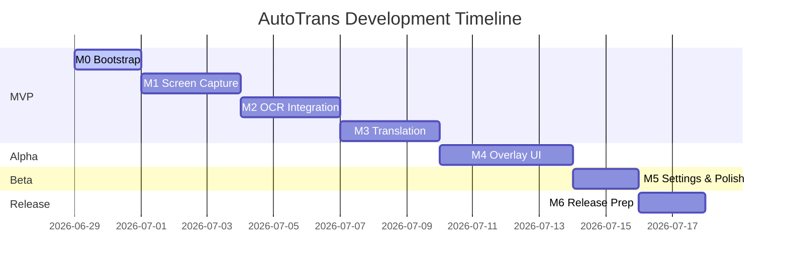

# AutoTrans Android — Roadmap

> **Version**: 1.0 | **Last updated**: 2026-06-29
> This roadmap reflects the [Implementation Plan](../implementation_plan.md) and is the **public-facing** version.
> Milestone completion is tracked via GitHub Issues and GitHub Projects.

---

## Table of Contents

1. [Vision](#1-vision)
2. [Release Philosophy](#2-release-philosophy)
3. [Current Status](#3-current-status)
4. [MVP — Milestone 0–3](#4-mvp--milestone-03)
   - [Milestone 0 — Bootstrap](#milestone-0--bootstrap-day-12)
   - [Milestone 1 — Screen Capture](#milestone-1--screen-capture-day-35)
   - [Milestone 2 — OCR Integration](#milestone-2--ocr-integration-day-68)
   - [Milestone 3 — Translation Engine](#milestone-3--translation-engine-day-911)
5. [v0.1.0-alpha — Milestone 4](#5-v010-alpha--milestone-4)
   - [Milestone 4 — Overlay UI](#milestone-4--overlay-ui-day-1215)
6. [v0.2.0-beta — Milestone 5](#6-v020-beta--milestone-5)
   - [Milestone 5 — Settings & Polish](#milestone-5--settings--polish-day-1617)
7. [v1.0.0 — Release](#7-v100--release)
   - [Milestone 6 — Release Prep](#milestone-6--release-prep-day-1819)
8. [v1.5.0 — Enhanced Overlay](#8-v150--enhanced-overlay)
9. [v2.0.0 — Platform Expansion](#9-v200--platform-expansion)
10. [Commit Strategy Overview](#10-commit-strategy-overview)
11. [Risk Register](#11-risk-register)

---

## 1. Vision

**AutoTrans** is a free, open-source, privacy-first Android screen translator.

- **Translate anything on screen** — games, apps, videos, PDFs — without copy-pasting
- **Works offline by default** — ML Kit on-device OCR and translation
- **Extensible by design** — community can add OCR and translation engines as plugins
- **No telemetry, no accounts** — all processing happens on your device

---

## 2. Release Philosophy

| Principle | Meaning |
|-----------|---------|
| **Ship early** | A working overlay in v0.1.0-alpha is better than a perfect app in v1.0.0 |
| **Milestone = releasable** | Every milestone produces something runnable and testable |
| **Plugin-first** | OCR and translation engines are pluggable from day one |
| **4 commits/day** | Sustainable daily progress — quality over quantity |
| **No big bang** | No feature is "too small" to commit and no refactor waits for a rewrite |

---

## 3. Current Status



| Milestone | Status | Target | Notes |
|-----------|--------|--------|-------|
| M0 — Bootstrap | 🟡 In Progress | Day 1–2 | Documentation complete, project init next |
| M1 — Screen Capture | ⬜ Pending | Day 3–5 | — |
| M2 — OCR | ⬜ Pending | Day 6–8 | — |
| M3 — Translation | ⬜ Pending | Day 9–11 | — |
| M4 — Overlay | ⬜ Pending | Day 12–15 | — |
| M5 — Settings | ⬜ Pending | Day 16–17 | — |
| M6 — Release Prep | ⬜ Pending | Day 18–19 | — |

---

## 4. MVP — Milestone 0–3

> **Goal**: A working Capture → OCR → Translate pipeline with a basic UI.
> **Definition of MVP**: The app can capture a screen, recognize text, translate it, and display the result — even if the UI is minimal.

---

### Milestone 0 — Bootstrap (Day 1–2)

**Goal**: Buildable Android project with multi-module structure, domain layer, and CI running.

#### Deliverables

- [ ] Android project initialized (Kotlin DSL, min SDK 26, target SDK 35)
- [ ] 11 modules created: `:app`, `:domain`, `:data`, `:feature:capture`, `:feature:ocr`, `:feature:translator`, `:feature:overlay`, `:feature:settings`, `:core:common`, `:core:ui`, `:core:testing`
- [ ] `libs.versions.toml` version catalog with all dependencies
- [ ] Domain layer complete: all models, repository interfaces, engine interfaces, use cases
- [ ] GitHub Actions CI: ktlint → detekt → test → build
- [ ] Documentation: README, ROADMAP, CONTRIBUTING, CODE_OF_CONDUCT, LICENSE (Apache 2.0)
- [ ] `.github/ISSUE_TEMPLATE/`, `PULL_REQUEST_TEMPLATE.md`

#### Commit plan — Day 1 (4 commits)

| # | Commit | Est. |
|---|--------|------|
| 1 | `chore: init Android project with Kotlin DSL and version catalog` | 25 min |
| 2 | `chore: setup 11-module structure with dependency graph` | 30 min |
| 3 | `feat(domain): add all models, repository interfaces, and engine interfaces` | 30 min |
| 4 | `feat(domain): add use case catalogue — 16 use cases` | 25 min |

#### Commit plan — Day 2 (5 commits)

| # | Commit | Est. |
|---|--------|------|
| 5 | `ci: add GitHub Actions workflow with ktlint, detekt, test, build` | 20 min |
| 6 | `ci: add release workflow triggered by version tags` | 15 min |
| 7 | `docs: add README with badges, setup instructions, and feature list` | 25 min |
| 8 | `docs: add LICENSE, CODE_OF_CONDUCT, CONTRIBUTING, PULL_REQUEST_TEMPLATE` | 20 min |
| 9 | `chore: add .github/ISSUE_TEMPLATE for bug reports and feature requests` | 15 min |

#### Definition of Done

- `./gradlew assembleDebug` passes with zero errors
- `./gradlew test` passes (domain layer unit tests green)
- CI pipeline passes on first push to `main`
- `:domain` module has zero `android.*` imports (verified by detekt rule)

#### Risks

| Risk | Likelihood | Mitigation |
|------|-----------|------------|
| Gradle sync fails due to version conflict | Medium | Pin all versions in `libs.versions.toml` |
| CI setup takes longer than expected | Low | Use a proven GitHub Actions template |

---

### Milestone 1 — Screen Capture (Day 3–5)

**Goal**: The app can request MediaProjection permission and continuously capture screen frames as `ImageData`.

#### Deliverables

- [ ] `MediaProjection` permission flow (UI + ViewModel)
- [ ] `CaptureRepositoryImpl` with `VirtualDisplay` + `ImageReader`
- [ ] `ImageStore` — in-memory bitmap registry with LRU eviction (max 3 frames)
- [ ] Bitmap downsampling to 720p on registration
- [ ] `startContinuousCapture()` as `Flow<Result<ImageData>>` with `conflate()`
- [ ] `ScreenCaptureService` — foreground service skeleton managing capture lifecycle
- [ ] `FakeCaptureRepository` in `:core:testing`
- [ ] Unit tests: `ImageStore`, `CaptureRepositoryImpl` with mocked `VirtualDisplay`

#### Commit plan — Day 3 (4 commits)

| # | Commit | Est. |
|---|--------|------|
| 1 | `feat(capture): add MediaProjection permission request flow and ViewModel` | 30 min |
| 2 | `feat(capture): implement ImageStore with LRU eviction and bitmap downsampling` | 25 min |
| 3 | `feat(capture): implement CaptureRepositoryImpl with VirtualDisplay and ImageReader` | 35 min |
| 4 | `test(capture): add unit tests for ImageStore eviction and downsampling` | 20 min |

#### Commit plan — Day 4 (4 commits)

| # | Commit | Est. |
|---|--------|------|
| 5 | `feat(capture): implement startContinuousCapture Flow with conflate backpressure` | 30 min |
| 6 | `feat(capture): add ScreenCaptureService foreground service skeleton` | 25 min |
| 7 | `test(capture): add unit tests for CaptureRepositoryImpl frame emission` | 25 min |
| 8 | `chore(testing): add FakeCaptureRepository to core:testing module` | 20 min |

#### Commit plan — Day 5 (4 commits)

| # | Commit | Est. |
|---|--------|------|
| 9 | `feat(capture): add debounce on manual capture trigger — 300ms` | 15 min |
| 10 | `refactor(capture): extract VirtualDisplay lifecycle to dedicated class` | 25 min |
| 11 | `test(capture): add unit tests for E05 VirtualDisplay dead recovery` | 25 min |
| 12 | `docs(capture): add inline KDoc to CaptureRepository and ImageStore` | 15 min |

#### Definition of Done

- App can request and receive MediaProjection consent
- `startContinuousCapture()` emits `ImageData` tokens at 1fps
- Bitmap resolved from `ImageStore` by `id` is the correct frame
- `ImageStore` never holds more than 3 bitmaps simultaneously
- `CaptureRepositoryImpl` releases `VirtualDisplay` in `finally` block
- All unit tests pass

#### Risks

| Risk | Likelihood | Mitigation |
|------|-----------|------------|
| MediaProjection token invalidated on reboot | High (by design) | Store token only in memory, re-request on start |
| `ImageReader` buffer overflow on slow pipeline | Medium | `conflate()` already drops frames |

---

### Milestone 2 — OCR Integration (Day 6–8)

**Goal**: The app can extract text from a captured `ImageData` using ML Kit.

#### Deliverables

- [ ] `OcrEngine` interface fully defined in `:domain`
- [ ] `MlKitOcrEngine` implementation with `suspendCancellableCoroutine` bridge
- [ ] `OcrEngineProvider` — selects active engine from `AppSettings`
- [ ] `OcrRepositoryImpl` delegating to `OcrEngineProvider`
- [ ] `android.graphics.Rect` → `BoundingBox` mapper
- [ ] Translation LRU cache stub (returns null — implemented in M3)
- [ ] OCR skip on unchanged text (`distinctUntilChanged`)
- [ ] `FakeOcrRepository`, `FakeMlKitOcrEngine` in `:core:testing`
- [ ] Unit tests: `OcrRepositoryImpl`, `OcrEngineProvider` fallback logic

#### Commit plan — Day 6 (4 commits)

| # | Commit | Est. |
|---|--------|------|
| 1 | `feat(ocr): add ML Kit dependency and MlKitOcrEngine with suspendCancellableCoroutine` | 35 min |
| 2 | `feat(ocr): add Rect→BoundingBox mapper and OcrResult domain model builder` | 20 min |
| 3 | `feat(ocr): add OcrEngineProvider with active engine selection from AppSettings` | 25 min |
| 4 | `feat(ocr): implement OcrRepositoryImpl delegating to OcrEngineProvider` | 20 min |

#### Commit plan — Day 7 (4 commits)

| # | Commit | Est. |
|---|--------|------|
| 5 | `feat(ocr): add post-processing filter — confidence threshold and min length` | 25 min |
| 6 | `perf(ocr): add distinctUntilChanged on OCR text to skip unchanged frames` | 15 min |
| 7 | `test(ocr): add unit tests for OcrRepositoryImpl with FakeMlKitOcrEngine` | 30 min |
| 8 | `chore(testing): add FakeOcrRepository and FakeMlKitOcrEngine to core:testing` | 20 min |

#### Commit plan — Day 8 (4 commits)

| # | Commit | Est. |
|---|--------|------|
| 9 | `test(ocr): add unit tests for OcrEngineProvider fallback on engine failure` | 25 min |
| 10 | `feat(ocr): add basic OCR result preview screen for debugging` | 30 min |
| 11 | `refactor(ocr): extract confidence filtering to OcrPostProcessor class` | 20 min |
| 12 | `docs(ocr): add KDoc to OcrEngine, OcrEngineProvider, OcrRepositoryImpl` | 15 min |

#### Definition of Done

- `OcrRepositoryImpl.recognizeText()` returns `OcrResult` with non-empty `fullText` on a real screen capture
- `OcrEngineProvider` falls back to `ML_KIT` if configured engine is unavailable
- `MlKitOcrEngine.release()` cleans up `TextRecognizer`
- OCR results with confidence < 0.6 are filtered out
- All unit tests pass

#### Risks

| Risk | Likelihood | Mitigation |
|------|-----------|------------|
| ML Kit accuracy poor for certain languages | Medium | Filter by confidence threshold |
| ML Kit initialization slow on first use | Low | Initialize eagerly in `OverlayForegroundService.onCreate()` |

---

### Milestone 3 — Translation Engine (Day 9–11)

**Goal**: The app can translate OCR text and persist translation history.

#### Deliverables

- [ ] `TranslationEngine` interface fully defined in `:domain`
- [ ] `MlKitTranslationEngine` with model download support
- [ ] `TranslationEngineProvider` — selects active engine
- [ ] `TranslationRepositoryImpl` with LRU cache (100 entries)
- [ ] `LanguageRepositoryImpl` with ML Kit model download `Flow<DownloadProgress>`
- [ ] `TranslationPipelineImpl` — first working end-to-end pipeline (no overlay yet)
- [ ] Room DB: `TranslationHistoryEntity`, DAO, `AutoTransDatabase`
- [ ] `TranslationHistoryRepositoryImpl`
- [ ] All pipeline unit tests with fake repos
- [ ] `FakeTranslationRepository` in `:core:testing`

#### Commit plan — Day 9 (4 commits)

| # | Commit | Est. |
|---|--------|------|
| 1 | `feat(translator): add MlKitTranslationEngine with suspendCancellableCoroutine bridge` | 35 min |
| 2 | `feat(translator): add TranslationEngineProvider and TranslationRepositoryImpl with LRU cache` | 30 min |
| 3 | `feat(translator): add LanguageRepositoryImpl with ML Kit model download Flow` | 30 min |
| 4 | `chore(testing): add FakeTranslationRepository and FakeMlKitTranslationEngine` | 20 min |

#### Commit plan — Day 10 (4 commits)

| # | Commit | Est. |
|---|--------|------|
| 5 | `feat(pipeline): implement TranslationPipelineImpl with conflate + mapLatest` | 35 min |
| 6 | `feat(pipeline): wire full Capture→OCR→Translate pipeline with PipelineState Flow` | 30 min |
| 7 | `test(pipeline): add unit tests for all PipelineState transitions` | 30 min |
| 8 | `test(translator): add unit tests for translation LRU cache hit and eviction` | 20 min |

#### Commit plan — Day 11 (5 commits)

| # | Commit | Est. |
|---|--------|------|
| 9 | `feat(data): add Room database with TranslationHistoryEntity and DAO` | 30 min |
| 10 | `feat(data): implement TranslationHistoryRepositoryImpl with mapper` | 25 min |
| 11 | `test(data): add integration tests for TranslationHistoryRepositoryImpl with in-memory Room` | 25 min |
| 12 | `feat(app): add basic translation result display in MainActivity (text only, no overlay)` | 25 min |
| 13 | `docs(arch): update ARCHITECTURE.md pipeline section with implementation class names` | 15 min |

> **Day 11 has 5 commits** — bonus commit for data layer. MVP is complete after this milestone.

#### Definition of Done

- End-to-end: capture screen → OCR → translate → `PipelineState.Success` emitted
- Translation cache: second call with same text returns cached result without calling engine
- `TranslationHistoryRepositoryImpl` saves and retrieves history items correctly
- ML Kit model downloads successfully for at least `vi` (Vietnamese) and `ja` (Japanese)
- All unit tests and integration tests pass

#### Risks

| Risk | Likelihood | Mitigation |
|------|-----------|------------|
| ML Kit translation model download requires network | High | Prompt user on first use |
| End-to-end latency > 2s on low-end device | Medium | Downsampling (M2) and cache (M3) already in place |

---

## 5. v0.1.0-alpha — Milestone 4

> **Tag**: `v0.1.0-alpha`
> **Goal**: Floating overlay visible on top of other apps. The core user experience is usable.

---

### Milestone 4 — Overlay UI (Day 12–15)

#### Deliverables

- [ ] `OverlayForegroundService` with `SupervisorJob` scope and foreground notification
- [ ] `OverlayWindowManager` — creates `TYPE_APPLICATION_OVERLAY` window
- [ ] `ComposeView` inside `WindowManager` with hardware acceleration
- [ ] `OverlayComposeContent` — renders `TranslationResult` as floating panel (bottom position)
- [ ] `SYSTEM_ALERT_WINDOW` permission check and request flow
- [ ] `key()` per block for selective recomposition
- [ ] `collectAsStateWithLifecycle()` for overlay state collection
- [ ] Pipeline wired into `OverlayForegroundService`
- [ ] Floating "Start/Stop" button in MainActivity
- [ ] Overlay position: **Bottom Panel** (default for MVP)
- [ ] E03 handling: overlay stops when permission revoked on `onResume()`
- [ ] E14 handling: `BadTokenException` caught, service stops gracefully
- [ ] UI tests: `OverlayComposeContent` renders translated text

#### Commit plan — Day 12 (4 commits)

| # | Commit | Est. |
|---|--------|------|
| 1 | `feat(overlay): add OverlayForegroundService with SupervisorJob scope and notification` | 30 min |
| 2 | `feat(overlay): implement OverlayWindowManager with TYPE_APPLICATION_OVERLAY window` | 35 min |
| 3 | `feat(overlay): add ComposeView inside WindowManager with FLAG_HARDWARE_ACCELERATED` | 25 min |
| 4 | `fix(overlay): handle BadTokenException in WindowManager.addView gracefully` | 20 min |

#### Commit plan — Day 13 (4 commits)

| # | Commit | Est. |
|---|--------|------|
| 5 | `feat(overlay): implement OverlayComposeContent with bottom panel layout` | 35 min |
| 6 | `feat(overlay): wire TranslationPipeline into OverlayForegroundService` | 25 min |
| 7 | `feat(overlay): add key() per block for selective Compose recomposition` | 15 min |
| 8 | `feat(app): add floating start/stop overlay button in MainActivity` | 25 min |

#### Commit plan — Day 14 (4 commits)

| # | Commit | Est. |
|---|--------|------|
| 9 | `feat(overlay): add overlay opacity control from AppSettings` | 20 min |
| 10 | `fix(overlay): handle E03 — stop service when overlay permission revoked on onResume` | 25 min |
| 11 | `test(overlay): add Compose UI tests for OverlayComposeContent` | 30 min |
| 12 | `refactor(overlay): extract OverlayWindowManager params to OverlayConfig data class` | 20 min |

#### Commit plan — Day 15 (4 commits)

| # | Commit | Est. |
|---|--------|------|
| 13 | `feat(overlay): add smooth fade-in animation on overlay appearance` | 20 min |
| 14 | `fix(overlay): ensure ComposeView.disposeComposition() called on service destroy` | 15 min |
| 15 | `perf(overlay): add distinctUntilChanged before overlay update to skip redundant renders` | 15 min |
| 16 | `docs(overlay): add KDoc to OverlayForegroundService and OverlayWindowManager` | 20 min |

#### Definition of Done

- Overlay appears on top of other apps when started from MainActivity
- Translated text updates automatically every ~1 second
- Overlay stops cleanly when service is stopped (no leaks)
- `onResume()` detects revoked permission and stops service
- No `BadTokenException` crashes
- Compose UI test for overlay content passes

#### Risks

| Risk | Likelihood | Mitigation |
|------|-----------|------------|
| ComposeView inside WindowManager causes lifecycle issues | Medium | Use `ViewTreeLifecycleOwner.set()` to attach lifecycle |
| Overlay flickers on each update | Medium | `distinctUntilChanged` + `key()` minimize recomposition |
| Memory leak from ComposeView not disposed | Low | Verify with LeakCanary in debug build |

---

## 6. v0.2.0-beta — Milestone 5

> **Tag**: `v0.2.0-beta`
> **Goal**: Full settings UI, engine switching, performance optimizations. Ready for beta testers.

---

### Milestone 5 — Settings & Polish (Day 16–17)

#### Deliverables

- [ ] Settings screen (Compose): language picker, engine selector, opacity slider, capture interval, auto-translate toggle
- [ ] `SettingsViewModel` backed by `GetSettingsUseCase` / `UpdateSettingsUseCase`
- [ ] Language model download UI with progress bar
- [ ] Translation engine switching at runtime (ML Kit ↔ Google Cloud)
- [ ] OCR engine switching at runtime (ML Kit ↔ Tesseract if added)
- [ ] Translation history screen: list, favorite toggle, clear all
- [ ] Capture interval presets: Fast (500ms), Normal (1s), Battery Saver (3s)
- [ ] Bitmap pool (`BitmapPool`) for GC optimization
- [ ] OCR skip Phase 1 (text comparison, skip translate on unchanged text)
- [ ] Performance: all P01–P05 optimizations active
- [ ] Translation cache eviction on language/engine change

#### Commit plan — Day 16 (4 commits)

| # | Commit | Est. |
|---|--------|------|
| 1 | `feat(settings): add SettingsScreen with language picker and engine selector` | 40 min |
| 2 | `feat(settings): add language model download UI with DownloadProgress Flow` | 30 min |
| 3 | `feat(settings): add translation history screen with favorite and clear actions` | 35 min |
| 4 | `test(settings): add SettingsViewModel unit tests with FakeSettingsRepository` | 25 min |

#### Commit plan — Day 17 (4 commits)

| # | Commit | Est. |
|---|--------|------|
| 5 | `feat(settings): add capture interval presets — Fast / Normal / Battery Saver` | 20 min |
| 6 | `perf(capture): implement BitmapPool to reduce GC pressure` | 30 min |
| 7 | `perf(pipeline): add OCR skip when translated text unchanged between frames` | 20 min |
| 8 | `perf(translator): evict LRU cache on engine or language change in settings` | 15 min |

#### Definition of Done

- User can change source/target language and see overlay update immediately
- User can switch translation engine at runtime
- History screen shows past translations, favorites work
- Battery Saver mode visibly reduces CPU usage (measure with `adb shell top`)
- All P01–P05 optimizations verified with timing logs in debug build

---

## 7. v1.0.0 — Release

> **Tag**: `v1.0.0`
> **Goal**: Stable, polished, Play Store ready. No critical bugs. Passes manual regression checklist.

---

### Milestone 6 — Release Prep (Day 18–19)

#### Deliverables

- [ ] Memory profiler run — zero growing heap over 60 seconds of continuous use
- [ ] LeakCanary — zero leaks in debug build
- [ ] All lint warnings resolved
- [ ] `minifyEnabled = true` + ProGuard rules for release build
- [ ] App signing configuration
- [ ] Privacy Policy (required for Play Store)
- [ ] Store listing: icon, screenshots, description (EN + VI)
- [ ] README updated with download badge, screenshots, feature list
- [ ] `CHANGELOG.md` complete for v1.0.0
- [ ] GitHub Release with signed APK attached
- [ ] All CI checks green on `main` branch

#### Commit plan — Day 18 (4 commits)

| # | Commit | Est. |
|---|--------|------|
| 1 | `fix: resolve all lint warnings across all modules` | 35 min |
| 2 | `chore: add ProGuard rules and enable minification for release build` | 25 min |
| 3 | `perf: run memory profiler and fix identified allocation hot spots` | 30 min |
| 4 | `chore: add app signing configuration and release keystore setup` | 20 min |

#### Commit plan — Day 19 (4 commits)

| # | Commit | Est. |
|---|--------|------|
| 5 | `docs: update README with screenshots, badges, and download link` | 25 min |
| 6 | `docs: add CHANGELOG.md with complete v1.0.0 entry` | 20 min |
| 7 | `chore: add GitHub Release workflow with signed APK upload` | 20 min |
| 8 | `chore: tag v1.0.0 release` | 5 min |

#### Definition of Done — v1.0.0

- App installs cleanly on Android 8.0+ (API 26+)
- End-to-end pipeline latency ≤ 2.1s on target device
- Zero crashes in 30 minutes of continuous use
- Overlay appears and disappears cleanly with no residual windows
- All CI checks green
- Signed APK available on GitHub Releases

---

## 8. v1.5.0 — Enhanced Overlay

> **Target**: ~4 weeks after v1.0.0
> **Theme**: Smarter, more accurate overlay rendering

#### Planned features

| Feature | Priority | Notes |
|---------|----------|-------|
| **Inline text overlay** — translated text replaces original position | High | Requires per-block `BoundingBox` positioning |
| **Multiple overlay positions** — Top, Bottom, Inline (user configurable) | High | `OverlayPosition` enum already in `AppSettings` |
| **Capture region selector** — user draws a rectangle to limit OCR area | Medium | Requires interactive overlay during setup |
| **OCR skip Phase 2** — perceptual hash (pHash) before OCR | Medium | Skip OCR entirely on visually unchanged frames |
| **Auto-detect source language** — remove manual source language selection | Medium | ML Kit language detection |
| **Font size auto-scaling** — fit translated text to original block size | Low | CSS-like shrink-to-fit logic |
| **Dark/light overlay theme** | Low | Follow system theme |

#### Risks

| Risk | Mitigation |
|------|-----------|
| Inline overlay hard to position accurately | Start with ±5% tolerance, improve iteratively |
| pHash implementation adds complexity | Third-party library or simple pixel sampling |

---

## 9. v2.0.0 — Platform Expansion

> **Target**: ~8 weeks after v1.0.0
> **Theme**: Community-driven, Accessibility-first

#### Planned features

| Feature | Priority | Notes |
|---------|----------|-------|
| **Accessibility Service mode** — read text from accessibility tree (no MediaProjection) | High | Better accuracy for standard apps |
| **Community plugin registry** — install OCR/translate engines from GitHub | Medium | APK plugin loading or dynamic feature modules |
| **Tesseract OCR engine** — open source, offline | Medium | Contributor-driven |
| **DeepL translation engine** | Medium | API key required |
| **LibreTranslate engine** | Low | Self-hosted endpoint |
| **Tap-to-translate** — tap a word in the overlay to get dictionary definition | Low | Requires inline overlay from v1.5.0 |
| **Translation export** — export history as TXT / CSV | Low | `ExportTranslationHistoryUseCase` already designed |
| **Widget** — home screen widget showing last translation | Low | — |

#### Architecture note for Accessibility Service

The `OcrRepository` interface in `:domain` is already designed for this. In v2.0.0, an `AccessibilityOcrEngine` implementation reads text from the accessibility tree instead of running ML Kit on a bitmap — zero changes to the pipeline or domain.

```kotlin
class AccessibilityOcrEngine @Inject constructor(
    private val accessibilityService: AutoTransAccessibilityService
) : OcrEngine {
    override val engineType = OcrEngineType.ACCESSIBILITY
    override suspend fun recognize(imageData: ImageData): Result<OcrResult> {
        // Read from AccessibilityNodeInfo tree — no bitmap needed
        val nodes = accessibilityService.rootInActiveWindow?.findTextNodes()
        return Result.success(nodes.toOcrResult())
    }
}
```

---

## 10. Commit Strategy Overview

**Target**: ≥ 4 meaningful commits every active development day.

### Commit type distribution per day (recommended)

| Type | Min per day | Purpose |
|------|-------------|---------|
| `feat` | 1 | New capability — main progress |
| `test` or `refactor` | 1 | Quality — makes code maintainable |
| `docs` or `chore` | 1 | Hygiene — keeps project healthy |
| `fix`, `perf`, `ci` | 0+ | Bonus — whenever applicable |

### When to split a task into more commits

If a task takes > 60 minutes → split it:

```
# ❌ Too large for one commit
feat(overlay): implement full OverlayForegroundService with pipeline, WindowManager, ComposeView, notification, and permission handling

# ✅ Split into 4 atomic commits
feat(overlay): add OverlayForegroundService with SupervisorJob scope and notification
feat(overlay): implement OverlayWindowManager with TYPE_APPLICATION_OVERLAY window
feat(overlay): add ComposeView inside WindowManager with hardware acceleration
feat(overlay): wire TranslationPipeline into OverlayForegroundService
```

### Filler commits for days under 4

If ahead of schedule with no major task pending, these are always valuable:

```bash
# Add missing KDoc
docs(ocr): add KDoc to MlKitOcrEngine public API

# Improve test coverage
test(domain): add edge case tests for BoundingBox normalization

# Dependency update
chore(deps): update Compose BOM to 2025.03.01

# Lint / warning cleanup
fix: resolve 3 unused import warnings in feature:translator

# README improvement
docs: add architecture diagram to README

# CI improvement
ci: cache Gradle wrapper to speed up CI by ~40s

# Detekt config
ci: add custom detekt rule to enforce no android imports in domain
```

---

## 11. Risk Register

### Project-level risks

| Risk | Likelihood | Impact | Mitigation |
|------|-----------|--------|-----------|
| MediaProjection API breaking change | Low | High | Test against API 26, 30, 34, 35 |
| ML Kit deprecates translation API | Low | High | Plugin interface allows swap without domain change |
| `TYPE_APPLICATION_OVERLAY` behavior differs by OEM | Medium | Medium | Test on Samsung, Xiaomi, OPPO |
| Play Store rejects app due to permission usage | Medium | High | Justify permissions in store listing, add Privacy Policy |
| Contributor burn-out (solo project) | Medium | High | Milestone-based pace, sustainable 4 commits/day |
| OCR accuracy insufficient for non-Latin scripts | Medium | Medium | Expose confidence score, let user filter threshold |

### Technical risks

| Risk | Where | Mitigation |
|------|-------|-----------|
| Memory leak in ComposeView inside WindowManager | M4 | LeakCanary + `disposeComposition()` in `finally` |
| `OutOfMemoryError` from bitmap accumulation | M1 | `ImageStore` max 3 entries + `recycle()` on eviction |
| `CancellationException` swallowed in ML Kit bridge | M2, M3 | `suspendCancellableCoroutine` with `invokeOnCancellation` |
| VirtualDisplay not released on crash | M1 | `try/finally` in `flow {}` builder |
| Hilt injection fails in Foreground Service | M4 | Use `EntryPoints.get()` pattern for Service injection |

---

*For current sprint tasks, see [GitHub Projects](https://github.com/autotrans/autotrans-android/projects).*
*For detailed technical design, see [ARCHITECTURE.md](architecture/ARCHITECTURE.md).*
*For contributing, see [CONTRIBUTOR_GUIDE.md](CONTRIBUTOR_GUIDE.md).*
