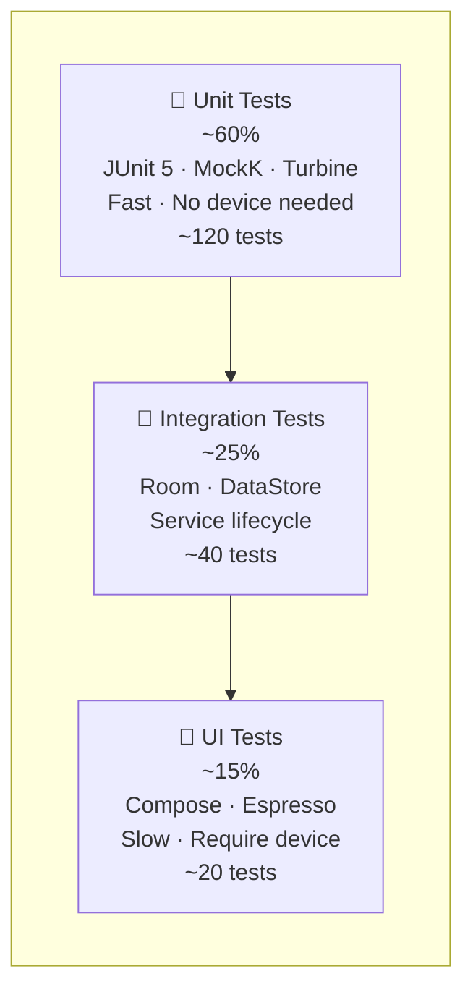

# AutoTrans Android — Testing Strategy

> **Version**: 1.0 | **Last updated**: 2026-06-29
> **Prerequisite**: Read [ARCHITECTURE.md](architecture/ARCHITECTURE.md) first.
> Fake implementations referenced here live in `:core:testing`.

---

## Table of Contents

1. [Testing Philosophy](#1-testing-philosophy)
2. [Test Pyramid](#2-test-pyramid)
3. [Module Test Matrix](#3-module-test-matrix)
4. [Unit Tests](#4-unit-tests)
   - [Domain — Use Cases](#41-domain--use-cases)
   - [Domain — Models](#42-domain--models)
   - [ViewModels](#43-viewmodels)
   - [Repository Implementations](#44-repository-implementations)
   - [Pipeline](#45-pipeline)
5. [Integration Tests](#5-integration-tests)
6. [UI Tests](#6-ui-tests)
7. [Fake Implementations](#7-fake-implementations)
8. [Test Fixtures & Builders](#8-test-fixtures--builders)
9. [Coverage Targets](#9-coverage-targets)
10. [Test Conventions](#10-test-conventions)
11. [Running Tests](#11-running-tests)

---

## 1. Testing Philosophy

**Two rules**:

1. **Test behavior, not implementation** — tests assert *what* a component does, not *how* it does it internally. Refactoring must not break tests unless behavior changes.
2. **Fast feedback loop** — unit tests run in < 5 seconds total. If a test requires an emulator, it belongs in integration or UI tests.

**What we test**:
- All use cases in `:domain` — 100% of public API
- All `Result.failure` paths — error handling is critical to UX
- All pipeline state transitions
- All ViewModel state emissions

**What we do not test**:
- Android framework internals (e.g., `WindowManager` behavior)
- Third-party library internals (ML Kit, Room DAO generated code)
- One-liner Kotlin extension functions with no branching logic

---

## 2. Test Pyramid



| Layer | Framework | Runs on | Target count | Speed |
|-------|-----------|---------|-------------|-------|
| Unit | JUnit 5 + MockK + Turbine | JVM | ~120 | < 5s total |
| Integration | JUnit 4 + Robolectric / Room test | JVM + Robolectric | ~40 | < 30s |
| UI | Compose Test + Espresso | Device / Emulator | ~20 | < 5 min |

---

## 3. Module Test Matrix

| Module | Unit | Integration | UI | Fakes needed |
|--------|------|-------------|-----|--------------|
| `:domain` | ✅ High priority | ❌ | ❌ | All 4 repo fakes |
| `:data` | ✅ Mappers only | ✅ Room in-memory | ❌ | — |
| `:feature:capture` | ✅ ImageStore | ✅ VirtualDisplay mock | ❌ | `FakeCaptureRepository` |
| `:feature:ocr` | ✅ Engine provider | ✅ ML Kit integration | ❌ | `FakeOcrRepository`, `FakeMlKitOcrEngine` |
| `:feature:translator` | ✅ Cache, engine provider | ✅ ML Kit integration | ❌ | `FakeTranslationRepository` |
| `:feature:overlay` | ✅ Pipeline logic | ✅ Service binding | ✅ Overlay render | All fakes |
| `:feature:settings` | ✅ ViewModel | ❌ | ✅ Settings screen | `FakeSettingsRepository` |
| `:app` | ✅ ViewModel | ❌ | ✅ Navigation | All fakes |
| `:core:common` | ✅ RetryPolicy, extensions | ❌ | ❌ | — |

---

## 4. Unit Tests

### 4.1 Domain — Use Cases

Domain use cases have **zero Android dependencies** — they test purely on JVM with JUnit 5.

#### `TranslateScreenUseCaseTest`

```kotlin
// domain/src/test/kotlin/usecase/TranslateScreenUseCaseTest.kt

@ExtendWith(CoroutinesExtension::class)
class TranslateScreenUseCaseTest {

    private val captureRepo     = FakeCaptureRepository()
    private val ocrRepo         = FakeOcrRepository()
    private val translationRepo = FakeTranslationRepository()

    private val useCase = TranslateScreenUseCase(captureRepo, ocrRepo, translationRepo)

    @Test
    fun `returns translation result on happy path`() = runTest {
        // Given
        captureRepo.nextResult  = Result.success(ImageData("img-1"))
        ocrRepo.nextResult      = Result.success(OcrResultBuilder.default())
        translationRepo.nextResult = Result.success(TranslationResultBuilder.default())

        // When
        val result = useCase(LanguagePair(Language.Auto, Language.Specific("vi")))

        // Then
        assertThat(result.isSuccess).isTrue()
        assertThat(result.getOrThrow().translatedText).isEqualTo("Xin chào")
    }

    @Test
    fun `returns failure when capture fails`() = runTest {
        captureRepo.nextResult = Result.failure(RuntimeException("capture error"))

        val result = useCase(LanguagePair(Language.Auto, Language.Specific("vi")))

        assertThat(result.isFailure).isTrue()
        // OCR and translate must NOT be called
        assertThat(ocrRepo.callCount).isEqualTo(0)
        assertThat(translationRepo.callCount).isEqualTo(0)
    }

    @Test
    fun `returns failure when OCR produces blank text`() = runTest {
        captureRepo.nextResult  = Result.success(ImageData("img-1"))
        ocrRepo.nextResult      = Result.success(OcrResultBuilder.blank())

        val result = useCase(LanguagePair(Language.Auto, Language.Specific("vi")))

        // Blank text → no translation → should fail or return empty
        assertThat(translationRepo.callCount).isEqualTo(0)
    }

    @Test
    fun `returns failure when translation fails`() = runTest {
        captureRepo.nextResult     = Result.success(ImageData("img-1"))
        ocrRepo.nextResult         = Result.success(OcrResultBuilder.default())
        translationRepo.nextResult = Result.failure(RuntimeException("network error"))

        val result = useCase(LanguagePair(Language.Auto, Language.Specific("vi")))

        assertThat(result.isFailure).isTrue()
    }
}
```

#### `StartContinuousTranslationUseCaseTest`

```kotlin
@ExtendWith(CoroutinesExtension::class)
class StartContinuousTranslationUseCaseTest {

    private val captureRepo     = FakeCaptureRepository()
    private val ocrRepo         = FakeOcrRepository()
    private val translationRepo = FakeTranslationRepository()
    private val useCase = StartContinuousTranslationUseCase(captureRepo, ocrRepo, translationRepo)

    @Test
    fun `emits success states for each valid frame`() = runTest {
        captureRepo.frames = listOf(
            Result.success(ImageData("frame-1")),
            Result.success(ImageData("frame-2"))
        )
        ocrRepo.nextResult         = Result.success(OcrResultBuilder.default())
        translationRepo.nextResult = Result.success(TranslationResultBuilder.default())

        val states = mutableListOf<PipelineState>()
        val job = launch { useCase(this).collect { states.add(it) } }
        advanceUntilIdle()
        job.cancel()

        assertThat(states).contains(PipelineState.Success(TranslationResultBuilder.default()))
    }

    @Test
    fun `skips translation when OCR text is blank`() = runTest {
        captureRepo.frames = listOf(Result.success(ImageData("frame-1")))
        ocrRepo.nextResult = Result.success(OcrResultBuilder.blank())

        val states = mutableListOf<PipelineState>()
        val job = launch { useCase(this).collect { states.add(it) } }
        advanceUntilIdle()
        job.cancel()

        assertThat(translationRepo.callCount).isEqualTo(0)
    }
}
```

---

### 4.2 Domain — Models

```kotlin
// domain/src/test/kotlin/model/LanguageTest.kt
class LanguageTest {

    @Test
    fun `Auto has code 'auto'`() {
        assertThat(Language.Auto.code).isEqualTo("auto")
    }

    @Test
    fun `Specific derives displayName from Locale`() {
        val lang = Language.Specific("vi")
        assertThat(lang.displayName).isNotBlank()
    }

    @Test
    fun `two Specific instances with same code are equal`() {
        assertThat(Language.Specific("en")).isEqualTo(Language.Specific("en"))
    }
}

// domain/src/test/kotlin/model/BoundingBoxTest.kt
class BoundingBoxTest {

    @Test
    fun `width and height are derived correctly`() {
        val box = BoundingBox(left = 0.1f, top = 0.2f, right = 0.5f, bottom = 0.8f)
        assertThat(box.width).isWithin(0.001f).of(0.4f)
        assertThat(box.height).isWithin(0.001f).of(0.6f)
    }

    @Test
    fun `normalized coordinates stay within 0 to 1`() {
        val box = BoundingBox(0f, 0f, 1f, 1f)
        assertThat(box.left).isAtLeast(0f)
        assertThat(box.right).isAtMost(1f)
    }
}
```

---

### 4.3 ViewModels

ViewModels depend on use cases — inject fakes via constructor.

```kotlin
// app/src/test/kotlin/MainViewModelTest.kt
@ExtendWith(CoroutinesExtension::class)
class MainViewModelTest {

    private val translateUseCase = FakeTranslateScreenUseCase()
    private val getSettingsUseCase = FakeGetSettingsUseCase()
    private lateinit var viewModel: MainViewModel

    @BeforeEach
    fun setup() {
        viewModel = MainViewModel(translateUseCase, getSettingsUseCase)
    }

    @Test
    fun `initial state is Loading`() = runTest {
        viewModel.uiState.test {
            assertThat(awaitItem()).isInstanceOf(AppUiState.Loading::class.java)
        }
    }

    @Test
    fun `transitions to Ready when settings load and permissions granted`() = runTest {
        getSettingsUseCase.emit(AppSettingsBuilder.default())

        viewModel.uiState.test {
            skipItems(1)  // Loading
            assertThat(awaitItem()).isInstanceOf(AppUiState.Ready::class.java)
        }
    }

    @Test
    fun `transitions to Translating on translate click`() = runTest {
        getSettingsUseCase.emit(AppSettingsBuilder.default())
        translateUseCase.nextResult = Result.success(TranslationResultBuilder.default())

        viewModel.onTranslateClicked()

        viewModel.uiState.test {
            assertThat(items()).anyMatch { it is AppUiState.Translating }
        }
    }
}
```

---

### 4.4 Repository Implementations

Test repository implementations with fake engines — not ML Kit itself.

```kotlin
// feature/translator/src/test/kotlin/TranslationRepositoryImplTest.kt
@ExtendWith(CoroutinesExtension::class)
class TranslationRepositoryImplTest {

    private val fakeEngine = FakeMlKitTranslationEngine()
    private val cache      = TranslationCache()
    private val repo       = TranslationRepositoryImpl(
        engineProvider = FakeTranslationEngineProvider(fakeEngine),
        cache = cache
    )

    @Test
    fun `returns cached result on second call with same text`() = runTest {
        val request = TranslationRequestBuilder.default()
        fakeEngine.nextResult = Result.success(TranslationResultBuilder.default())

        repo.translate(request.text, request.from, request.to)
        repo.translate(request.text, request.from, request.to)

        // Engine called only once — second call uses cache
        assertThat(fakeEngine.callCount).isEqualTo(1)
    }

    @Test
    fun `evicts cache on language change`() = runTest {
        val request = TranslationRequestBuilder.default()
        fakeEngine.nextResult = Result.success(TranslationResultBuilder.default())

        repo.translate(request.text, request.from, request.to)
        cache.evict()
        repo.translate(request.text, request.from, request.to)

        assertThat(fakeEngine.callCount).isEqualTo(2)
    }

    @Test
    fun `propagates engine failure as Result failure`() = runTest {
        fakeEngine.shouldFail = true
        val result = repo.translate("hello", Language.Auto, Language.Specific("vi"))
        assertThat(result.isFailure).isTrue()
    }
}
```

---

### 4.5 Pipeline

Pipeline tests use `kotlinx-coroutines-test` and `Turbine` for Flow assertions.

```kotlin
// feature/overlay/src/test/kotlin/TranslationPipelineImplTest.kt
@ExtendWith(CoroutinesExtension::class)
class TranslationPipelineImplTest {

    private val captureRepo     = FakeCaptureRepository()
    private val ocrRepo         = FakeOcrRepository()
    private val translationRepo = FakeTranslationRepository()
    private val settingsRepo    = FakeSettingsRepository()
    private val dispatchers     = TestAppDispatchers()

    private val pipeline = TranslationPipelineImpl(
        captureRepo, ocrRepo, translationRepo, settingsRepo, dispatchers
    )

    @Test
    fun `initial state is Idle`() = runTest {
        pipeline.state.test {
            assertThat(awaitItem()).isEqualTo(PipelineState.Idle)
            cancelAndIgnoreRemainingEvents()
        }
    }

    @Test
    fun `transitions through Capturing → Processing → Success`() = runTest {
        captureRepo.frames         = listOf(Result.success(ImageData("f1")))
        ocrRepo.nextResult         = Result.success(OcrResultBuilder.default())
        translationRepo.nextResult = Result.success(TranslationResultBuilder.default())

        pipeline.state.test {
            pipeline.start(this@runTest)

            assertThat(awaitItem()).isEqualTo(PipelineState.Idle)
            assertThat(awaitItem()).isEqualTo(PipelineState.Capturing)
            assertThat(awaitItem()).isInstanceOf(PipelineState.Processing::class.java)
            assertThat(awaitItem()).isInstanceOf(PipelineState.Success::class.java)

            cancelAndIgnoreRemainingEvents()
        }
    }

    @Test
    fun `emits non-fatal Error and continues on OCR failure`() = runTest {
        captureRepo.frames = listOf(
            Result.success(ImageData("f1")),
            Result.success(ImageData("f2"))
        )
        ocrRepo.resultsQueue = ArrayDeque(listOf(
            Result.failure(RuntimeException("OCR failed")),
            Result.success(OcrResultBuilder.default())
        ))
        translationRepo.nextResult = Result.success(TranslationResultBuilder.default())

        pipeline.state.test {
            pipeline.start(this@runTest)
            advanceUntilIdle()

            val allStates = cancelAndConsumeRemainingEvents()
                .filterIsInstance<Event.Item<PipelineState>>()
                .map { it.value }

            // Error state emitted for frame 1
            assertThat(allStates).anyMatch { it is PipelineState.Error }
            // Success state emitted for frame 2 — pipeline continued
            assertThat(allStates).anyMatch { it is PipelineState.Success }
        }
    }

    @Test
    fun `stop() transitions back to Idle`() = runTest {
        captureRepo.frames = listOf(Result.success(ImageData("f1")))

        pipeline.state.test {
            pipeline.start(this@runTest)
            advanceTimeBy(100)
            pipeline.stop()

            val states = cancelAndConsumeRemainingEvents()
                .filterIsInstance<Event.Item<PipelineState>>()
                .map { it.value }

            assertThat(states.last()).isEqualTo(PipelineState.Idle)
        }
    }
}
```

---

## 5. Integration Tests

Integration tests verify real component interactions — with real Room, real DataStore, and real coroutine timing. They run on JVM via Robolectric or use in-memory databases.

### Room — `TranslationHistoryRepositoryImplTest`

```kotlin
// data/src/test/kotlin/TranslationHistoryRepositoryImplTest.kt
@RunWith(RobolectricTestRunner::class)
class TranslationHistoryRepositoryImplTest {

    private lateinit var db: AutoTransDatabase
    private lateinit var repo: TranslationHistoryRepositoryImpl

    @Before
    fun setup() {
        val context = ApplicationProvider.getApplicationContext<Context>()
        db = Room.inMemoryDatabaseBuilder(context, AutoTransDatabase::class.java)
            .allowMainThreadQueries()
            .build()
        repo = TranslationHistoryRepositoryImpl(db.historyDao())
    }

    @After
    fun teardown() = db.close()

    @Test
    fun `saved item appears in history`() = runTest {
        val item = TranslationHistoryItemBuilder.default()
        repo.save(item)

        repo.getHistory(limit = 10).test {
            assertThat(awaitItem()).hasSize(1)
            cancelAndIgnoreRemainingEvents()
        }
    }

    @Test
    fun `toggleFavorite flips the isFavorite flag`() = runTest {
        val item = TranslationHistoryItemBuilder.default().copy(isFavorite = false)
        repo.save(item)
        val savedId = repo.getHistory(10).first().first().id

        repo.toggleFavorite(savedId)

        repo.getHistory(10).test {
            assertThat(awaitItem().first().isFavorite).isTrue()
            cancelAndIgnoreRemainingEvents()
        }
    }
}
```

### DataStore — `AppSettingsDataStoreTest`

```kotlin
@RunWith(RobolectricTestRunner::class)
class AppSettingsDataStoreTest {

    private lateinit var dataStore: DataStore<Preferences>
    private lateinit var settingsRepo: AppSettingsDataStore

    @Before
    fun setup() {
        val context = ApplicationProvider.getApplicationContext<Context>()
        dataStore = PreferenceDataStoreFactory.create(
            scope = CoroutineScope(UnconfinedTestDispatcher()),
            produceFile = { context.preferencesDataStoreFile("test_settings") }
        )
        settingsRepo = AppSettingsDataStore(dataStore)
    }

    @Test
    fun `default settings are emitted on first read`() = runTest {
        settingsRepo.settings.test {
            val settings = awaitItem()
            assertThat(settings.targetLanguage).isEqualTo(Language.Specific("vi"))
            cancelAndIgnoreRemainingEvents()
        }
    }

    @Test
    fun `updated settings are emitted downstream`() = runTest {
        val updated = AppSettings(targetLanguage = Language.Specific("ja"))
        settingsRepo.updateSettings(updated)

        settingsRepo.settings.test {
            skipItems(1)  // initial default
            assertThat(awaitItem().targetLanguage).isEqualTo(Language.Specific("ja"))
            cancelAndIgnoreRemainingEvents()
        }
    }
}
```

---

## 6. UI Tests

UI tests run on a device or emulator. They test user-visible behavior end-to-end.

### Settings Screen

```kotlin
// feature/settings/src/androidTest/kotlin/SettingsScreenTest.kt
@HiltAndroidTest
class SettingsScreenTest {

    @get:Rule(order = 0) val hiltRule = HiltAndroidRule(this)
    @get:Rule(order = 1) val composeRule = createAndroidComposeRule<SettingsActivity>()

    @Inject lateinit var fakeSettingsRepo: FakeSettingsRepository

    @Before
    fun setup() = hiltRule.inject()

    @Test
    fun `target language chip updates when selection changes`() {
        composeRule.onNodeWithTag("language_picker").performClick()
        composeRule.onNodeWithText("Japanese").performClick()

        composeRule.onNodeWithTag("target_language_chip")
            .assertTextContains("JA")
    }

    @Test
    fun `auto-translate toggle persists setting`() {
        composeRule.onNodeWithTag("auto_translate_toggle").performClick()

        runBlocking {
            val settings = fakeSettingsRepo.settings.first()
            assertThat(settings.autoTranslate).isTrue()
        }
    }
}
```

### Overlay render — Compose test

```kotlin
// feature/overlay/src/androidTest/kotlin/OverlayContentTest.kt
class OverlayContentTest {

    @get:Rule val composeRule = createComposeRule()

    @Test
    fun `translated text is displayed for each block`() {
        val content = OverlayContent(
            blocks = listOf(
                OverlayBlock(
                    originalText    = "Hello",
                    translatedText  = "Xin chào",
                    position        = BoundingBox(0f, 0f, 0.5f, 0.1f),
                    fontSize        = 14f
                )
            ),
            screenWidth  = 1080,
            screenHeight = 1920
        )

        composeRule.setContent { OverlayComposeContent(content = content) }

        composeRule.onNodeWithText("Xin chào").assertIsDisplayed()
    }

    @Test
    fun `empty content shows no text`() {
        composeRule.setContent {
            OverlayComposeContent(content = OverlayContent(emptyList(), 1080, 1920))
        }
        composeRule.onNodeWithTag("overlay_block").assertDoesNotExist()
    }
}
```

---

## 7. Fake Implementations

All fakes live in `:core:testing`. They are **real implementations** (not mocks) with configurable behavior.

### `FakeCaptureRepository`

```kotlin
// core/testing/src/main/kotlin/fake/FakeCaptureRepository.kt
class FakeCaptureRepository : CaptureRepository {
    var frames: List<Result<ImageData>> = emptyList()
    var shouldFailPermission = false
    private var frameIndex = 0
    private val _isCapturing = MutableStateFlow(false)
    override val isCapturing: StateFlow<Boolean> = _isCapturing

    override suspend fun captureScreen(): Result<ImageData> =
        frames.getOrElse(0) { Result.failure(RuntimeException("No frame configured")) }

    override fun startContinuousCapture(intervalMs: Long): Flow<Result<ImageData>> = flow {
        _isCapturing.value = true
        frames.forEach { emit(it) }
        _isCapturing.value = false
    }

    override fun stopCapture() { _isCapturing.value = false }

    override suspend fun requestPermission(): Result<Unit> =
        if (shouldFailPermission) Result.failure(SecurityException("denied"))
        else Result.success(Unit)

    override fun releaseResources() { frames = emptyList() }
}
```

### `FakeOcrRepository`

```kotlin
class FakeOcrRepository : OcrRepository {
    var nextResult: Result<OcrResult> = Result.success(OcrResultBuilder.default())
    var resultsQueue: ArrayDeque<Result<OcrResult>> = ArrayDeque()
    var callCount = 0

    override suspend fun recognizeText(imageData: ImageData): Result<OcrResult> {
        callCount++
        return resultsQueue.removeFirstOrNull() ?: nextResult
    }

    override suspend fun recognizeInRegion(
        imageData: ImageData,
        region: BoundingBox
    ): Result<OcrResult> = recognizeText(imageData)
}
```

### `FakeTranslationRepository`

```kotlin
class FakeTranslationRepository : TranslationRepository {
    var nextResult: Result<TranslationResult> = Result.success(TranslationResultBuilder.default())
    var callCount = 0
    var lastRequest: TranslationRequest? = null

    override suspend fun translate(
        text: String,
        from: Language,
        to: Language
    ): Result<TranslationResult> {
        callCount++
        lastRequest = TranslationRequest(text, from, to)
        return nextResult
    }

    override suspend fun detectLanguage(text: String): Result<Language> =
        Result.success(Language.Specific("en"))
}
```

### `FakeSettingsRepository`

```kotlin
class FakeSettingsRepository : SettingsRepository {
    private val _settings = MutableStateFlow(AppSettings())
    override val settings: Flow<AppSettings> = _settings

    fun emit(settings: AppSettings) { _settings.value = settings }

    override suspend fun updateSettings(settings: AppSettings) {
        _settings.value = settings
    }
}
```

### `TestAppDispatchers`

```kotlin
// core/testing/src/main/kotlin/TestAppDispatchers.kt
class TestAppDispatchers(
    testDispatcher: TestCoroutineDispatcher = UnconfinedTestDispatcher()
) : AppDispatchers(
    default = testDispatcher,
    io      = testDispatcher,
    main    = testDispatcher
)
```

### `CoroutinesExtension` (JUnit 5)

```kotlin
// core/testing/src/main/kotlin/CoroutinesExtension.kt
class CoroutinesExtension : BeforeEachCallback, AfterEachCallback {
    val testDispatcher = UnconfinedTestDispatcher()

    override fun beforeEach(context: ExtensionContext) {
        Dispatchers.setMain(testDispatcher)
    }

    override fun afterEach(context: ExtensionContext) {
        Dispatchers.resetMain()
    }
}
```

---

## 8. Test Fixtures & Builders

Builders produce valid domain objects for tests. They should have sensible defaults and be easy to customize.

```kotlin
// core/testing/src/main/kotlin/builder/OcrResultBuilder.kt
object OcrResultBuilder {
    fun default() = OcrResult(
        blocks    = listOf(
            OcrBlock("Hello world", BoundingBox(0f, 0f, 0.5f, 0.1f), confidence = 0.95f)
        ),
        fullText  = "Hello world",
        timestamp = 1_000_000L
    )

    fun blank() = OcrResult(blocks = emptyList(), fullText = "", timestamp = 0L)

    fun withText(text: String) = default().copy(
        blocks   = listOf(OcrBlock(text, BoundingBox(0f, 0f, 1f, 0.1f), 0.9f)),
        fullText = text
    )
}

// core/testing/src/main/kotlin/builder/TranslationResultBuilder.kt
object TranslationResultBuilder {
    fun default() = TranslationResult(
        originalText   = "Hello world",
        translatedText = "Xin chào thế giới",
        sourceLanguage = "en",
        targetLanguage = "vi"
    )

    fun withTranslation(original: String, translated: String) = default().copy(
        originalText   = original,
        translatedText = translated
    )
}

// core/testing/src/main/kotlin/builder/AppSettingsBuilder.kt
object AppSettingsBuilder {
    fun default() = AppSettings(
        sourceLanguage  = Language.Auto,
        targetLanguage  = Language.Specific("vi"),
        captureIntervalMs = 1_000L,
        autoTranslate   = false
    )
}
```

---

## 9. Coverage Targets

Coverage is measured with **JaCoCo** and enforced in CI.

```kotlin
// root build.gradle.kts — JaCoCo threshold
tasks.withType<JacocoReport> {
    violationRules {
        rule {
            limit { minimum = "0.70".toBigDecimal() }  // global 70% floor
        }
    }
}
```

### Per-layer targets

| Layer | Line coverage | Branch coverage | Notes |
|-------|-------------|----------------|-------|
| `:domain` use cases | **90%** | 85% | All error paths must be tested |
| `:domain` models | 80% | 70% | Focus on derived fields |
| ViewModels | **80%** | 75% | All UI state transitions |
| Repository implementations | **70%** | 65% | Cache, error paths |
| Pipeline | **85%** | 80% | All state transitions |
| Feature modules (engine impls) | 50% | 40% | ML Kit bridge is hard to unit-test |
| UI (Compose) | 40% | — | Snapshot + UI tests |
| `:core:common` | 70% | 60% | RetryPolicy, extensions |

### Coverage report command

```bash
./gradlew koverHtmlReport   # or jacocoTestReport
# Output: build/reports/kover/html/index.html
```

---

## 10. Test Conventions

### Naming — `subject_condition_expectation`

```kotlin
// ✅ Clear
fun `returns failure when capture fails`()
fun `emits Success state after valid frame processed`()
fun `cache returns stored result on second call with same text`()

// ❌ Vague
fun `test translate`()
fun `error case`()
```

### Structure — Given / When / Then

```kotlin
@Test
fun `returns failure when OCR produces blank text`() = runTest {
    // Given
    captureRepo.nextResult = Result.success(ImageData("img-1"))
    ocrRepo.nextResult     = Result.success(OcrResultBuilder.blank())

    // When
    val result = useCase(LanguagePair(Language.Auto, Language.Specific("vi")))

    // Then
    assertThat(translationRepo.callCount).isEqualTo(0)
    assertThat(result.isFailure).isTrue()
}
```

### Never use `Thread.sleep()` in tests

```kotlin
// ❌ Flaky — timing-dependent
Thread.sleep(1000)
assertThat(pipeline.state.value).isEqualTo(PipelineState.Success(...))

// ✅ Use advanceUntilIdle() from coroutines-test
advanceUntilIdle()
assertThat(pipeline.state.value).isEqualTo(PipelineState.Success(...))
```

### Test tags for UI tests

Every interactive Compose element must have a `testTag`:

```kotlin
// ✅
Button(
    onClick = { },
    modifier = Modifier.testTag("translate_button")
) { Text("Translate") }

// ❌ — untestable
Button(onClick = { }) { Text("Translate") }
```

---

## 11. Running Tests

```bash
# All unit tests (fast — JVM only)
./gradlew test

# Single module
./gradlew :domain:test
./gradlew :feature:overlay:test

# Integration tests (Robolectric)
./gradlew testDebugUnitTest

# Instrumented UI tests (requires device/emulator)
./gradlew connectedAndroidTest

# Coverage report
./gradlew koverHtmlReport

# All checks (CI equivalent)
./gradlew ktlintCheck detekt test
```

### CI test gates

| Gate | Command | Blocks merge? |
|------|---------|--------------|
| Lint + ktlint + detekt | `./gradlew ktlintCheck detekt lint` | ✅ Yes |
| Unit tests | `./gradlew test` | ✅ Yes |
| Coverage threshold | JaCoCo/Kover minimum | ✅ Yes |
| UI tests | `./gradlew connectedAndroidTest` | ⬜ Milestone 4+ |

---

*For which error paths to cover in tests, see [ERROR_HANDLING.md](ERROR_HANDLING.md).*
*For performance benchmarks (not unit tests), see [PERFORMANCE.md](PERFORMANCE.md) §8.*
*For CI workflow details, see [CONTRIBUTOR_GUIDE.md](CONTRIBUTOR_GUIDE.md).*
