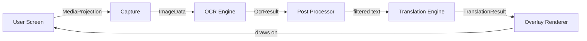
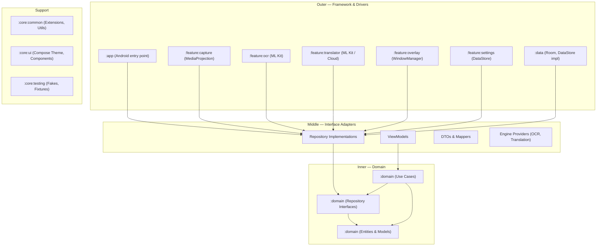
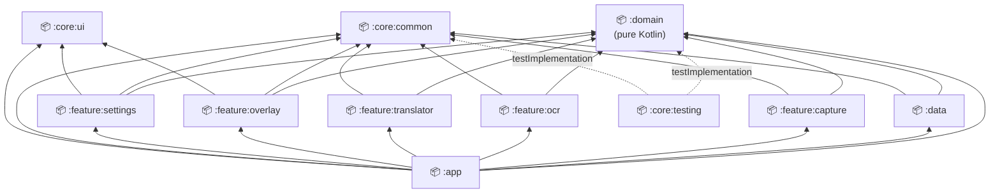
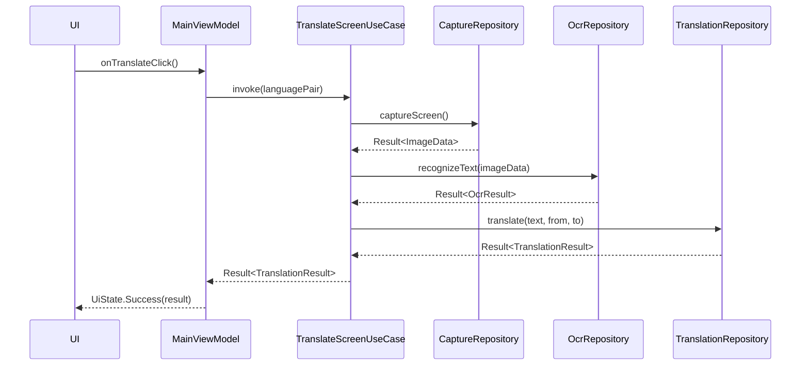
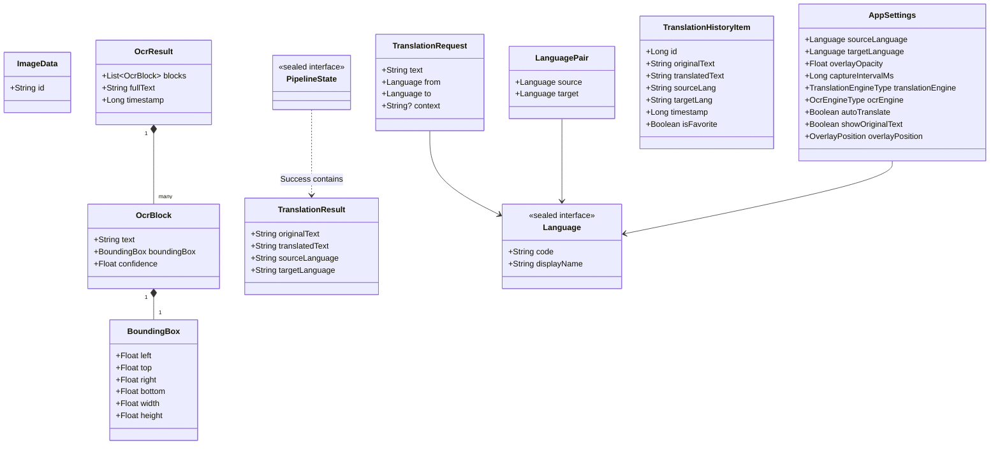

# AutoTrans Android — Architecture

> **Version**: 1.0 | **Last updated**: 2026-06-29
> **Source of truth**: This document reflects the [Implementation Plan](../../implementation_plan.md).
> For pipeline-specific details, see [PIPELINE.md](PIPELINE.md).

---

## Table of Contents

1. [System Overview](#1-system-overview)
2. [Clean Architecture Layers](#2-clean-architecture-layers)
3. [Module Structure](#3-module-structure)
4. [Dependency Graph](#4-dependency-graph)
5. [Dependency Rules](#5-dependency-rules)
6. [Data Flow](#6-data-flow)
7. [Module Responsibilities](#7-module-responsibilities)
8. [Domain Layer Detail](#8-domain-layer-detail)
9. [Key Design Decisions](#9-key-design-decisions)
10. [Architecture Decision Records](#10-architecture-decision-records)

---

## 1. System Overview

AutoTrans is a real-time Android screen translator. When the overlay is active, the app continuously:

1. Captures the screen via **MediaProjection**
2. Extracts text via an **OCR engine** (ML Kit by default)
3. Translates the text via a **Translation engine** (ML Kit by default)
4. Renders the translation in a **floating overlay** on top of all apps



**Core constraint**: The entire pipeline runs inside a **Foreground Service** so the overlay persists when the host app is backgrounded.

---

## 2. Clean Architecture Layers

AutoTrans follows Clean Architecture with a strict dependency rule: **outer layers depend on inner layers, never the reverse**.



### Layer Summary

| Layer | Contains | May depend on |
|-------|----------|---------------|
| **Domain** | Entities, Use Cases, Repository interfaces | Nothing (pure Kotlin) |
| **Data** | Repository implementations, DTOs, Mappers | Domain only |
| **Feature** | Engine implementations, ViewModels, UI | Domain, core:common |
| **App** | DI setup, Navigation, MainActivity | All modules |
| **Core** | Shared utilities (no business logic) | Nothing |

---

## 3. Module Structure

```
autotrans-android/
│
├── app/                        # Entry point, DI graph assembly, navigation
│
├── domain/                     # Pure Kotlin — zero Android dependencies
│   └── src/main/kotlin/
│       ├── model/              # Entities: OcrResult, TranslationResult, …
│       ├── repository/         # Repository interfaces
│       ├── usecase/            # Use cases (one class per use case)
│       └── engine/             # OcrEngine, TranslationEngine interfaces
│
├── data/                       # Android-aware repository implementations
│   └── src/main/kotlin/
│       ├── local/
│       │   ├── room/           # Entities, DAOs, Database
│       │   └── datastore/      # Settings DataStore
│       ├── repository/         # Implements domain repository interfaces
│       └── mapper/             # DTO ↔ Domain model mappers
│
├── feature/
│   ├── capture/                # MediaProjection, CaptureRepositoryImpl
│   ├── ocr/                    # ML Kit engine, OcrEngineProvider, OcrRepositoryImpl
│   ├── translator/             # ML Kit / Cloud engines, TranslationRepositoryImpl
│   ├── overlay/                # OverlayForegroundService, WindowManager, ComposeView
│   └── settings/               # Settings UI (Compose), LanguageDownloader
│
└── core/
    ├── common/                 # Extensions, constants, Result helpers — no Android UI
    ├── ui/                     # Material3 theme, shared Compose components, icons
    └── testing/                # Fake repos, test fixtures, TestCoroutineRule
```

---

## 4. Dependency Graph



> **Rule**: Arrows point from dependent → dependency.
> `:domain` has no outgoing arrows — it depends on nothing.

---

## 5. Dependency Rules

These rules are **enforced** and must never be violated:

| Rule | Rationale |
|------|-----------|
| `:domain` MUST NOT import any `android.*` class | Domain must be testable with pure JUnit without Android SDK |
| `:domain` MUST NOT import any other project module | Domain is the innermost layer |
| `:core:common` MUST NOT contain business logic | It is a utility layer only |
| `:core:ui` MUST NOT import `:data` or `:feature:*` | UI components are presentational only |
| `:feature:*` modules MUST NOT depend on each other | Features communicate through `:domain` interfaces only |
| `:data` MUST NOT import `:feature:*` | Data is an implementation module, not orchestration |
| All Android-specific types (`Bitmap`, `Context`, `Uri`) MUST stay in `:feature:*` or `:data` | Keeps domain pure and testable |

### The `ImageData` Contract

`Bitmap` is an Android class and must not appear in `:domain`. Instead, we use `ImageData` — an opaque handle:

```kotlin
// domain/model/ImageData.kt — pure Kotlin
@JvmInline
value class ImageData(val id: String)
```

The `:feature:capture` module maintains an in-memory `Map<String, Bitmap>` (the **ImageStore**). When it produces an `ImageData`, it registers the bitmap there. When `:feature:ocr` receives an `ImageData`, it resolves the actual `Bitmap` from its own injected `ImageStore`. This keeps large objects within the feature layer and prevents expensive cross-layer copies.

---

## 6. Data Flow

### Single-shot translation (manual trigger)



### Continuous translation (overlay mode)

See [PIPELINE.md](PIPELINE.md) for the full continuous pipeline with backpressure, cancellation, and caching.

---

## 7. Module Responsibilities

### `:app`
- Application class with `@HiltAndroidApp`
- `MainActivity` — single activity hosting the nav graph
- Hilt DI graph assembly: binds all repository implementations and engine providers
- Navigation between screens

### `:domain`
- **Entities / Models**: All data structures that represent business concepts
- **Repository interfaces**: Contracts that outer layers must implement
- **Engine interfaces**: `OcrEngine`, `TranslationEngine` — pluggable strategy interfaces
- **Use cases**: One class per action, orchestrate repositories
- **Zero Android dependencies** — compiles as a pure JVM library

### `:data`
- Room database: `TranslationHistoryEntity`, `TranslationHistoryDao`, `AutoTransDatabase`
- DataStore: `AppSettingsDataStore` implementing `SettingsRepository`
- `TranslationHistoryRepositoryImpl` — implements `TranslationHistoryRepository`
- DTOs and domain mappers (`TranslationHistoryMapper`, etc.)

### `:feature:capture`
- `CaptureRepositoryImpl` — wraps `MediaProjection` API
- `ImageStore` — in-memory bitmap registry keyed by `ImageData.id`
- `ScreenCaptureService` — manages `VirtualDisplay` lifecycle
- Permission request logic for `MEDIA_PROJECTION`

### `:feature:ocr`
- `OcrEngine` implementations: `MlKitOcrEngine`, *(future: `TesseractOcrEngine`, `PaddleOcrEngine`)*
- `OcrEngineProvider` — selects active engine from `AppSettings`
- `OcrRepositoryImpl` — delegates to `OcrEngineProvider`
- Bitmap-to-domain mapper: `android.graphics.Rect` → `BoundingBox`

### `:feature:translator`
- `TranslationEngine` implementations: `MlKitTranslationEngine`, `GoogleCloudTranslationEngine`, *(future: `DeepLEngine`, `LibreTranslateEngine`)*
- `TranslationEngineProvider` — selects active engine from `AppSettings`
- `TranslationRepositoryImpl` — with LRU cache wrapping engine calls
- `LanguageRepositoryImpl` — ML Kit model download management

### `:feature:overlay`
- `OverlayForegroundService` — Android `Service` that owns the translation pipeline and overlay lifetime
- `OverlayWindowManager` — creates and manages a `WindowManager` window with `TYPE_APPLICATION_OVERLAY`
- `OverlayComposeContent` — Compose UI rendered inside the overlay window
- `TranslationPipelineImpl` — orchestrates the `Capture → OCR → Translate` flow with `conflate` + `mapLatest`

### `:feature:settings`
- Settings screen built with Compose
- Language picker, engine selector, opacity slider, auto-translate toggle
- `SettingsViewModel` backed by `GetSettingsUseCase` / `UpdateSettingsUseCase`

### `:core:common`
- Kotlin extension functions (`String`, `Flow`, `Result`)
- App-wide constants
- `AppDispatchers` — injectable coroutine dispatchers for testability

### `:core:ui`
- Material3 `AutoTransTheme`, `Typography`, `ColorScheme`
- Shared Compose components: `AutoTransButton`, `LanguageChip`, `LoadingIndicator`
- Icons and drawable resources

### `:core:testing`
- `FakeCaptureRepository`, `FakeOcrRepository`, `FakeTranslationRepository`, `FakeSettingsRepository`
- `FakeMlKitOcrEngine`, `FakeMlKitTranslationEngine`
- `TestCoroutineRule` (JUnit 4 Rule wrapping `UnconfinedTestDispatcher`)
- `TranslationResultBuilder`, `OcrResultBuilder` — test data builders

---

## 8. Domain Layer Detail

### Entity Model Map



### Use Case Catalogue

| Use Case | Input | Output | Notes |
|----------|-------|--------|-------|
| `TranslateScreenUseCase` | `LanguagePair` | `Result<TranslationResult>` | Single-shot |
| `StartContinuousTranslationUseCase` | `CoroutineScope` | `Unit` | Starts pipeline |
| `StopContinuousTranslationUseCase` | — | `Unit` | Stops pipeline |
| `GetTranslationHistoryUseCase` | `limit: Int` | `Flow<List<TranslationHistoryItem>>` | |
| `SaveTranslationHistoryUseCase` | `TranslationHistoryItem` | `Result<Unit>` | |
| `ClearTranslationHistoryUseCase` | — | `Result<Unit>` | |
| `ToggleFavoriteUseCase` | `id: Long` | `Result<Unit>` | |
| `GetSettingsUseCase` | — | `Flow<AppSettings>` | |
| `UpdateSettingsUseCase` | `AppSettings` | `Result<Unit>` | |
| `ResetSettingsUseCase` | — | `Result<Unit>` | |
| `GetSupportedLanguagesUseCase` | `TranslationEngineType` | `Result<List<Language>>` | |
| `DetectLanguageUseCase` | `String` | `Result<Language>` | |
| `DownloadLanguageModelUseCase` | `Language` | `Flow<DownloadProgress>` | ML Kit model |
| `ShowOverlayUseCase` | `OverlayContent` | `Result<Unit>` | |
| `HideOverlayUseCase` | — | `Result<Unit>` | |
| `UpdateOverlayPositionUseCase` | `OverlayPosition` | `Result<Unit>` | |

---

## 9. Key Design Decisions

### 9.1 `ImageData` as opaque handle instead of passing `Bitmap`

**Problem**: `Bitmap` is an Android class (violates domain purity) and can be 10–50 MB (copying across layers causes GC pressure).

**Decision**: Use `@JvmInline value class ImageData(val id: String)` in domain. Each feature module that produces or consumes bitmaps resolves the actual `Bitmap` from an injected `ImageStore` using the `id`.

**Trade-off**: Slightly more complex lookup logic. Benefit: domain stays pure, no large object copies.

### 9.2 Plugin pattern for OCR and Translation engines

**Problem**: We want to support multiple OCR and translation backends (ML Kit, Tesseract, Google Cloud, DeepL) and switch between them at runtime without touching the domain layer.

**Decision**: Define `OcrEngine` and `TranslationEngine` interfaces in `:domain`. Multiple implementations live in `:feature:ocr` and `:feature:translator`. An `EngineProvider` class (in each feature module) selects the active implementation based on `AppSettings`.

**Trade-off**: Adds indirection. Benefit: adding a new engine = one new class + one Hilt binding, zero changes to domain or pipeline code.

### 9.3 `sealed interface Language` instead of `sealed class`

**Problem**: The original `sealed class Language` had a primary constructor that `data object Auto` had to supply, causing awkward duplication. `"auto"` is not a valid BCP-47 code.

**Decision**: `sealed interface Language` with `data object Auto` and `@JvmInline value class Specific(override val code: String)`. `displayName` is derived from `Locale(code).displayLanguage` at call time.

**Trade-off**: `Locale` call on each access (negligible). Benefit: correct, zero allocation for `Specific`.

### 9.4 `OverlayForegroundService` owns the pipeline

**Problem**: Coroutine pipelines started in a ViewModel or Activity are cancelled when the user navigates away.

**Decision**: The pipeline lives inside a `ForegroundService`. The service creates its own `CoroutineScope(SupervisorJob() + Dispatchers.Default)` and cancels it in `onDestroy()`. This guarantees overlay continues working when any app is in the foreground.

**Trade-off**: More complex service lifecycle to manage. Benefit: correct behavior for the core use case.

### 9.5 `conflate() + mapLatest` for backpressure

**Problem**: Screen capture emits frames at a fixed interval (e.g., 1 fps). OCR + translation can be slower. Without backpressure handling, a queue of unprocessed frames builds up.

**Decision**: Apply `.conflate()` to drop intermediate frames, then `.mapLatest { }` to cancel any in-progress OCR/translation when a new frame arrives.

**Trade-off**: Some frames are never processed. Benefit: the overlay always shows the translation of the **latest** frame, not a stale one from seconds ago.

---

## 10. Architecture Decision Records

ADRs are stored in [`docs/architecture/decisions/`](decisions/). Each significant architectural decision is recorded as an ADR.

| ADR | Title | Status |
|-----|-------|--------|
| [ADR-001](decisions/ADR-001-multi-module.md) | Multi-module architecture | Accepted |
| [ADR-002](decisions/ADR-002-translation-engine-plugin.md) | Plugin pattern for translation engines | Accepted |
| [ADR-003](decisions/ADR-003-overlay-foreground-service.md) | Foreground Service for overlay | Accepted |

---

*For the full technical pipeline design including concurrency, caching, and retry strategies, see [PIPELINE.md](PIPELINE.md).*
*For sequence diagrams of all major flows, see [SEQUENCE_DIAGRAMS.md](SEQUENCE_DIAGRAMS.md).*
*For contributing guidelines and how to add a new engine, see [CONTRIBUTOR_GUIDE.md](../../CONTRIBUTOR_GUIDE.md).*
