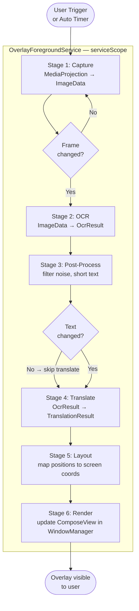
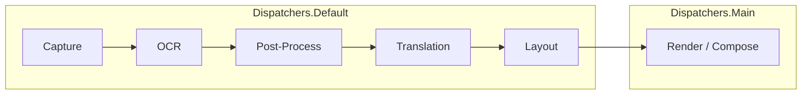
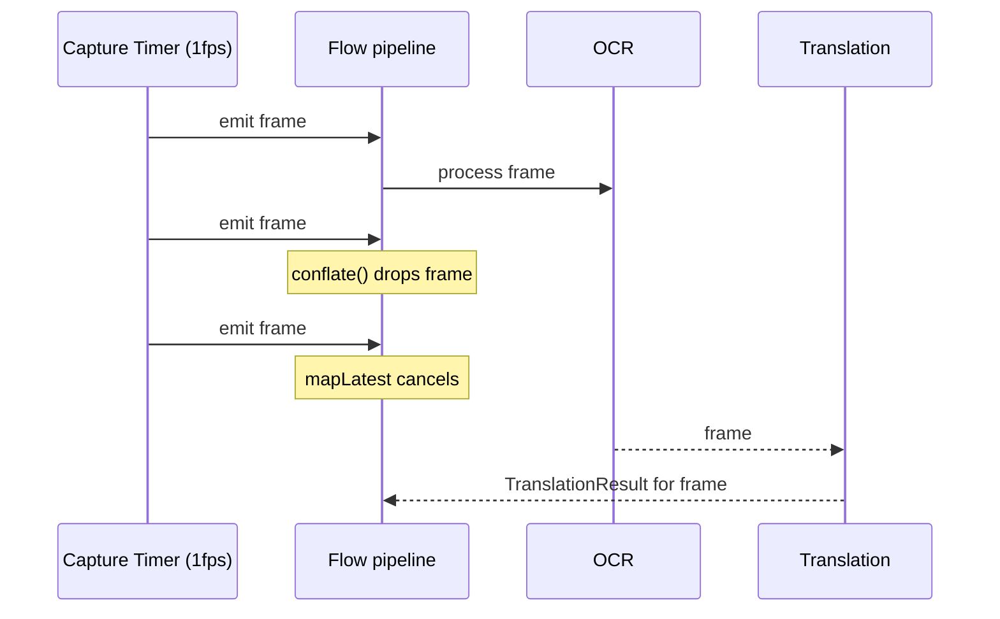

# AutoTrans Android — Translation Pipeline

> **Version**: 1.0 | **Last updated**: 2026-06-29
> **Prerequisite**: Read [ARCHITECTURE.md](ARCHITECTURE.md) first.
> **Concurrency operators** referenced here are covered in the Kotlin Coroutines documentation.

---

## Table of Contents

1. [Pipeline Overview](#1-pipeline-overview)
2. [Stage Breakdown](#2-stage-breakdown)
3. [Concurrency Design](#3-concurrency-design)
4. [Backpressure & Frame Dropping](#4-backpressure--frame-dropping)
5. [Caching Strategy](#5-caching-strategy)
6. [Retry & Error Recovery](#6-retry--error-recovery)
7. [Cancellation Contract](#7-cancellation-contract)
8. [Single-Shot vs Continuous Mode](#8-single-shot-vs-continuous-mode)
9. [Performance Budgets](#9-performance-budgets)
10. [Pipeline Implementation Reference](#10-pipeline-implementation-reference)

---

## 1. Pipeline Overview



### Pipeline States

At any point in time, the pipeline emits a `PipelineState` via `StateFlow`:

```kotlin
sealed interface PipelineState {
    data object Idle       : PipelineState  // not running
    data object Capturing  : PipelineState  // waiting for first frame
    data class  Processing(val stage: PipelineStage) : PipelineState
    data class  Success(val result: TranslationResult) : PipelineState
    data class  Error(val cause: Throwable) : PipelineState
}

enum class PipelineStage { CAPTURE, OCR, POST_PROCESS, TRANSLATE, LAYOUT }
```

---

## 2. Stage Breakdown

### Stage 1 — Capture

**Responsibility**: Produce a new `ImageData` representing the current screen.

**Implementation module**: `:feature:capture`

**Key decisions**:
- `MediaProjection` creates a `VirtualDisplay` that renders into an `ImageReader`
- Each new `Image` is stored in `ImageStore` keyed by a UUID → the UUID becomes `ImageData.id`
- `ImageData` (pure Kotlin value class) is what crosses the module boundary to `:domain`
- The raw `Bitmap` never leaves `:feature:capture`

```
ImageReader.acquireLatestImage()
    → registerBitmap(uuid, bitmap) into ImageStore
    → emit ImageData(uuid) downstream
```

**Output**: `Flow<Result<ImageData>>`

---

### Stage 2 — OCR

**Responsibility**: Extract text blocks from an `ImageData`.

**Implementation module**: `:feature:ocr`

**Key decisions**:
- `OcrRepositoryImpl` resolves `ImageData → Bitmap` via `ImageStore`
- Delegates to the active `OcrEngine` (selected by `OcrEngineProvider` from `AppSettings`)
- Results are mapped from Android types (`android.graphics.Rect`) to domain types (`BoundingBox`)
- ML Kit's `TextRecognizer` is async — bridged with `suspendCoroutine`

```
ImageData
    → ImageStore.resolve(id) → Bitmap
    → OcrEngine.recognize(bitmap)
    → TextRecognizer.process(inputImage)
    → map TextBlock → OcrBlock (Rect → BoundingBox, normalized to 0..1)
    → OcrResult
```

**Output**: `Result<OcrResult>`

---

### Stage 3 — Post-Processing

**Responsibility**: Filter out noise and low-quality OCR output.

**Implementation module**: `:feature:ocr` (or `:core:common`)

**Filtering rules** (applied in order):

| Rule | Threshold | Rationale |
|------|-----------|-----------|
| Minimum confidence | ≥ 0.6 | Discard uncertain OCR blocks |
| Minimum text length | ≥ 2 chars | Skip single characters/symbols |
| Duplicate deduplication | exact match | Skip identical text from overlapping regions |
| Language filter | configurable | Discard blocks in wrong script if source lang is set |

```kotlin
fun OcrResult.postProcess(settings: AppSettings): OcrResult {
    val filtered = blocks
        .filter { it.confidence >= 0.6f }
        .filter { it.text.trim().length >= 2 }
        .distinctBy { it.text.trim() }
    return copy(
        blocks = filtered,
        fullText = filtered.joinToString(" ") { it.text }
    )
}
```

**Output**: `OcrResult` (same type, filtered content)

---

### Stage 4 — Translation

**Responsibility**: Translate the extracted text.

**Implementation module**: `:feature:translator`

**Key decisions**:
- `TranslationRepositoryImpl` checks the LRU cache **before** calling the engine
- Delegates to the active `TranslationEngine` (selected by `TranslationEngineProvider`)
- `TranslationRequest` carries optional `context` (surrounding text) for future accuracy improvements
- On ML Kit: translation is async, bridged with `suspendCoroutine`

```
OcrResult.fullText
    → TranslationCache.get(text, from, to) → cache hit → skip engine
    → TranslationEngine.translate(TranslationRequest)
    → TranslationCache.put(text, from, to, result)
    → TranslationResult
```

**Output**: `Result<TranslationResult>`

---

### Stage 5 — Layout

**Responsibility**: Convert domain-space `BoundingBox` (normalized 0..1) to actual screen pixel positions for overlay rendering.

**Implementation module**: `:feature:overlay`

```kotlin
fun BoundingBox.toScreenRect(screenWidth: Int, screenHeight: Int): Rect {
    return Rect(
        (left * screenWidth).toInt(),
        (top * screenHeight).toInt(),
        (right * screenWidth).toInt(),
        (bottom * screenHeight).toInt()
    )
}
```

**Output**: `OverlayContent` with pixel-precise `OverlayBlock` positions

---

### Stage 6 — Render

**Responsibility**: Update the Compose UI inside the `WindowManager` overlay.

**Implementation module**: `:feature:overlay`

**Key decisions**:
- `OverlayWindowManager` holds a `ComposeView` attached to `WindowManager`
- The `ComposeView` observes `overlayState: StateFlow<OverlayContent>` from `OverlayWindowManager`
- Compose re-composes only the changed blocks (`key()` on block ID)
- Rendering happens on the Main thread (Compose requirement) — all previous stages run on `Dispatchers.Default`

---

## 3. Concurrency Design

### Thread Assignment



### Scope Hierarchy

```
Application
└── OverlayForegroundService
    └── serviceScope = CoroutineScope(SupervisorJob() + Dispatchers.Default)
        ├── pipelineJob      ← the main capture→translate pipeline
        └── overlayJob       ← collects PipelineState and updates UI
```

`SupervisorJob` ensures that if the pipeline coroutine fails, the overlay rendering coroutine is **not** cancelled (and vice versa).

### CoroutineDispatcher injection

All dispatchers are injected via Hilt so tests can substitute `UnconfinedTestDispatcher`:

```kotlin
// core:common — AppDispatchers.kt
data class AppDispatchers(
    val default: CoroutineDispatcher = Dispatchers.Default,
    val io: CoroutineDispatcher = Dispatchers.IO,
    val main: CoroutineDispatcher = Dispatchers.Main
)

// In Hilt module
@Provides @Singleton
fun provideAppDispatchers(): AppDispatchers = AppDispatchers()
```

---

## 4. Backpressure & Frame Dropping

This is the most critical concurrency concern. OCR + translation is **slower** than the capture interval, so we must drop frames intentionally.



### Operators applied (in order)

```kotlin
captureRepo.startContinuousCapture(intervalMs = settings.captureIntervalMs)
    .conflate()          // (1) drop buffered frames — keep only latest unprocessed
    .mapLatest { frame → // (2) cancel previous in-flight OCR+translate if new frame arrives
        processFrame(frame)
    }
    .distinctUntilChanged { a, b ->  // (3) suppress re-render if result is identical
        a is PipelineState.Success &&
        b is PipelineState.Success &&
        a.result.translatedText == b.result.translatedText
    }
    .collect { state -> _pipelineState.value = state }
```

| Operator | Effect | Why |
|----------|--------|-----|
| `conflate()` | Drop buffered frames while processing | Prevents growing queue of stale work |
| `mapLatest` | Cancel in-flight processing on new frame | Always shows translation of newest frame |
| `distinctUntilChanged` | Skip overlay update if text unchanged | Reduces unnecessary Compose recompositions |

### Adaptive capture interval

As a future optimization, the capture interval can adapt to observed pipeline latency:

```kotlin
// Pseudo-code — implement in Milestone 5+
val adaptiveInterval = observedLatency * 1.2   // capture at 80% of processing capacity
```

---

## 5. Caching Strategy

### Translation LRU Cache

Location: `:feature:translator` (in `TranslationRepositoryImpl`)

```kotlin
class TranslationCache @Inject constructor() {
    // 100 entries ≈ ~50 KB for typical short strings
    private val cache = LruCache<String, TranslationResult>(maxSize = 100)

    private fun key(text: String, from: Language, to: Language) =
        "${from.code}:${to.code}:${text.trim().lowercase()}"

    fun get(text: String, from: Language, to: Language): TranslationResult? =
        cache.get(key(text, from, to))

    fun put(text: String, from: Language, to: Language, result: TranslationResult) =
        cache.put(key(text, from, to), result)

    fun evict() = cache.evictAll()
}
```

**Cache hit path** (no engine call):

```
text + language pair → cache key → LruCache.get() → TranslationResult (< 1ms)
```

**Cache miss path** (engine called):

```
text + language pair → cache miss → TranslationEngine.translate() → put into cache → return
```

### OCR Deduplication

If the screen has not changed significantly (same `ImageData` hash), skip OCR entirely.

```kotlin
// In pipeline — compare hash of last processed frame
private var lastImageHash: Int = 0

fun shouldSkipOcr(imageData: ImageData): Boolean {
    val hash = imageData.id.hashCode()   // or perceptual hash of bitmap content
    return hash == lastImageHash
}
```

> For Milestone 2: use simple `ImageData.id` comparison (same capture = same ID).
> For Milestone 5+: use perceptual hashing (`pHash`) for content-aware deduplication.

---

## 6. Retry & Error Recovery

Each stage can fail independently. The strategy per stage:

| Stage | Failure | Retry | User Feedback |
|-------|---------|-------|---------------|
| Capture | `SecurityException` (permission revoked) | No retry — stop service | Notification: "Permission revoked" |
| Capture | `IllegalStateException` (VirtualDisplay dead) | 3× with 500ms delay | None (transparent retry) |
| OCR | ML Kit not initialized | Re-initialize once, then fail | None |
| OCR | `Exception` (generic) | 2× with 200ms delay | None |
| Post-process | Never fails (pure function) | N/A | N/A |
| Translation | Network timeout | 3× exponential backoff (1s, 2s, 4s) | Overlay shows "Translation failed" |
| Translation | No network (offline engine) | N/A (offline works) | N/A |
| Translation | Model not downloaded | Fail fast, no retry | Bottom sheet: "Download model?" |
| Layout | Never fails (pure function) | N/A | N/A |
| Render | OOM on ComposeView | Stop service | Notification: "Overlay stopped" |

### Retry implementation

```kotlin
// core:common — RetryPolicy.kt
suspend fun <T> withRetry(
    times: Int,
    initialDelay: Long = 200L,
    factor: Double = 2.0,
    block: suspend () -> Result<T>
): Result<T> {
    var delay = initialDelay
    repeat(times - 1) { attempt ->
        val result = block()
        if (result.isSuccess) return result
        delay(delay)
        delay = (delay * factor).toLong()
    }
    return block()  // final attempt — propagate failure
}

// Usage in TranslationRepositoryImpl
val result = withRetry(times = 3, initialDelay = 1_000L) {
    engine.translate(request)
}
```

---

## 7. Cancellation Contract

Every suspend function in the pipeline must be **cooperative with cancellation**.

### Rules

1. **Never catch `CancellationException`** — or if you must, always rethrow it
2. **Always release resources in `finally`**:

```kotlin
// feature:capture — CaptureRepositoryImpl.kt
override fun startContinuousCapture(intervalMs: Long): Flow<Result<ImageData>> = flow {
    val virtualDisplay = createVirtualDisplay()
    try {
        while (currentCoroutineContext().isActive) {
            emit(captureFrame())
            delay(intervalMs)
        }
    } finally {
        virtualDisplay.release()      // always runs — even on cancellation
        imageReader.close()
    }
}
```

3. **`mapLatest` cancels the lambda** — OCR and translation libraries must support interruption. ML Kit uses `Tasks` API; bridged with `suspendCancellableCoroutine`:

```kotlin
suspend fun TextRecognizer.process(image: InputImage): Text =
    suspendCancellableCoroutine { cont ->
        val task = process(image)
            .addOnSuccessListener { cont.resume(it) }
            .addOnFailureListener { cont.resumeWithException(it) }
        cont.invokeOnCancellation { task.cancel() }
    }
```

4. **Service destruction = scope cancellation**:

```kotlin
class OverlayForegroundService : Service() {
    private val serviceScope = CoroutineScope(SupervisorJob() + Dispatchers.Default)

    override fun onDestroy() {
        serviceScope.cancel("Service destroyed")
        super.onDestroy()
    }
}
```

---

## 8. Single-Shot vs Continuous Mode

The pipeline supports two trigger modes. The same stages run in both; only the trigger mechanism differs.

### Single-Shot (manual)

```
User taps floating button
→ TranslateScreenUseCase.invoke()
→ Capture once → OCR → Translate
→ Show result in bottom sheet or panel
→ Done
```

**Scope**: Tied to the `ViewModel`'s `viewModelScope`. Cancelled if ViewModel is cleared.

### Continuous (auto-translate)

```
User enables auto-translate in settings
→ OverlayForegroundService starts
→ startContinuousCapture() → Flow pipeline running
→ Each frame: OCR → Translate → update overlay
→ Runs until user disables or service is killed
```

**Scope**: `serviceScope` inside `OverlayForegroundService`. Survives app background.

### Mode selection

```kotlin
// AppSettings.autoTranslate controls which mode is active
if (settings.autoTranslate) {
    startContinuousTranslationUseCase(serviceScope)
} else {
    // Single-shot triggered by user action only
}
```

---

## 9. Performance Budgets

Target device: mid-range Android (Snapdragon 665 class, 4 GB RAM).

| Stage | Target latency | Max acceptable |
|-------|---------------|----------------|
| Capture (screenshot) | < 50ms | 100ms |
| OCR (ML Kit, 1080p) | < 400ms | 800ms |
| Post-processing | < 5ms | 10ms |
| Translation (ML Kit on-device) | < 600ms | 1200ms |
| Layout computation | < 2ms | 5ms |
| Compose re-render | < 16ms (1 frame) | 32ms |
| **End-to-end (pipeline)** | **< 1.1s** | **2.1s** |

### Optimizations by milestone

| Optimization | Milestone | Expected gain |
|-------------|-----------|---------------|
| Bitmap downsampling to 720p before OCR | M2 | −40% OCR latency |
| `conflate()` frame dropping | M1 | Prevents queue buildup |
| Translation LRU cache | M3 | ~0ms for repeated text |
| OCR skip on unchanged frame | M2 | −100% OCR when static screen |
| Crop to changed region before OCR | M5 | −60% OCR latency on partial changes |
| Bitmap pool (`BitmapPool`) | M5 | −30% GC pressure |

---

## 10. Pipeline Implementation Reference

The canonical implementation lives in `:feature:overlay`.

```kotlin
// feature/overlay/src/main/kotlin/.../pipeline/TranslationPipelineImpl.kt

class TranslationPipelineImpl @Inject constructor(
    private val captureRepo: CaptureRepository,
    private val ocrRepo: OcrRepository,
    private val translationRepo: TranslationRepository,
    private val settingsRepo: SettingsRepository,
    private val dispatchers: AppDispatchers
) {
    private val _state = MutableStateFlow<PipelineState>(PipelineState.Idle)
    val state: StateFlow<PipelineState> = _state.asStateFlow()

    private var pipelineJob: Job? = null

    fun start(scope: CoroutineScope) {
        pipelineJob = scope.launch(dispatchers.default) {
            val settings = settingsRepo.settings.first()
            _state.value = PipelineState.Capturing

            captureRepo.startContinuousCapture(intervalMs = settings.captureIntervalMs)
                .conflate()
                .mapLatest { captureResult ->
                    captureResult.fold(
                        onSuccess  = { imageData -> processFrame(imageData, settings) },
                        onFailure  = { PipelineState.Error(it) }
                    )
                }
                .distinctUntilChanged { a, b ->
                    a is PipelineState.Success &&
                    b is PipelineState.Success &&
                    a.result.translatedText == b.result.translatedText
                }
                .collect { _state.value = it }
        }
    }

    fun stop() {
        pipelineJob?.cancel()
        pipelineJob = null
        _state.value = PipelineState.Idle
    }

    private suspend fun processFrame(
        imageData: ImageData,
        settings: AppSettings
    ): PipelineState {

        // Stage 2 — OCR
        _state.value = PipelineState.Processing(PipelineStage.OCR)
        val ocrResult = ocrRepo.recognizeText(imageData).getOrElse {
            return PipelineState.Error(it)
        }

        // Stage 3 — Post-process
        _state.value = PipelineState.Processing(PipelineStage.POST_PROCESS)
        val filtered = ocrResult.postProcess(settings)
        if (filtered.fullText.isBlank()) return PipelineState.Idle

        // Stage 4 — Translation
        _state.value = PipelineState.Processing(PipelineStage.TRANSLATE)
        val translation = translationRepo.translate(
            text = filtered.fullText,
            from = settings.sourceLanguage,
            to   = settings.targetLanguage
        ).getOrElse { return PipelineState.Error(it) }

        // Stage 5 — Layout (handled by overlay renderer consuming this state)
        return PipelineState.Success(translation)
    }
}
```

---

*For how state transitions are defined across all components, see [STATE_MACHINE.md](STATE_MACHINE.md).*
*For sequence diagrams of startup and permission flows, see [SEQUENCE_DIAGRAMS.md](SEQUENCE_DIAGRAMS.md).*
*For error details and recovery strategies, see [ERROR_HANDLING.md](../ERROR_HANDLING.md).*
