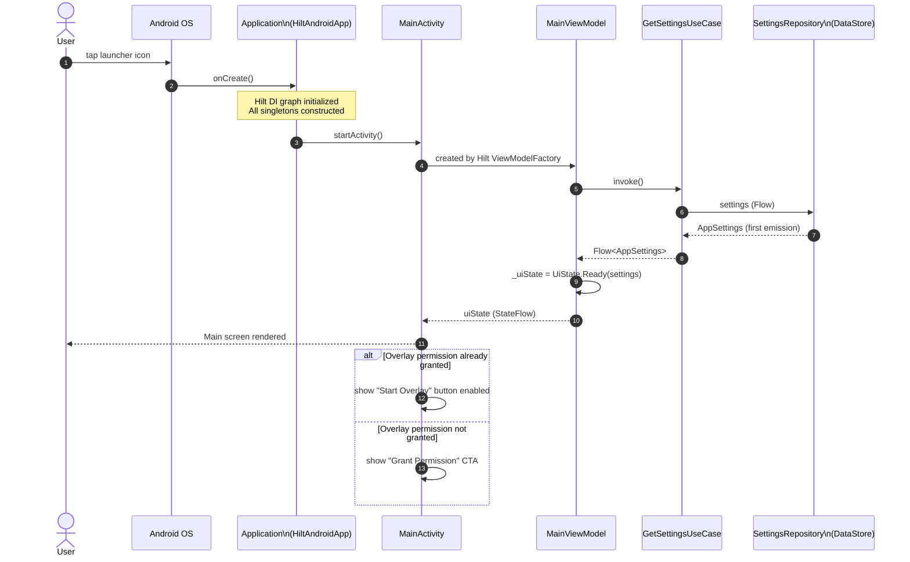
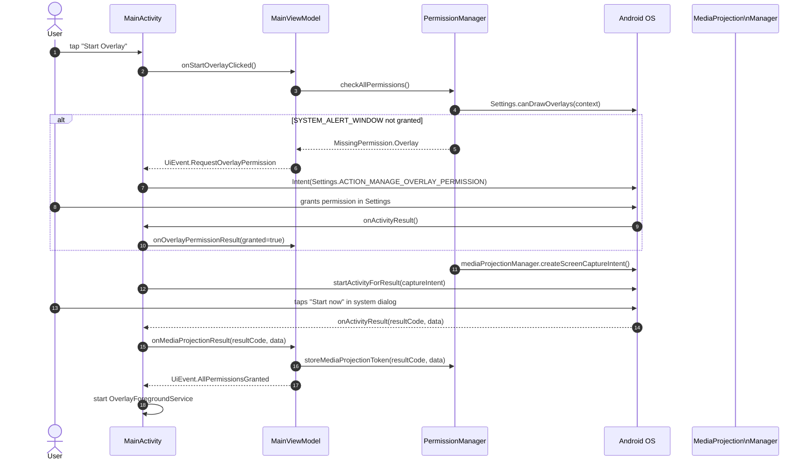
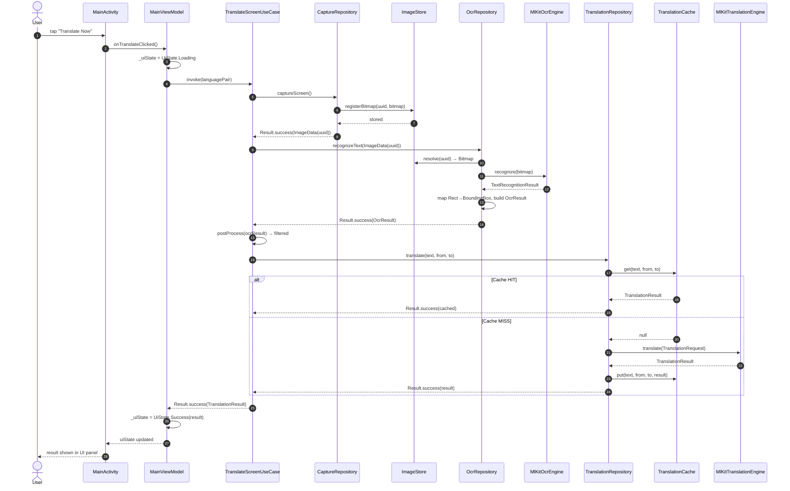
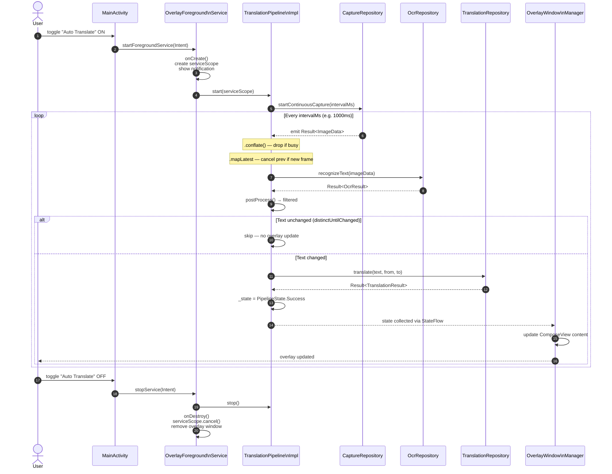
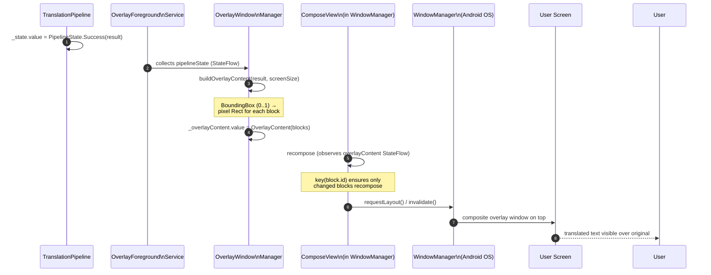
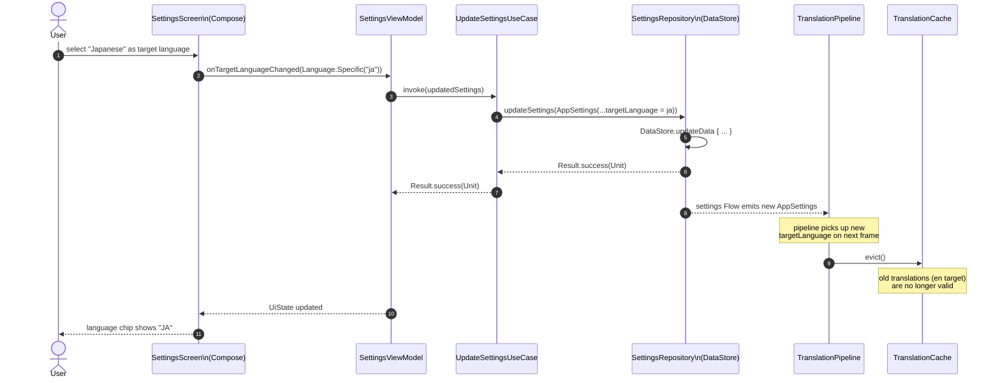
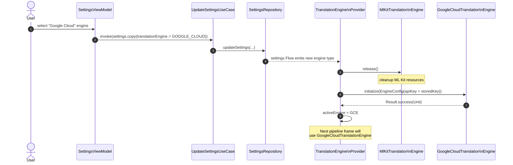
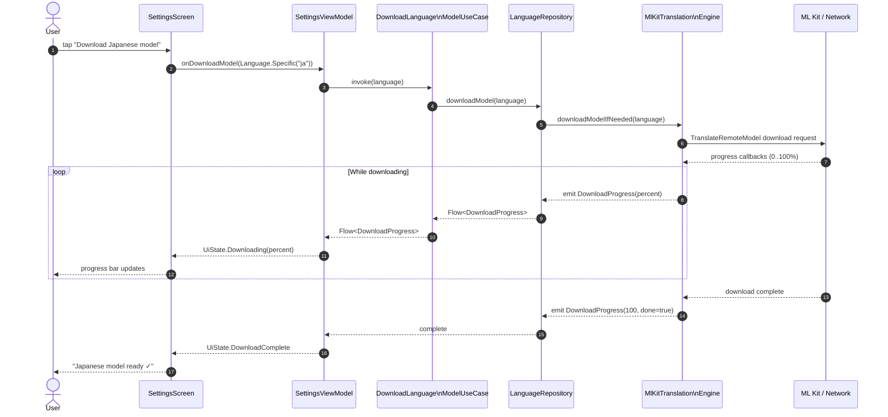
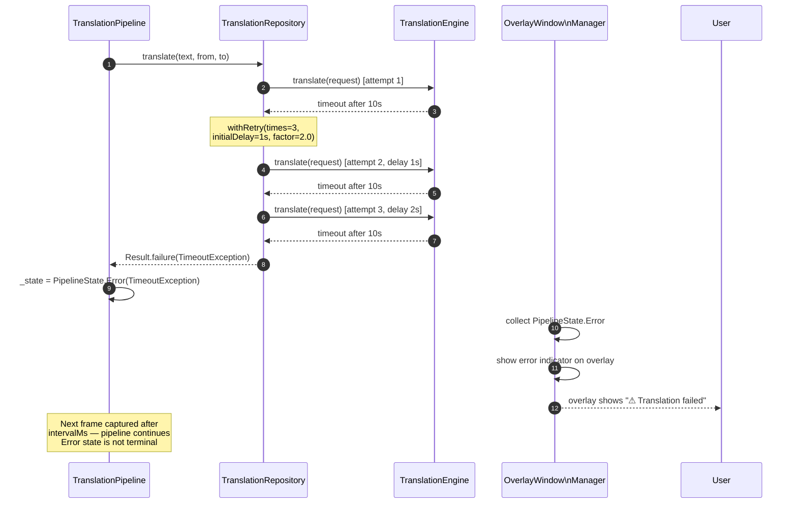
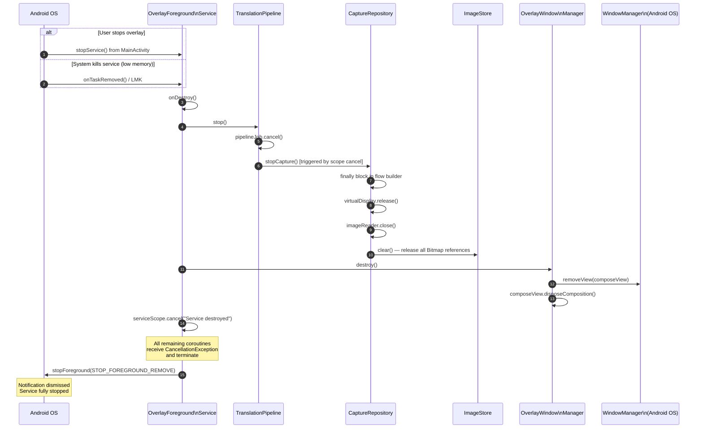

# AutoTrans Android — Sequence Diagrams

> **Version**: 1.0 | **Last updated**: 2026-06-29
> **Prerequisite**: Read [ARCHITECTURE.md](ARCHITECTURE.md) and [PIPELINE.md](PIPELINE.md) first.
> All actors below map directly to classes described in ARCHITECTURE.md §7.

---

## Table of Contents

1. [App Startup Flow](#1-app-startup-flow)
2. [Permission Request Flow](#2-permission-request-flow)
3. [Single-Shot Translation Flow](#3-single-shot-translation-flow)
4. [Continuous Translation Flow (Overlay Mode)](#4-continuous-translation-flow-overlay-mode)
5. [Overlay Update Flow](#5-overlay-update-flow)
6. [Settings Update Flow](#6-settings-update-flow)
7. [Translation Engine Switch Flow](#7-translation-engine-switch-flow)
8. [Language Model Download Flow](#8-language-model-download-flow)
9. [Error Recovery Flow](#9-error-recovery-flow)
10. [Service Destruction Flow](#10-service-destruction-flow)

---

## 1. App Startup Flow

Cold start from launcher icon through to the main UI being ready.

---

## 2. Permission Request Flow

Two permissions are required before the pipeline can run:

- `SYSTEM_ALERT_WINDOW` — draw overlay over other apps
- `MediaProjection` consent — screen capture

---

## 3. Single-Shot Translation Flow

User manually triggers a one-time translation without enabling the overlay.

---

## 4. Continuous Translation Flow (Overlay Mode)

User enables auto-translate. The service starts and the pipeline runs until stopped.

---

## 5. Overlay Update Flow

Zooms in on how a `TranslationResult` becomes visible pixels on screen.

---

## 6. Settings Update Flow

User changes a setting (e.g., target language from English to Japanese).

---

## 7. Translation Engine Switch Flow

User switches from ML Kit to Google Cloud Translate in Settings.

---

## 8. Language Model Download Flow

ML Kit requires downloading language models before offline translation is available.

---

## 9. Error Recovery Flow

Illustrates how a translation timeout is handled and retried.

---

## 10. Service Destruction Flow

Covers both user-initiated stop and system kill (low memory).

---

*For full state definitions and transition rules, see [STATE_MACHINE.md](STATE_MACHINE.md).*
*For error details and recovery strategies per failure mode, see [ERROR_HANDLING.md](../ERROR_HANDLING.md).*
