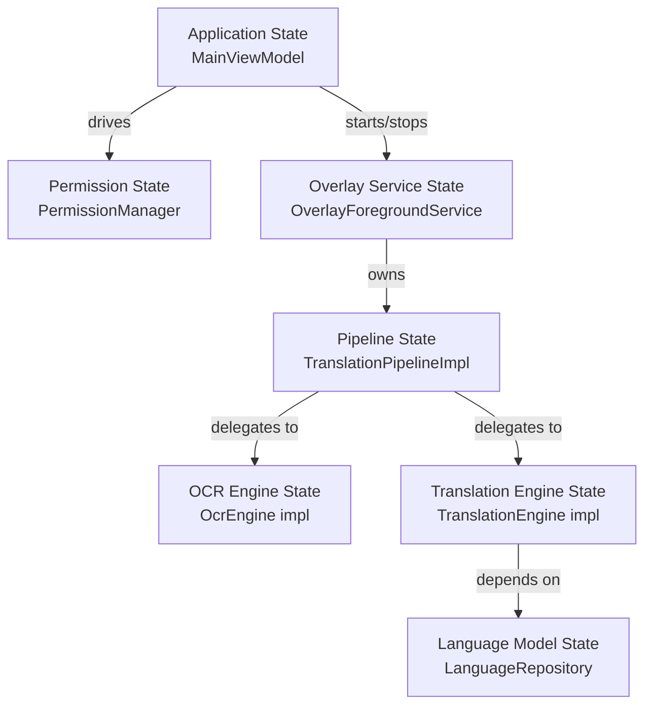
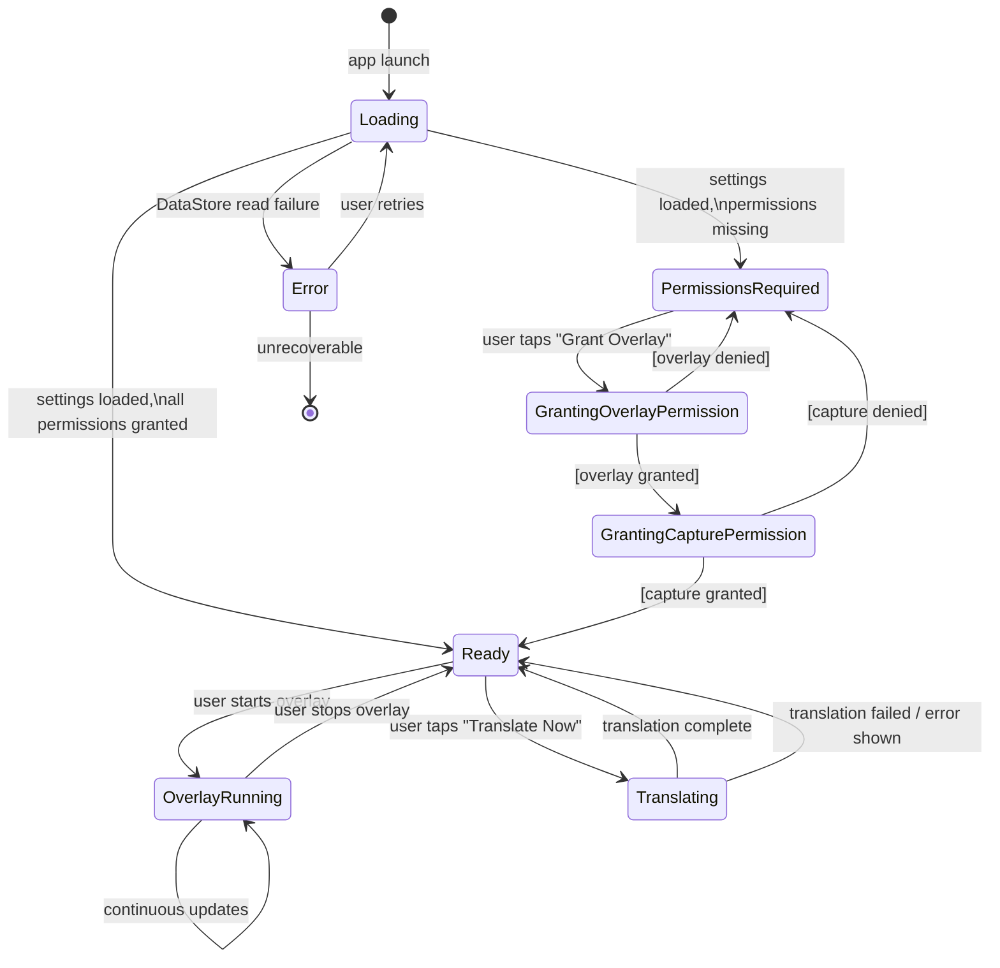
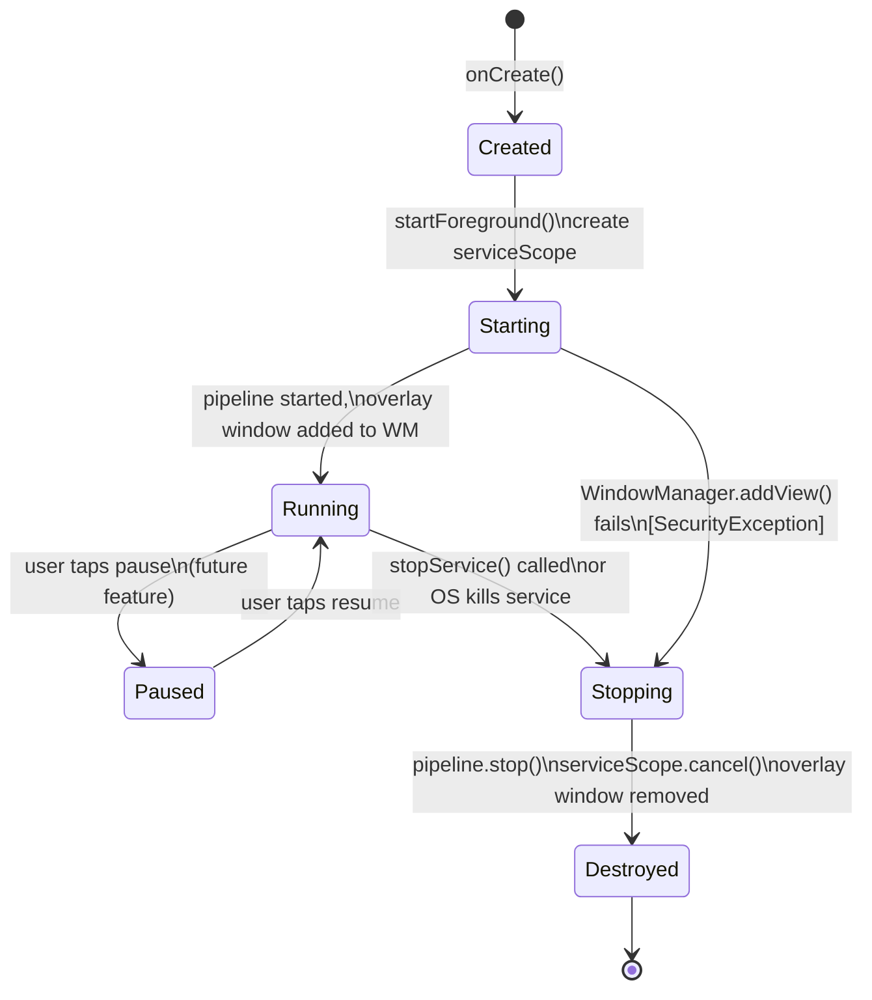
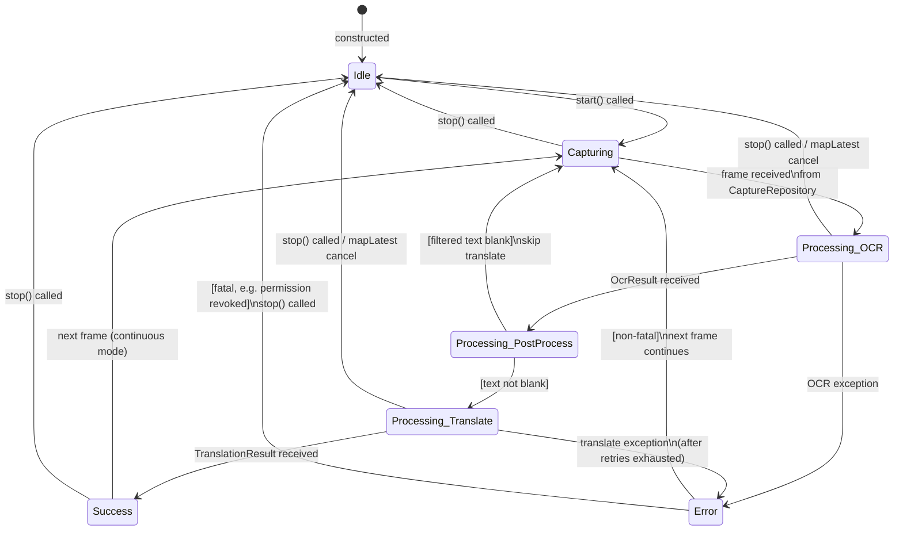
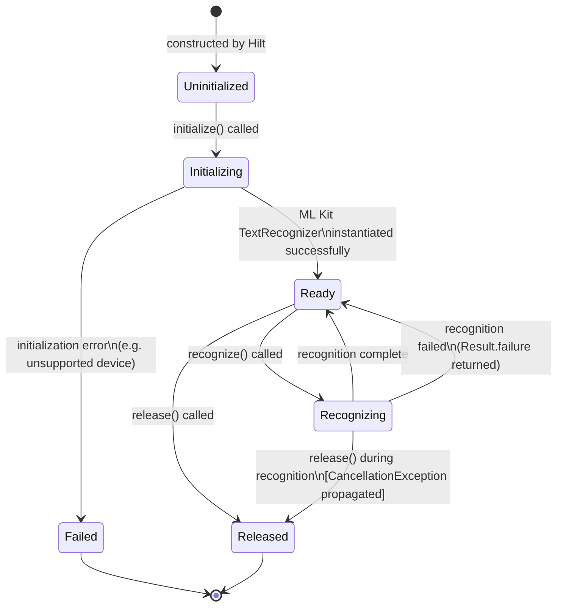
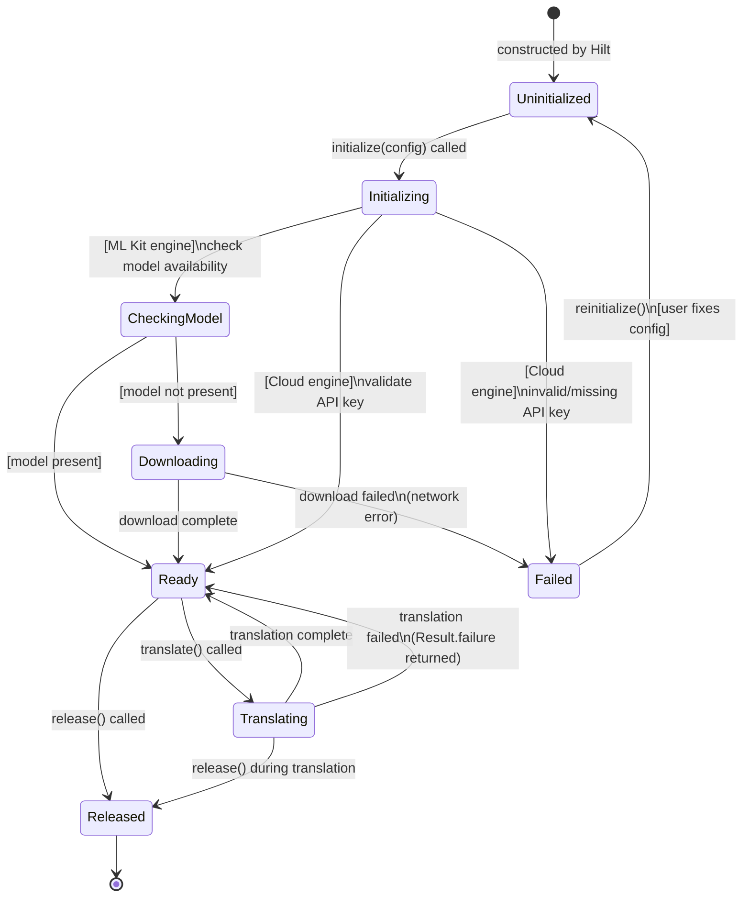
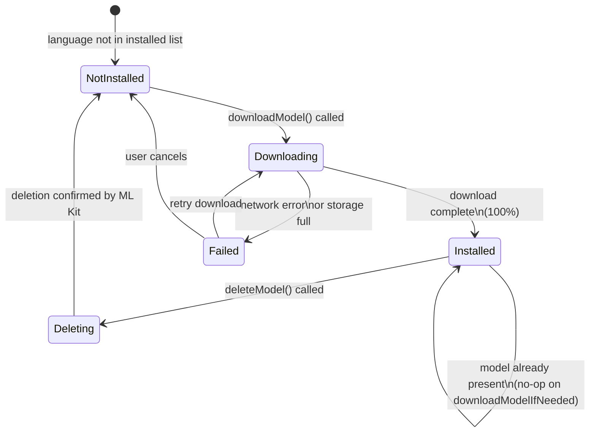
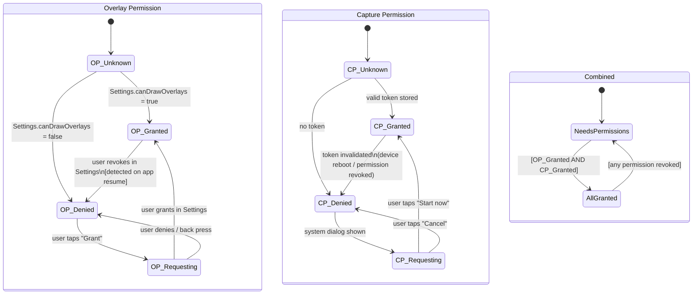
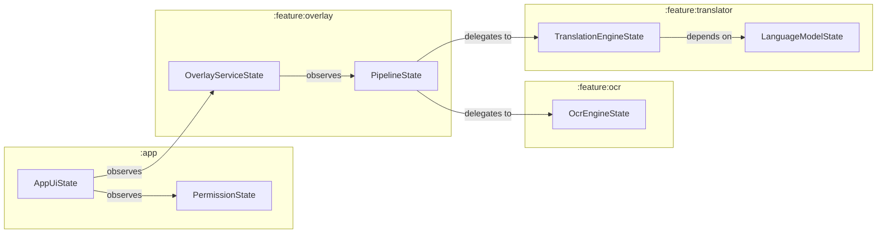

# AutoTrans Android — State Machines

> **Version**: 1.0 | **Last updated**: 2026-06-29
> **Prerequisite**: Read [ARCHITECTURE.md](ARCHITECTURE.md) and [PIPELINE.md](PIPELINE.md) first.
> State types referenced here are defined in `:domain` unless otherwise noted.

---

## Table of Contents

1. [Overview](#1-overview)
2. [Application State Machine](#2-application-state-machine)
3. [Overlay Service State Machine](#3-overlay-service-state-machine)
4. [Translation Pipeline State Machine](#4-translation-pipeline-state-machine)
5. [OCR Engine State Machine](#5-ocr-engine-state-machine)
6. [Translation Engine State Machine](#6-translation-engine-state-machine)
7. [Language Model State Machine](#7-language-model-state-machine)
8. [Permission State Machine](#8-permission-state-machine)
9. [State Ownership & Communication](#9-state-ownership--communication)
10. [Illegal Transitions](#10-illegal-transitions)

---

## 1. Overview

The app has **six independent state machines** that operate concurrently. Each owns its state via a `StateFlow` and communicates with others only through domain interfaces — never directly.



### Notation used in diagrams

| Symbol | Meaning |
|--------|---------|
| Rounded box | State |
| Arrow with label | Transition + trigger |
| `[guard]` | Condition that must be true |
| `/ action` | Side effect on transition |

---

## 2. Application State Machine

**Owner**: `MainViewModel`
**StateFlow**: `_uiState: MutableStateFlow<AppUiState>`
**Location**: `:app`



### State definitions

```kotlin
sealed interface AppUiState {
    data object Loading : AppUiState
    data object PermissionsRequired : AppUiState
    data object GrantingOverlayPermission : AppUiState
    data object GrantingCapturePermission : AppUiState
    data class  Ready(val settings: AppSettings) : AppUiState
    data class  Translating(val settings: AppSettings) : AppUiState
    data class  OverlayRunning(val settings: AppSettings) : AppUiState
    data class  Error(val cause: Throwable, val retryable: Boolean) : AppUiState
}
```

### Transition table

| From | Event | Guard | To | Side Effect |
|------|-------|-------|----|-------------|
| `Loading` | Settings loaded | permissions OK | `Ready` | — |
| `Loading` | Settings loaded | permissions missing | `PermissionsRequired` | — |
| `Loading` | DataStore error | — | `Error` | log error |
| `PermissionsRequired` | Tap "Grant Overlay" | — | `GrantingOverlayPermission` | open Settings intent |
| `GrantingOverlayPermission` | `onActivityResult` | denied | `PermissionsRequired` | show snackbar |
| `GrantingOverlayPermission` | `onActivityResult` | granted | `GrantingCapturePermission` | show system capture dialog |
| `GrantingCapturePermission` | `onActivityResult` | denied | `PermissionsRequired` | show snackbar |
| `GrantingCapturePermission` | `onActivityResult` | granted | `Ready` | store token |
| `Ready` | Tap "Translate Now" | — | `Translating` | launch `TranslateScreenUseCase` |
| `Translating` | UseCase result | success | `Ready` | show result |
| `Translating` | UseCase result | failure | `Ready` | show error |
| `Ready` | Tap "Start Overlay" | — | `OverlayRunning` | `startForegroundService` |
| `OverlayRunning` | Tap "Stop Overlay" | — | `Ready` | `stopService` |
| `Error` | Tap "Retry" | retryable | `Loading` | reload settings |

---

## 3. Overlay Service State Machine

**Owner**: `OverlayForegroundService`
**StateFlow**: `_serviceState: MutableStateFlow<OverlayServiceState>`
**Location**: `:feature:overlay`



### State definitions

```kotlin
// domain/model/OverlayServiceState.kt
sealed interface OverlayServiceState {
    data object Created  : OverlayServiceState
    data object Starting : OverlayServiceState
    data object Running  : OverlayServiceState
    data object Paused   : OverlayServiceState
    data object Stopping : OverlayServiceState
    data object Destroyed: OverlayServiceState
}
```

### Lifecycle binding

```
Android lifecycle          →  OverlayServiceState
─────────────────────────────────────────────────
onCreate()                 →  Created
onStartCommand()           →  Starting → Running
onDestroy()                →  Stopping → Destroyed
```

### Invariants

- In `Running` state: `serviceScope` is active, `pipelineJob` is active, overlay window is attached to `WindowManager`
- In `Destroyed` state: all bitmaps in `ImageStore` are released, `ComposeView` composition is disposed
- **`Stopping` is non-reversible** — once entered, the service always proceeds to `Destroyed`

---

## 4. Translation Pipeline State Machine

**Owner**: `TranslationPipelineImpl`
**StateFlow**: `_state: MutableStateFlow<PipelineState>`
**Location**: `:feature:overlay`



### State definitions

```kotlin
// domain/model/PipelineState.kt
sealed interface PipelineState {
    data object Idle      : PipelineState
    data object Capturing : PipelineState
    data class  Processing(val stage: PipelineStage) : PipelineState
    data class  Success(val result: TranslationResult) : PipelineState
    data class  Error(val cause: Throwable) : PipelineState
}

enum class PipelineStage { CAPTURE, OCR, POST_PROCESS, TRANSLATE, LAYOUT }
```

### Fatal vs Non-fatal errors

| Exception | Fatal? | Behaviour |
|-----------|--------|-----------|
| `SecurityException` (capture permission revoked) | ✅ Fatal | Pipeline stops, service stops |
| `IllegalStateException` (VirtualDisplay dead) | ❌ Non-fatal | Retry capture up to 3× |
| ML Kit `Exception` (OCR failure) | ❌ Non-fatal | Skip frame, continue |
| `IOException` (network — cloud translation) | ❌ Non-fatal | Retry with backoff |
| `OutOfMemoryError` (Bitmap) | ✅ Fatal | Stop service, log, notify user |
| `CancellationException` | N/A | Normal — from `mapLatest` or `stop()` |

### `mapLatest` cancellation points

`CancellationException` can be thrown at any `suspend` call inside `processFrame()`. The pipeline is designed so that every state correctly transitions to `Idle` on cancellation — no resources are leaked because cleanup is in `finally` blocks of each repository.

---

## 5. OCR Engine State Machine

**Owner**: Each `OcrEngine` implementation
**Location**: `:feature:ocr`

Each `OcrEngine` instance manages its own lifecycle independently. The `OcrEngineProvider` switches between them based on `AppSettings`.



### State definitions

```kotlin
// feature/ocr — internal to each engine implementation
sealed interface OcrEngineState {
    data object Uninitialized : OcrEngineState
    data object Initializing  : OcrEngineState
    data object Ready         : OcrEngineState
    data object Recognizing   : OcrEngineState
    data class  Failed(val cause: Throwable) : OcrEngineState
    data object Released      : OcrEngineState
}
```

### Invariant

`recognize()` MUST NOT be called when `state != Ready`. The `OcrEngineProvider` guarantees this by calling `initialize()` and awaiting `Ready` before returning an engine to the pipeline.

---

## 6. Translation Engine State Machine

**Owner**: Each `TranslationEngine` implementation
**Location**: `:feature:translator`

Mirrors the OCR engine lifecycle but adds `Downloading` for ML Kit model management.



### `EngineConfig` per engine type

| Engine | `requiresApiKey` | `supportsOffline` | Model download needed |
|--------|-----------------|------------------|-----------------------|
| `MlKitTranslationEngine` | ❌ | ✅ | ✅ (first use) |
| `GoogleCloudTranslationEngine` | ✅ | ❌ | ❌ |
| `LibreTranslateEngine` | ❌ | ❌ (needs server) | ❌ |
| `DeepLEngine` *(future)* | ✅ | ❌ | ❌ |

---

## 7. Language Model State Machine

**Owner**: `LanguageRepositoryImpl`
**Location**: `:feature:translator`

Tracks the download state of each individual language model for ML Kit.



### `DownloadProgress` model

```kotlin
// domain/model/DownloadProgress.kt
data class DownloadProgress(
    val language: Language,
    val percent: Int,           // 0..100
    val isDone: Boolean = false,
    val error: Throwable? = null
)
```

---

## 8. Permission State Machine

**Owner**: `PermissionManager`
**Location**: `:app`

Tracks the two runtime permissions independently. Both must be `Granted` before the overlay service can start.



### Permission check on resume

`MainActivity.onResume()` always re-checks `Settings.canDrawOverlays()` because the user can revoke overlay permission while the app is backgrounded (through Android Settings). If revoked while the service is running, the service must stop immediately.

```kotlin
// app — MainActivity.kt
override fun onResume() {
    super.onResume()
    viewModel.recheckPermissions()  // triggers PermissionState re-evaluation
}
```

---

## 9. State Ownership & Communication

Each state machine owns its `StateFlow` and is the **only writer** to it. Other components observe but never mutate foreign state directly.



### Communication rules

| From | To | Mechanism |
|------|----|-----------|
| `MainViewModel` → `OverlayForegroundService` | Start/stop commands | `Intent` via `startForegroundService` / `stopService` |
| `OverlayForegroundService` → `MainViewModel` | Status updates | `SharedFlow` via bound service or `BroadcastReceiver` |
| `PipelineImpl` → `OverlayWindowManager` | Render trigger | `StateFlow<PipelineState>` collected in service |
| `SettingsRepository` → `PipelineImpl` | Settings changes | `Flow<AppSettings>` observed in pipeline `start()` |
| `OcrEngineProvider` → `PipelineImpl` | Engine ready | Returns initialized engine, no StateFlow |

---

## 10. Illegal Transitions

These transitions must never happen. Violations indicate a bug.

| From | Illegal To | Why |
|------|-----------|-----|
| `PipelineState.Idle` | `Processing(*)` | Must go through `Capturing` first |
| `OcrEngineState.Uninitialized` | `Recognizing` | Engine not ready — will crash |
| `OverlayServiceState.Destroyed` | Any state | Service is dead — can't recover |
| `TranslationEngineState.Failed` | `Translating` | Must reinitialize first |
| `LanguageModelState.Downloading` | `Installed` | Must complete to 100% first |
| `AppUiState.OverlayRunning` | `Translating` | Can't single-shot while overlay is active |

### Enforcement strategy

Illegal transitions are prevented by:

1. **`when` exhaustiveness** — all `sealed interface` branches must be handled; compiler enforces this
2. **Guard checks in use cases** — `TranslateScreenUseCase` checks `captureRepo.isCapturing` before proceeding
3. **`check()` assertions** in debug builds — fail fast during development:

```kotlin
// feature/ocr — MlKitOcrEngine.kt
override suspend fun recognize(imageData: ImageData): Result<OcrResult> {
    check(_state.value == OcrEngineState.Ready) {
        "recognize() called in state ${_state.value} — must be Ready"
    }
    // ...
}
```

---

*For how these states are observed in UI, see [SEQUENCE_DIAGRAMS.md](SEQUENCE_DIAGRAMS.md).*
*For which errors trigger which state transitions, see [ERROR_HANDLING.md](../ERROR_HANDLING.md).*
